# Giriş

Bu dökümantasyon,

B2B'de [KSeF](https://ksef-test.mf.gov.pl/) (Ulusal e-Fatura Sistemi) ve B2G'de [PEF](https://efaktura.gov.pl/uslugi-pef/)(e-faturalama Platformu) olmak üzere iki büyük temel faturlama platformun çerçevisinde, Polonya e-fatura düzenlemelerine uyum sağlama amacı taşıyan stratejik bir inisiyatiftir.  

Büyük şirketler, güncel olarak sanal ortamda faturalandırma sistemlerinin tamamının değiştirilecek olması dolayısıyla; **1 Temmuz 2024** tarihinde temelli [KSeF VAT(KDV)](https://www.podatki.gov.pl/e-deklaracje/dokumentacja-it/struktury-dokumentow-xml/#ksef) entegrasyonlarının hazırlık aşamalarına başlamış durumdalar.

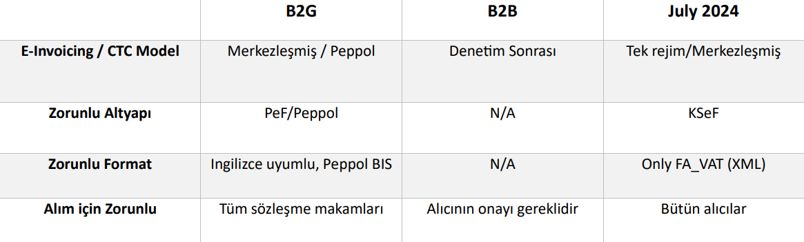

?> Faturalandırmalarda güncel olarak *elektronik imza zorunluluğu yoktur*.

?> Fatura saklama işlemleri, [entegratörlerin bulutlarında]() 5 yıl, [OSS](https://www.pagero.com/blog/oss-ioss) (One-Stop Shop) şeması altında 10, [KSeF](https://ksef-test.mf.gov.pl/) altında ise 10 yıldır.  

> [OSS](https://www.pagero.com/blog/oss-ioss) nedir? Tek Noktadan Hizmet (OSS) programı, tüm AB Üye Devletlerindeki satışlarda KDV'nin tek bir vergi dairesine ödenmesinin olanağını sağlayan bir programdır.

<h4>PEF ve Peppolün faturalandırmadaki rolü nedir?</h4>

**PEF**, Polonya'da e-faturalandırma süreçlerini düzenlemek ve standartlaştırmak amacıyla oluşturulmuş bir sistemdir. PEF, Polonya'daki ticaret ve işletmeler arasında e-fatura değişimini kolaylaştırmak ve düzenlemek için kullanılır. 

> PEF'in başlıca rolleri:

- **Fatura Standartları ve Formatları** PEF, yukarıda da bahsettiğim e-fatura standartlarını ve formatlarını belirler. Bu sayede faturaların tutarlı bir şekilde oluşturulması ve alınması sağlanır.
- **Fatura Onay ve İşlemleri** PEF, e-faturaların gönderilmesi, alınması, onaylanması ve saklanması gibi işlemleri düzenler.
- **Yasal Uyumluluk** PEF, Polonya'daki e-fatura düzenlemelerine ve yasal gereksinimlerine uyum sağlar.
- **E-İmza ve Güvenlik**  PEF, e-faturaların güvenli bir şekilde imzalanmasını ve iletilmesini destekler.

<br>

**Peppol (Pan-European Public Procurement OnLine)** ise Avrupa'da birçok ülkede e-faturalandırmayı kolaylaştırmak ve sürdürülebilir bir şekilde yapmak amacıyla oluşturulmuş bir platformdur. Polonya da Peppol'u benimsemiş ve bu platform Polonya'da e-faturalandırmada önemli bir rol oynamıştır. 

> Peppol'ün başlıca rolleri:

- **Uluslararası Fatura Değişimi** Peppol, uluslararası düzeyde e-fatura değişimini kolaylaştırır ve standartlarını sağlar.
- **İşletmeler Arası İletişim** Peppol, işletmeler arasında fatura değişimini ve iletişimini hızlandırır ve basitleştirir.
- **Hız ve Verimlilik** Peppol ile e-fatura değişimi daha hızlı ve verimli hale gelir, kağıt tabanlı süreçlere göre avantajlar sunar.
- **Düşük Maliyetler** Peppol, e-fatura değişimini kağıt faturalara göre daha düşük maliyetle gerçekleştirmeyi sağlar.


?> **PEF** platform standardındaki e-fatura belgesi, PEPPOL **İş Birlikte Çalışabilirlik Spesifikasyonları** spesifikasyonunda tanımlanmıştır. [OpenPEPPOL](https://peppol.org/) tarafından yayınlanan açıklamalara göre şu an yürürlükte olan [Avrupa Standartı PEF BIS 3.0](http://docs.peppol.eu/poacc/billing/3.0/) Faturalandırma versiyonu [`UBL 2.1`](https://docs.oasis-open.org/ubl/UBL-2.1.html) üzerine kuruludur. 
  

## Sistem Mimarisi <!-- {docsify-ignore} -->

> Bu kısımda, grafik modellemelerine yer verilmiştir. Sistemin genel işleyici ele alınmış olup, teknik kısımlara yüzeysel olarak [Entegrasyona Genel Bakış](#entegrasyona-genel-bakış) bölümünde ve derinlemesine *dökümantasyon* kısımlarında ele alınmıştır. 

<swimlanes-io> 
title: EDM UYGULAMADA NASIL ÇALIŞMALI?

Tedarikçi => ERP: DATA
note: 
Tedarikçi için uygun bir formatta **fatura veya fatura verileri**

ERP --> Tedarikçi: FEEDBACK

ERP <=> KSeF: API
note:
**KSEF** üzerinde yapılandırılmış e-fatura 


ERP => Alıcı(Ticari Ağ): 
note: 
KSeF faturası ve KSeF numarasına atıfta bulunarak alıcı için uygun bir formatta yapılandırılmış **fatura**
</swimlanes-io> 

Sistem modeli, Tedarikçi veya Müşteri tarafından yetkilendirilmiş bir kuruluş olarak KSeF faturalarını düzenleyen ve alan aracı ek hizmetiyle birlikte mevcut ERP mekanizmalarının sürdürülmesidir. Yukarıdaki modelde bu önemli noktalara değinilmiştir.

# KSeF

`KSeF` (Ulusal e-Fatura Sistemi), faturaların elektronik ortamda düzenlenmesi ve alınmasına yönelik bir platformdur.

**İletişim, sistemin mükellefin bağlamına dayandığı bir süreçtir.** Vergi mükellefinin toplu fatura düzenleme yeteneğine sahip olduğu gözlemlenmektedir. Faturaların düzenlenmesinde rol oynayan kuruluş, etkileşimli işlemler için bir varlık olabilir; bu, faturaları alan, düzenleyen veya yetkilendiren kuruluşu içerebilir.

<br>

## KSeF Manual 

Bu bölümde, [KSeF WEB PORTAL](https://ksef-test.mf.gov.pl/web/login) (test sunucusu) kullanılarak **nasıl manual olarak elektronik fatura** oluşturulduğuna, düzenlendiğine değinilmiştir.

### Varlık Hesabı (Podmiot) Oluşturma <!-- {docsify-ignore} -->

**Varlık (Podmiot)** faturayı düzenleyen(satıcı mükellef) veya faturayı alan kurum veya kuruluştur. Ilerleyen bölümlerde detaylı olarak varlıklara değinilmiştir. Fatura düzenlemelerinde zorunlu olarak, iki varlık hesabı olmalı ve durumlara bağlı olarak üçüncü bir varlık hesabı da olabilir:  

**Varlık1**: Vergi mükellefini (satıcıyı) karakterize eden bilgileri içerir.

**Varlık2**: Mal veya hizmetlerin alıcısını karakterize eden bilgileri içerir.

**Varlık3**: Üçüncü taraf kuruluş(lar)ın (satıcı (Varlık1) ve bölümde adı geçen alıcı
dışında) verilerini içerir.


> Test ortamında varlık hesabı yani alıcı, satıcı veya üçüncü parti hesap oluşturmak için gereken **instance** dataları yaratan generator. [**generatory.it**](http://generatory.it/)

> 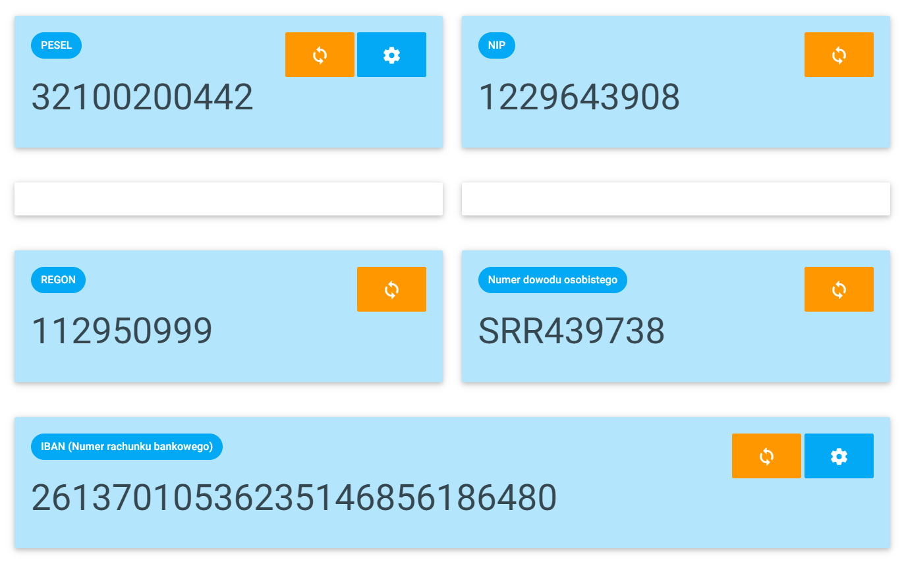


- `PESEL` Şahısın **kimlik numarasını** temsil eder.
- `NIP` Kurum veya kuruluşun **vergi kimlik numarasını** temsil eder.
- `REGON` Ulusal Ekonomi Sicilinin kısaltması.

<br>

> İlk aşamada, generatorden alınan bilgiler ile web [KSeF'in test ortamından](https://ksef-test.mf.gov.pl/web/login) aşağıda görüldüğü üzere manual olarak hesap oluşturulmasına başlanılabilir.

> 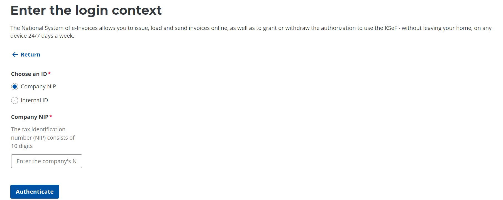

<br>

> İkinci aşamada, NIP numarası girildiken sonra, ekrana çıkan seçeneklerden ikincisine **nitelikli sertifika**'ya tıklıyoruz. 

> 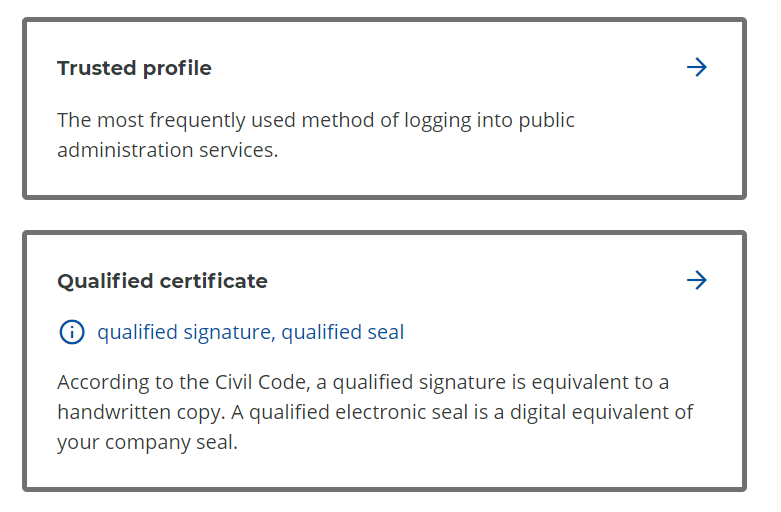

<br>

> Üçüncü aşamada, çıkan iki seçenekten **evet**'e tıklayarak devam ediyoruz.

> 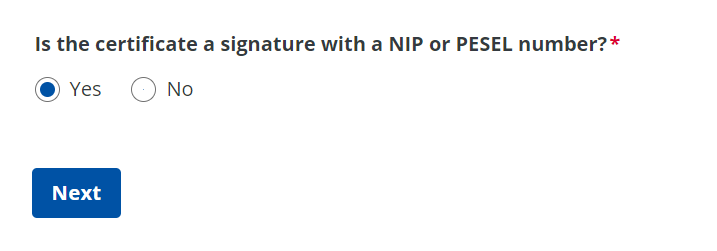

<br>

> Dördüncü aşamada, oluşturduğumuz `NIP` numarası ile **stamp with NIP** diyerek devam ediyoruz. Üçüncü ek veri kısmı boş kalabilir.

> 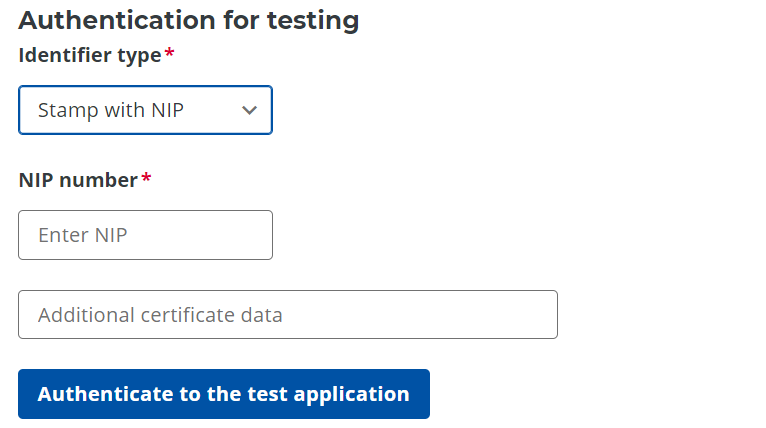

<br>

> İlk dört adım sonunda, birkaç saniye doğrulama yapılıyor (test ortamı olduğu için) otomatik olarak test ortamına yönlendiriliyoruz. 

> 

<br>

> Yönlendirme sonrası sistem bize aşağıdaki gösterildiği gibi bir unique `SESSION_NUMBER` veriyor. 

> 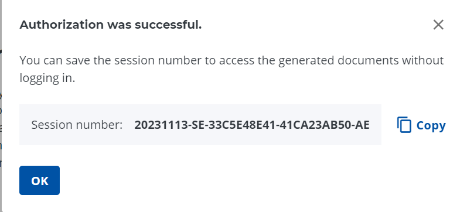

!> `SESSION_NUMBER` penceresi oturum süresince bir kere verilir ve pencerenin kapatılması durumunda sisteme tekrar giriş yapılması aksi takdirde portal içerisinde oturum numarasını tedarik etmek için herhangi başka bir bölüm olmayacaktır. Bu yüzden oturum numarasının kaydedilmesi gereklidir.

<br>

### KSeF üzerinden e-fatura oluşturma <!-- {docsify-ignore} -->

Varlık hesabı(Podmiot) üzerinden oturum açılarak oluşturulan fatura tipleri:

- **Temel** 
- **Ön ödeme**
- **Faturalandırma**: Bu fatura türü yalnızca daha önce advance invoice düzenlenmiş işlemlerin kapatılması için kullanılır.
- **Düzeltici**
  - Temel fatura düzeltimi
  - Advance invoice düzeltimi
  - Uzlaşma faturası düzeltimi
  - Toplu düzeltme: İndirim nedeniyle bir döneme ait birden fazla faturanın düzeltilmesi

<br>

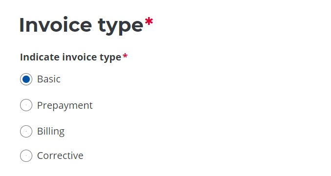

<br>

!> Fatura tipi seçimi sonrasında ana 2 aşama(satıcı ve alıcı bilgilerin girilmesi ürün bilgilerinin girilmesi) toplamda 4 aşama ile gerekli bilgilerin doldurulması bitiminde, **fatura 3 formatta oluşturulabilir**. `XML`,`PDF`,`HTML`.

> İşleme aldığımız örnek temel tipli elektonik fatura **PDF görüntüsü** 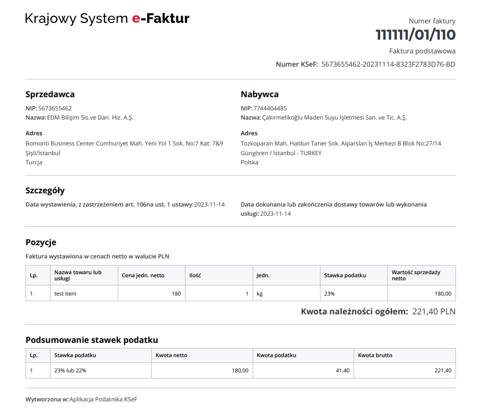

## KSeF E-fatura Mantıksal Yapısı 

1 Eylül 2023 tarihinden itibaren geçerli 1olan **FA(2)** sürümündeki yapılandırılmış fatura şablonunUN orijinaline [buraya tıklayarak ulaşabilirsiniz](http://crd.gov.pl/wzor/2023/06/29/12648/).

### Şema yapısı 

> XSD diyagramında kullanılan sembollerin listesi 
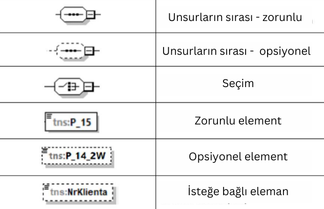

> Diyagram yapı kökleri (orijinali) 
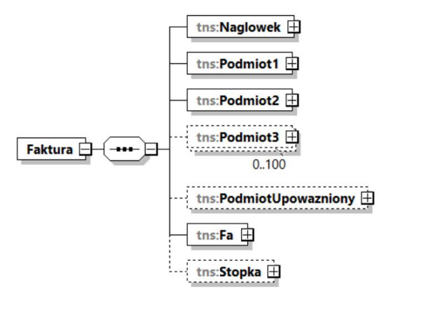

> Diyagram yapı kökleri (Türkçe çevirisi) 
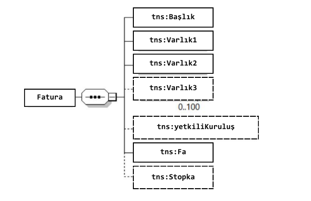

?> Kalan diyagram yapıları eklenilecektir.

### XML şemaları (Örnek üzerinde) 

?> Temel senaryoda kesilmiş faturanın `PDF` görüntüsü.
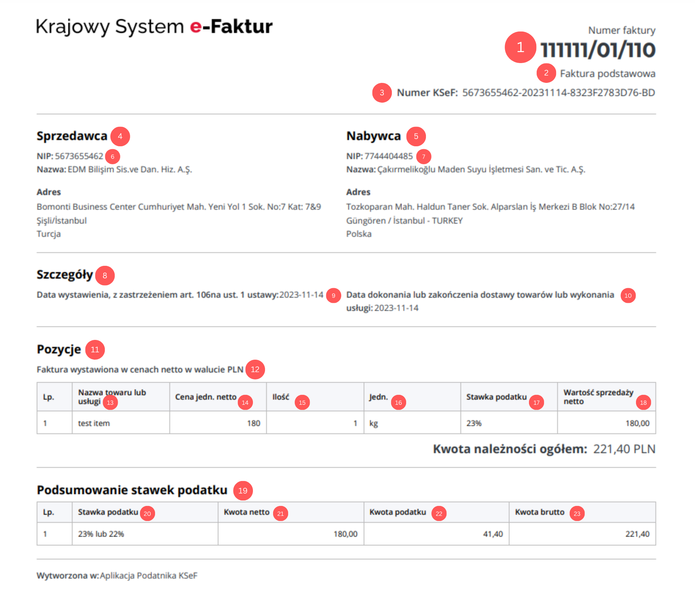

1. Faturayı benzersiz şekilde tanımlayan, bir veya daha fazla
seriye atanan sıralı fatura numarası. XML formatındadaki karşılığı `<P_2>` **bu alanda belirtilen fatura numarası, KSeF'deki faturayı tanımlayan numarayla aynı olmamalıdır. Bunlar iki farklı sayıdır.**
2. **Fatura tipi** (Temel, Ön ödeme, Faturalandırma, Düzeltici)
3. KSeF tarafından verilen, faturaya sorgulamak için kullanılan eşsiz **ksef fatura numarası**
4. Satıcı bilgileri 
5. Alıcı bilgileri
6. Varlık1 `<Podmiot1>` altındaki **satıcı vergi kimlik numarası** `<NIP>`
7. Varlık2 `<Podmiot2>` altındaki **alıcı vergi kimlik numarası** `<NIP>` 
8. Detaylar 
9. `<Fa>` altındaki `<P_1>` **yayın tarihi** 
10. `<Fa>` altındaki `<P_6>` elementi **mal veya hizmet tesliminin tamamlandığı veya tamamlandığı veya ödemenin alındığı tarih**  
11. Özet
12. PLN cinsinden net fiyatlarla düzenlenen fatura 
13. `<Fa>` altındaki `<P_7>`  PLN cinsinden net fiyatlarla düzenlenen fatura **MAL ADI** 
14. `<Fa>` altındaki `<P_9A>`  **NET FIYAT**
15. `<Fa>` altındaki `<P_8B>`  **MIKTAR**
16. `<Fa>` altındaki `<P_8A>` **BIRIM**
17. `<Fa>` altındaki `<P_12>`  **VERGİ ORANI**
18. `<Fa>` altındaki `<P_11>`  **NET SATIŞ MIKTARI**
19. Vergi oranlarının özeti
20. `<Fa>` altındaki `<P_13_1>`  **VERGI ORANI**
21. `<Fa>` altındaki `<P_11>`  **NET TUTAR**
22. `<Fa>` altındaki `<P_14_1>`  **VERGİ MİKTARI**
23. `<Fa>` altındaki `<P_15>`  **BRÜT TUTAR**

<br>

Yukarıdaki fatura tipi temel olan faturanın `XML` görüntüsü.

```XML
<?xml version="1.0" encoding="utf-8"?>
<Faktura
	xmlns:xsi="http://www.w3.org/2001/XMLSchema-instance"
	xmlns:xsd="http://www.w3.org/2001/XMLSchema"
	xmlns="http://crd.gov.pl/wzor/2023/06/29/12648/">
	<Naglowek>
		<KodFormularza kodSystemowy="FA (2)" wersjaSchemy="1-0E">FA</KodFormularza>
		<WariantFormularza>2</WariantFormularza>
		<DataWytworzeniaFa>2023-11-14T12:07:34.0478748+01:00</DataWytworzeniaFa>
		<SystemInfo>Aplikacja Podatnika KSeF</SystemInfo>
	</Naglowek>
	<Podmiot1>
		<DaneIdentyfikacyjne>
			<NIP>5673655462</NIP>
			<Nazwa>EDM Bilişim Sis.ve Dan. Hiz. A.Ş.</Nazwa>
		</DaneIdentyfikacyjne>
		<Adres>
			<KodKraju>TR</KodKraju>
			<AdresL1>Bomonti Business Center Cumhuriyet Mah. Yeni Yol 1 Sok. No:7 Kat: 7&amp;9 Şişli/İstanbul</AdresL1>
		</Adres>
	</Podmiot1>
	<Podmiot2>
		<DaneIdentyfikacyjne>
			<NIP>7744404485</NIP>
			<Nazwa>Çakırmelikoğlu Maden Suyu İşletmesi San. ve Tic. A.Ş.</Nazwa>
		</DaneIdentyfikacyjne>
		<Adres>
			<KodKraju>PL</KodKraju>
			<AdresL1>Tozkoparan Mah. Haldun Taner Sok. Alparslan İş Merkezi
B Blok No:27/14 Güngören / İstanbul - TURKEY</AdresL1>
		</Adres>
	</Podmiot2>
	<Fa>
		<KodWaluty>PLN</KodWaluty>
		<P_1>2023-11-14</P_1>
		<P_2>111111/01/110</P_2>
		<P_6>2023-11-14</P_6>
		<P_13_1>180</P_13_1>
		<P_14_1>41.4</P_14_1>
		<P_15>221.4</P_15>
		<Adnotacje>
			<P_16>2</P_16>
			<P_17>2</P_17>
			<P_18>2</P_18>
			<P_18A>2</P_18A>
			<Zwolnienie>
				<P_19N>1</P_19N>
			</Zwolnienie>
			<NoweSrodkiTransportu>
				<P_22N>1</P_22N>
			</NoweSrodkiTransportu>
			<P_23>2</P_23>
			<PMarzy>
				<P_PMarzyN>1</P_PMarzyN>
			</PMarzy>
		</Adnotacje>
		<RodzajFaktury>VAT</RodzajFaktury>
		<FaWiersz>
			<NrWierszaFa>1</NrWierszaFa>
			<P_7>test item</P_7>
			<P_8A>kg</P_8A>
			<P_8B>1</P_8B>
			<P_9A>180</P_9A>
			<P_11>180</P_11>
			<P_12>23</P_12>
		</FaWiersz>
	</Fa>
</Faktura>
```

####  <!-- {docsify-ignore} -->

<h3>XML Fatura Şemaları</h3>

<br>

**Ticari mal satış faturası**
> Mallar için satış faturası. Fatura, düzenlendiği tarihte ödemenin tamamının yapıldığını belirtmektedir.

```XML
<?xml version="1.0" encoding="UTF-8"?>
<Faktura xmlns:etd="http://crd.gov.pl/xml/schematy/dziedzinowe/mf/2022/01/05/eD/DefinicjeTypy/" xmlns:xsi="http://www.w3.org/2001/XMLSchema-instance"
xmlns="http://crd.gov.pl/wzor/2023/06/29/12648/">
	<Naglowek>
		<KodFormularza kodSystemowy="FA (2)" wersjaSchemy="1-0E">FA</KodFormularza>
		<WariantFormularza>2</WariantFormularza>
		<DataWytworzeniaFa>2022-01-01T00:00:00Z</DataWytworzeniaFa>
		<SystemInfo>Kesilen Faturanın platformu</SystemInfo>
	</Naglowek>
	<Podmiot1>
		<DaneIdentyfikacyjne>
			<NIP>9999999999</NIP>
			<Nazwa>ABC AGD sp. z o. o.</Nazwa>
		</DaneIdentyfikacyjne>
		<Adres>
			<KodKraju>PL</KodKraju>
			<AdresL1>ul. Kwiatowa 1 m. 2</AdresL1>
			<AdresL2>00-001 Warszawa</AdresL2>
		</Adres>
		<DaneKontaktowe>
			<Email>abc@abc.pl</Email>
			<Telefon>667444555</Telefon>
		</DaneKontaktowe>
	</Podmiot1>
	<Podmiot2>
		<DaneIdentyfikacyjne>
			<NIP>1111111111</NIP>
			<Nazwa>F.H.U. Jan Kowalski</Nazwa>
		</DaneIdentyfikacyjne>
		<Adres>
			<KodKraju>PL</KodKraju>
			<AdresL1>ul. Polna 1</AdresL1>
			<AdresL2>00-001 Warszawa</AdresL2>
		</Adres>
		<DaneKontaktowe>
			<Email>jan@kowalski.pl</Email>
			<Telefon>555777999</Telefon>
		</DaneKontaktowe>
		<NrKlienta>fdfd778343</NrKlienta>
	</Podmiot2>
	<Fa>
		<KodWaluty>PLN</KodWaluty>
		<P_1>2022-02-15</P_1>
		<P_1M>Warszawa</P_1M>
		<P_2>FV2022/02/150</P_2>
		<P_6>2022-01-27</P_6>
		<P_13_1>1666.66</P_13_1>
		<P_14_1>383.33</P_14_1>
		<P_13_3>0.95</P_13_3>
		<P_14_3>0.05</P_14_3>
		<P_15>2051</P_15>
		<Adnotacje>
			<P_16>2</P_16>
			<P_17>2</P_17>
			<P_18>2</P_18>
			<P_18A>2</P_18A>
			<Zwolnienie>
				<P_19N>1</P_19N>
			</Zwolnienie>
			<NoweSrodkiTransportu>
				<P_22N>1</P_22N>
			</NoweSrodkiTransportu>
			<P_23>2</P_23>
			<PMarzy>
				<P_PMarzyN>1</P_PMarzyN>
			</PMarzy>
		</Adnotacje>
		<RodzajFaktury>VAT</RodzajFaktury>
		<FP>1</FP>
		<DodatkowyOpis>
			<Klucz>tercih edilen teslimat süreleri</Klucz>
			<Wartosc>çalışma günleri 17:00 - 20:00</Wartosc>
		</DodatkowyOpis>
		<FaWiersz>
			<NrWierszaFa>1</NrWierszaFa>
			<UU_ID>aaaa111133339990</UU_ID>
			<P_7>lodówka Zimnotech mk1</P_7>
			<P_8A>szt.</P_8A>
			<P_8B>1</P_8B>
			<P_9A>1626.01</P_9A>
			<P_11>1626.01</P_11>
			<P_12>23</P_12>
		</FaWiersz>
		<FaWiersz>
			<NrWierszaFa>2</NrWierszaFa>
			<UU_ID>aaaa111133339991</UU_ID>
			<P_7>ekipmanın getirilmesi</P_7>
			<P_8A>szt.</P_8A>
			<P_8B>1</P_8B>
			<P_9A>40.65</P_9A>
			<P_11>40.65</P_11>
			<P_12>23</P_12>
		</FaWiersz>
		<FaWiersz>
			<NrWierszaFa>3</NrWierszaFa>
			<UU_ID>aaaa111133339992</UU_ID>
			<P_7>süt dolu promosyon buzdolabı</P_7>
			<P_8A>szt.</P_8A>
			<P_8B>1</P_8B>
			<P_9A>0.95</P_9A>
			<P_11>0.95</P_11>
			<P_12>5</P_12>
		</FaWiersz>
		<Platnosc>
			<Zaplacono>1</Zaplacono>
			<DataZaplaty>2022-01-27</DataZaplaty>
			<FormaPlatnosci>6</FormaPlatnosci>
		</Platnosc>
		<WarunkiTransakcji>
			<Zamowienia>
				<DataZamowienia>2022-01-26</DataZamowienia>
				<NrZamowienia>4354343</NrZamowienia>
			</Zamowienia>
		</WarunkiTransakcji>
	</Fa>
	<Stopka>
		<Informacje>
			<StopkaFaktury>Sermaye 5.000.000</StopkaFaktury>
		</Informacje>
		<Rejestry>
			<KRS>0000099999</KRS>
			<REGON>999999999</REGON>
			<BDO>000099999</BDO>
		</Rejestry>
	</Stopka>
</Faktura>
```

<br>

**Örnek 1'deki düzeltme satış faturası.** Düzeltme öncesi ve sonrası durumun ayrı satırlar olarak sunulduğu faturalar.

?> Belirli bir kalem için fiyatı düşüren düzeltme faturası. Belirli bir satır için düzeltme faturasında iki satır sağlar. İlk satır düzeltmeden önceki durumu gösterir ve `StanPrzed` etiketi ile işaretlenir. İkinci satır düzeltmeden sonraki doğru değeri gösterir. Önceki ve sonraki satırlar ayrı numaralandırmaya sahiptir.

```XML
<?xml version="1.0" encoding="UTF-8"?>
<Faktura xmlns:etd="http://crd.gov.pl/xml/schematy/dziedzinowe/mf/2022/01/05/eD/DefinicjeTypy/" xmlns:xsi="http://www.w3.org/2001/XMLSchema-instance"
xmlns="http://crd.gov.pl/wzor/2023/06/29/12648/">
	<Naglowek>
		<KodFormularza kodSystemowy="FA (2)" wersjaSchemy="1-0E">FA</KodFormularza>
		<WariantFormularza>2</WariantFormularza>
		<DataWytworzeniaFa>2022-01-01T00:00:00Z</DataWytworzeniaFa>
		<SystemInfo>SamploFaktur</SystemInfo>
	</Naglowek>
	<Podmiot1>
		<DaneIdentyfikacyjne>
			<NIP>9999999999</NIP>
			<Nazwa>ABC AGD sp. z o. o.</Nazwa>
		</DaneIdentyfikacyjne>
		<Adres>
			<KodKraju>PL</KodKraju>
			<AdresL1>ul. Kwiatowa 1 m. 2</AdresL1>
			<AdresL2>00-001 Warszawa</AdresL2>
		</Adres>
		<DaneKontaktowe>
			<Email>abc@abc.pl</Email>
			<Telefon>667444555</Telefon>
		</DaneKontaktowe>
	</Podmiot1>
	<Podmiot2>
		<DaneIdentyfikacyjne>
			<NIP>1111111111</NIP>
			<Nazwa>F.H.U. Jan Kowalski</Nazwa>
		</DaneIdentyfikacyjne>
		<Adres>
			<KodKraju>PL</KodKraju>
			<AdresL1>ul. Polna 1</AdresL1>
			<AdresL2>00-001 Warszawa</AdresL2>
		</Adres>
		<DaneKontaktowe>
			<Email>jan@kowalski.pl</Email>
			<Telefon>555777999</Telefon>
		</DaneKontaktowe>
		<NrKlienta>fdfd778343</NrKlienta>
	</Podmiot2>
	<Fa>
		<KodWaluty>PLN</KodWaluty>
		<P_1>2022-03-15</P_1>
		<P_1M>Warszawa</P_1M>
		<P_2>FK2022/03/200</P_2>
		<P_6>2022-01-27</P_6>
		<P_13_1>-162.60</P_13_1>
		<P_14_1>-37.40</P_14_1>
		<P_15>-200</P_15>
		<Adnotacje>
			<P_16>2</P_16>
			<P_17>2</P_17>
			<P_18>2</P_18>
			<P_18A>2</P_18A>
			<Zwolnienie>
				<P_19N>1</P_19N>
			</Zwolnienie>
			<NoweSrodkiTransportu>
				<P_22N>1</P_22N>
			</NoweSrodkiTransportu>
			<P_23>2</P_23>
			<PMarzy>
				<P_PMarzyN>1</P_PMarzyN>
			</PMarzy>
		</Adnotacje>
		<RodzajFaktury>KOR</RodzajFaktury>
		<PrzyczynaKorekty>Estetik hasar nedeniyle fiyatta 200 PLN indirim</PrzyczynaKorekty>
		<TypKorekty>3</TypKorekty>
		<DaneFaKorygowanej>
			<DataWystFaKorygowanej>2022-02-15</DataWystFaKorygowanej>
			<NrFaKorygowanej>FV2022/02/150</NrFaKorygowanej>
			<NrKSeF>1</NrKSeF>
			<NrKSeFFaKorygowanej>9999999999-20230908-8BEF280C8D35-4D</NrKSeFFaKorygowanej>
		</DaneFaKorygowanej>
		<FaWiersz>
			<NrWierszaFa>1</NrWierszaFa>
			<UU_ID>aaaa111133339990</UU_ID>
			<P_7>buzdolabı Zimnotech mk1</P_7>
			<P_8A>szt.</P_8A>
			<P_8B>1</P_8B>
			<P_9A>1626.01</P_9A>
			<P_11>1626.01</P_11>
			<P_12>23</P_12>
			<StanPrzed>1</StanPrzed>
		</FaWiersz>
		<FaWiersz>
			<NrWierszaFa>1</NrWierszaFa>
			<UU_ID>aaaa111133339990</UU_ID>
			<P_7>buzdolabı Zimnotech mk1</P_7>
			<P_8A>szt.</P_8A>
			<P_8B>1</P_8B>
			<P_9A>1463.41</P_9A>
			<P_11>1463.41</P_11>
			<P_12>23</P_12>
		</FaWiersz>
	</Fa>
	<Stopka>
		<Informacje>
			<StopkaFaktury>Sermaye 5.000.000</StopkaFaktury>
		</Informacje>
		<Rejestry>
			<KRS>0000099999</KRS>
			<REGON>999999999</REGON>
			<BDO>000099999</BDO>
		</Rejestry>
	</Stopka>
</Faktura>

```

<br>

**Örnek 1'deki düzeltici satış faturası.** Yöntem farka göre düzeltme.

?> Belirli bir kalem için fiyatı düşüren düzeltme faturası. Belirli bir mal kalemi için fiyatı düşüren düzeltme faturası. Farka göre bir giriş sunarak alternatif düzeltme yöntemi. Bu yöntem, yanlış uygulanan bir vergi oranını düzeltmek için önerilmez.

```XML
<?xml version="1.0" encoding="UTF-8"?>
<Faktura xmlns:etd="http://crd.gov.pl/xml/schematy/dziedzinowe/mf/2022/01/05/eD/DefinicjeTypy/" xmlns:xsi="http://www.w3.org/2001/XMLSchema-instance"
xmlns="http://crd.gov.pl/wzor/2023/06/29/12648/">
	<Naglowek>
		<KodFormularza kodSystemowy="FA (2)" wersjaSchemy="1-0E">FA</KodFormularza>
		<WariantFormularza>2</WariantFormularza>
		<DataWytworzeniaFa>2022-01-01T00:00:00Z</DataWytworzeniaFa>
		<SystemInfo>SamploFaktur</SystemInfo>
	</Naglowek>
	<Podmiot1>
		<DaneIdentyfikacyjne>
			<NIP>9999999999</NIP>
			<Nazwa>ABC AGD sp. z o. o.</Nazwa>
		</DaneIdentyfikacyjne>
		<Adres>
			<KodKraju>PL</KodKraju>
			<AdresL1>ul. Kwiatowa 1 m. 2</AdresL1>
			<AdresL2>00-001 Warszawa</AdresL2>
		</Adres>
		<DaneKontaktowe>
			<Email>abc@abc.pl</Email>
			<Telefon>667444555</Telefon>
		</DaneKontaktowe>
	</Podmiot1>
	<Podmiot2>
		<DaneIdentyfikacyjne>
			<NIP>1111111111</NIP>
			<Nazwa>F.H.U. Jan Kowalski</Nazwa>
		</DaneIdentyfikacyjne>
		<Adres>
			<KodKraju>PL</KodKraju>
			<AdresL1>ul. Polna 1</AdresL1>
			<AdresL2>00-001 Warszawa</AdresL2>
		</Adres>
		<DaneKontaktowe>
			<Email>jan@kowalski.pl</Email>
			<Telefon>555777999</Telefon>
		</DaneKontaktowe>
		<NrKlienta>fdfd778343</NrKlienta>
	</Podmiot2>
	<Fa>
		<KodWaluty>PLN</KodWaluty>
		<P_1>2022-03-15</P_1>
		<P_1M>Warszawa</P_1M>
		<P_2>FK2022/03/200</P_2>
		<P_6>2022-01-27</P_6>
		<P_13_1>-162.60</P_13_1>
		<P_14_1>-37.40</P_14_1>
		<P_15>-200</P_15>
		<Adnotacje>
			<P_16>2</P_16>
			<P_17>2</P_17>
			<P_18>2</P_18>
			<P_18A>2</P_18A>
			<Zwolnienie>
				<P_19N>1</P_19N>
			</Zwolnienie>
			<NoweSrodkiTransportu>
				<P_22N>1</P_22N>
			</NoweSrodkiTransportu>
			<P_23>2</P_23>
			<PMarzy>
				<P_PMarzyN>1</P_PMarzyN>
			</PMarzy>
		</Adnotacje>
		<RodzajFaktury>KOR</RodzajFaktury>
		<PrzyczynaKorekty>obniżka ceny o 200 zł z uwagi na uszkodzenia estetyczne</PrzyczynaKorekty>
		<TypKorekty>3</TypKorekty>
		<DaneFaKorygowanej>
			<DataWystFaKorygowanej>2022-02-15</DataWystFaKorygowanej>
			<NrFaKorygowanej>FV2022/02/150</NrFaKorygowanej>
			<NrKSeF>1</NrKSeF>
			<NrKSeFFaKorygowanej>9999999999-20230908-8BEF280C8D35-4D</NrKSeFFaKorygowanej>
		</DaneFaKorygowanej>
		<FaWiersz>
			<NrWierszaFa>1</NrWierszaFa>
			<UU_ID>aaaa111133339990</UU_ID>
			<P_7>lodówka Zimnotech mk1</P_7>
			<P_8A>szt.</P_8A>
			<P_8B>1</P_8B>
			<P_9A>-162.60</P_9A>
			<P_11>-162.60</P_11>
			<P_12>23</P_12>
		</FaWiersz>
	</Fa>
	<Stopka>
		<Informacje>
			<StopkaFaktury>Kapiał zakładowy 5 000 000</StopkaFaktury>
		</Informacje>
		<Rejestry>
			<KRS>0000099999</KRS>
			<REGON>999999999</REGON>
			<BDO>000099999</BDO>
		</Rejestry>
	</Stopka>
</Faktura>

```

<br>

**Toptan satış faturası.** Faturada faktör ve taşıyıcı yer alır.

?> Mallar için toptan satış faturası. Örnekte, bir faktör ve bir taşıyıcı vardır. Her bir fatura kalemi için farklı teslim tarihleri vardır.Fatura Üzerinde, tutarın tamamı için tek bir ödeme vadesi belirlenmiştir.

```XML
<?xml version="1.0" encoding="UTF-8"?>
<Faktura xmlns:etd="http://crd.gov.pl/xml/schematy/dziedzinowe/mf/2022/01/05/eD/DefinicjeTypy/" xmlns:xsi="http://www.w3.org/2001/XMLSchema-instance"
xmlns="http://crd.gov.pl/wzor/2023/06/29/12648/">
	<Naglowek>
		<KodFormularza kodSystemowy="FA (2)" wersjaSchemy="1-0E">FA</KodFormularza>
		<WariantFormularza>2</WariantFormularza>
		<DataWytworzeniaFa>2022-02-15T09:30:47Z</DataWytworzeniaFa>
		<SystemInfo>Samplofaktur</SystemInfo>
	</Naglowek>
	<Podmiot1>
		<DaneIdentyfikacyjne>
			<NIP>9999999999</NIP>
			<Nazwa>ABC AGD sp. z o. o.</Nazwa>
		</DaneIdentyfikacyjne>
		<Adres>
			<KodKraju>PL</KodKraju>
			<AdresL1>ul. Kwiatowa 1 m. 2</AdresL1>
			<AdresL2>00-001 Warszawa</AdresL2>
		</Adres>
		<DaneKontaktowe>
			<Email>abc@abc.pl</Email>
			<Telefon>667444555</Telefon>
		</DaneKontaktowe>
	</Podmiot1>
	<Podmiot2>
		<DaneIdentyfikacyjne>
			<NIP>1111111111</NIP>
			<Nazwa>CDE sp. j.</Nazwa>
		</DaneIdentyfikacyjne>
		<Adres>
			<KodKraju>PL</KodKraju>
			<AdresL1>ul. Sadowa 1 lok. 3</AdresL1>
			<AdresL2>00-002 Kraków</AdresL2>
		</Adres>
		<DaneKontaktowe>
			<Email>cde@cde.pl</Email>
			<Telefon>555777999</Telefon>
		</DaneKontaktowe>
		<NrKlienta>fdfd778343</NrKlienta>
	</Podmiot2>
	<Podmiot3>
		<DaneIdentyfikacyjne>
			<NIP>2222222222</NIP>
			<Nazwa>Bank Bankowości Bankowej S. A. BBB Faktoring</Nazwa>
		</DaneIdentyfikacyjne>
		<Adres>
			<KodKraju>PL</KodKraju>
			<AdresL1>ul. Bankowa 1</AdresL1>
			<AdresL2>00-003 Łódź</AdresL2>
		</Adres>
		<DaneKontaktowe>
			<Email>bbb@efaktoring.pl</Email>
			<Telefon>666888999</Telefon>
		</DaneKontaktowe>
		<Rola>1</Rola>
	</Podmiot3>
	<Fa>
		<KodWaluty>PLN</KodWaluty>
		<P_1>2022-02-15</P_1>
		<P_1M>Warszawa</P_1M>
		<P_2>FV2022/02/150</P_2>
		<WZ>44343434/2022</WZ>
		<P_13_1>52260.10</P_13_1>
		<P_14_1>12019.82</P_14_1>
		<P_15>64279.92</P_15>
		<Adnotacje>
			<P_16>2</P_16>
			<P_17>2</P_17>
			<P_18>2</P_18>
			<P_18A>2</P_18A>
			<Zwolnienie>
				<P_19N>1</P_19N>
			</Zwolnienie>
			<NoweSrodkiTransportu>
				<P_22N>1</P_22N>
			</NoweSrodkiTransportu>
			<P_23>2</P_23>
			<PMarzy>
				<P_PMarzyN>1</P_PMarzyN>
			</PMarzy>
		</Adnotacje>
		<RodzajFaktury>VAT</RodzajFaktury>
		<FaWiersz>
			<NrWierszaFa>1</NrWierszaFa>
			<UU_ID>aaaa111133339990</UU_ID>
			<P_6A>2022-01-03</P_6A>
			<P_7>lodówka Zimnotech mk1</P_7>
			<CN>8418 21 91</CN>
			<P_8A>szt.</P_8A>
			<P_8B>10</P_8B>
			<P_9A>1626.01</P_9A>
			<P_11>16260.10</P_11>
			<P_12>23</P_12>
		</FaWiersz>
		<FaWiersz>
			<NrWierszaFa>2</NrWierszaFa>
			<UU_ID>aaaa111133339991</UU_ID>
			<P_6A>2022-01-10</P_6A>
			<P_7>zamrażarka Zimnotech mk2</P_7>
			<CN>8418 40 20</CN>
			<P_8A>szt.</P_8A>
			<P_8B>20</P_8B>
			<P_9A>1000</P_9A>
			<P_10>100</P_10>
			<P_11>18000</P_11>
			<P_12>23</P_12>
		</FaWiersz>
		<FaWiersz>
			<NrWierszaFa>3</NrWierszaFa>
			<UU_ID>aaaa111133339992</UU_ID>
			<P_6A>2022-01-15</P_6A>
			<P_7>zmywarka Bryza 100</P_7>
			<CN>8422 11 00</CN>
			<P_8A>szt.</P_8A>
			<P_8B>15</P_8B>
			<P_9A>1200</P_9A>
			<P_11>18000</P_11>
			<P_12>23</P_12>
		</FaWiersz>
		<Rozliczenie>
			<Odliczenia>
				<Kwota>1000</Kwota>
				<Powod>nadwyżka salda nierozliczonych środków</Powod>
			</Odliczenia>
			<SumaOdliczen>1000</SumaOdliczen>
			<DoZaplaty>63279.92</DoZaplaty>
		</Rozliczenie>
		<Platnosc>
			<TerminPlatnosci>
				<Termin>2022-03-15</Termin>
			</TerminPlatnosci>
			<FormaPlatnosci>6</FormaPlatnosci>
			<RachunekBankowyFaktora>
				<NrRB>73111111111111111111111111</NrRB>
				<RachunekWlasnyBanku>2</RachunekWlasnyBanku>
				<NazwaBanku>Bank Bankowości Bankowej S. A.</NazwaBanku>
				<OpisRachunku>PLN</OpisRachunku>
			</RachunekBankowyFaktora>
		</Platnosc>
		<WarunkiTransakcji>
			<Zamowienia>
				<DataZamowienia>2022-01-26</DataZamowienia>
				<NrZamowienia>4354343</NrZamowienia>
			</Zamowienia>
			<NrPartiiTowaru>2312323/2022</NrPartiiTowaru>
			<WarunkiDostawy>CIP</WarunkiDostawy>
			<Transport>
				<RodzajTransportu>3</RodzajTransportu>
				<Przewoznik>
					<DaneIdentyfikacyjne>
						<NIP>6666666666</NIP>
						<Nazwa>Jan Nowak Transport</Nazwa>
					</DaneIdentyfikacyjne>
					<AdresPrzewoznika>
						<KodKraju>PL</KodKraju>
						<AdresL1>ul. Bukowa 5</AdresL1>
						<AdresL2>00-004 Poznań</AdresL2>
					</AdresPrzewoznika>
				</Przewoznik>
				<OpisLadunku>13</OpisLadunku>
				<JednostkaOpakowania>a</JednostkaOpakowania>
				<WysylkaZ>
					<KodKraju>PL</KodKraju>
					<AdresL1>Sadowa 1 lok. 2</AdresL1>
					<AdresL2>00-001 Warszawa</AdresL2>
				</WysylkaZ>
				<WysylkaDo>
					<KodKraju>PL</KodKraju>
					<AdresL1>ul. Sadowa 1 lok. 3</AdresL1>
					<AdresL2>00-002 Kraków</AdresL2>
				</WysylkaDo>
			</Transport>
		</WarunkiTransakcji>
	</Fa>
	<Stopka>
		<Informacje>
			<StopkaFaktury>Kapiał zakładowy 5 000 000</StopkaFaktury>
		</Informacje>
		<Rejestry>
			<KRS>0000099999</KRS>
			<REGON>999999999</REGON>
			<BDO>000099999</BDO>
		</Rejestry>
	</Stopka>
</Faktura>

```

<br>

**Yukaridaki toptan satış faturasındaki alıcı verileri için faturanın düzeltilmesi**

?> Malların toptan satışı için düzeltici fatura, fatura düzeltmesinin alıcının adının yanlış olmasından kaynaklandığı durum. Fatura düzeltmesi tutar değerlerini etkilemez.

```XML
<?xml version="1.0" encoding="UTF-8"?>
<Faktura xmlns:etd="http://crd.gov.pl/xml/schematy/dziedzinowe/mf/2022/01/05/eD/DefinicjeTypy/" xmlns:xsi="http://www.w3.org/2001/XMLSchema-instance"
xmlns="http://crd.gov.pl/wzor/2023/06/29/12648/">
	<Naglowek>
		<KodFormularza kodSystemowy="FA (2)" wersjaSchemy="1-0E">FA</KodFormularza>
		<WariantFormularza>2</WariantFormularza>
		<DataWytworzeniaFa>2022-02-15T09:30:47Z</DataWytworzeniaFa>
		<SystemInfo>Samplofaktur</SystemInfo>
	</Naglowek>
	<Podmiot1>
		<DaneIdentyfikacyjne>
			<NIP>9999999999</NIP>
			<Nazwa>ABC AGD sp. z o. o.</Nazwa>
		</DaneIdentyfikacyjne>
		<Adres>
			<KodKraju>PL</KodKraju>
			<AdresL1>ul. Kwiatowa 1 m. 2</AdresL1>
			<AdresL2>00-001 Warszawa</AdresL2>
		</Adres>
		<DaneKontaktowe>
			<Email>abc@abc.pl</Email>
			<Telefon>667444555</Telefon>
		</DaneKontaktowe>
	</Podmiot1>
	<Podmiot2>
		<DaneIdentyfikacyjne>
			<NIP>1111111111</NIP>
			<Nazwa>CeDeE s.c.</Nazwa>
		</DaneIdentyfikacyjne>
		<Adres>
			<KodKraju>PL</KodKraju>
			<AdresL1>ul. Sadowa 1 lok. 3</AdresL1>
			<AdresL2>00-002 Kraków</AdresL2>
		</Adres>
		<DaneKontaktowe>
			<Email>cde@cde.pl</Email>
			<Telefon>555777999</Telefon>
		</DaneKontaktowe>
		<NrKlienta>fdfd778343</NrKlienta>
		<IDNabywcy>0001</IDNabywcy>
	</Podmiot2>
	<Fa>
		<KodWaluty>PLN</KodWaluty>
		<P_1>2022-04-01</P_1>
		<P_1M>Warszawa</P_1M>
		<P_2>FK2022/04/23</P_2>
		<P_15>0</P_15>
		<Adnotacje>
			<P_16>2</P_16>
			<P_17>2</P_17>
			<P_18>2</P_18>
			<P_18A>2</P_18A>
			<Zwolnienie>
				<P_19N>1</P_19N>
			</Zwolnienie>
			<NoweSrodkiTransportu>
				<P_22N>1</P_22N>
			</NoweSrodkiTransportu>
			<P_23>2</P_23>
			<PMarzy>
				<P_PMarzyN>1</P_PMarzyN>
			</PMarzy>
		</Adnotacje>
		<RodzajFaktury>KOR</RodzajFaktury>
		<PrzyczynaKorekty>błędna nazwa nabywcy</PrzyczynaKorekty>
		<TypKorekty>1</TypKorekty>
		<DaneFaKorygowanej>
			<DataWystFaKorygowanej>2022-02-15</DataWystFaKorygowanej>
			<NrFaKorygowanej>FV2022/02/150</NrFaKorygowanej>
			<NrKSeF>1</NrKSeF>
			<NrKSeFFaKorygowanej>9999999999-20230908-8BEF280C8D35-4D</NrKSeFFaKorygowanej>
		</DaneFaKorygowanej>
		<Podmiot2K>
			<DaneIdentyfikacyjne>
				<NIP>1111111111</NIP>
				<Nazwa>CDE sp. j.</Nazwa>
			</DaneIdentyfikacyjne>
			<Adres>
				<KodKraju>PL</KodKraju>
				<AdresL1>ul. Sadowa 1 lok. 3</AdresL1>
				<AdresL2>00-002 Kraków</AdresL2>
			</Adres>
			<IDNabywcy>0001</IDNabywcy>
		</Podmiot2K>
	</Fa>
	<Stopka>
		<Informacje>
			<StopkaFaktury>Kapiał zakładowy 5 000 000</StopkaFaktury>
		</Informacje>
		<Rejestry>
			<KRS>0000099999</KRS>
			<REGON>999999999</REGON>
			<BDO>000099999</BDO>
		</Rejestry>
	</Stopka>
</Faktura>
```

<br>

**Düzeltici bir fatura, belirli bir dönemdeki tüm teslimatlarda yapılan indirim nedeniyle**.

?> Belirli bir dönemdeki tüm teslimatlarla ilgili bir indirimden kaynaklanan "kümülatif" düzeltme faturası. Bu faturanın karakteristik özellikleri "eksi" tutarlar (fatura satırlarında veri olmamasına rağmen), DönemFaKor alanının oluşumu ve düzeltilmiş faturaların birden fazla sayı ve tarihidir.

```XML
<?xml version="1.0" encoding="UTF-8"?>
<Faktura xmlns:etd="http://crd.gov.pl/xml/schematy/dziedzinowe/mf/2022/01/05/eD/DefinicjeTypy/" xmlns:xsi="http://www.w3.org/2001/XMLSchema-instance"
xmlns="http://crd.gov.pl/wzor/2023/06/29/12648/">
	<Naglowek>
		<KodFormularza kodSystemowy="FA (2)" wersjaSchemy="1-0E">FA</KodFormularza>
		<WariantFormularza>2</WariantFormularza>
		<DataWytworzeniaFa>2022-02-15T09:30:47Z</DataWytworzeniaFa>
		<SystemInfo>Samplofaktur</SystemInfo>
	</Naglowek>
	<Podmiot1>
		<DaneIdentyfikacyjne>
			<NIP>9999999999</NIP>
			<Nazwa>ABC AGD sp. z o. o.</Nazwa>
		</DaneIdentyfikacyjne>
		<Adres>
			<KodKraju>PL</KodKraju>
			<AdresL1>ul. Kwiatowa 1 m. 2</AdresL1>
			<AdresL2>00-001 Warszawa</AdresL2>
		</Adres>
		<DaneKontaktowe>
			<Email>abc@abc.pl</Email>
			<Telefon>667444555</Telefon>
		</DaneKontaktowe>
	</Podmiot1>
	<Podmiot2>
		<DaneIdentyfikacyjne>
			<NIP>1111111111</NIP>
			<Nazwa>CeDeE s.c.</Nazwa>
		</DaneIdentyfikacyjne>
		<Adres>
			<KodKraju>PL</KodKraju>
			<AdresL1>ul. Sadowa 1 lok. 3</AdresL1>
			<AdresL2>00-002 Kraków</AdresL2>
		</Adres>
		<DaneKontaktowe>
			<Email>cde@cde.pl</Email>
			<Telefon>555777999</Telefon>
		</DaneKontaktowe>
		<NrKlienta>fdfd778343</NrKlienta>
	</Podmiot2>
	<Fa>
		<KodWaluty>PLN</KodWaluty>
		<P_1>2022-07-15</P_1>
		<P_1M>Warszawa</P_1M>
		<P_2>FK2022/07/243</P_2>
		<P_13_1>-40650.41</P_13_1>
		<P_14_1>-9349.59</P_14_1>
		<P_15>-50000</P_15>
		<Adnotacje>
			<P_16>2</P_16>
			<P_17>2</P_17>
			<P_18>2</P_18>
			<P_18A>2</P_18A>
			<Zwolnienie>
				<P_19N>1</P_19N>
			</Zwolnienie>
			<NoweSrodkiTransportu>
				<P_22N>1</P_22N>
			</NoweSrodkiTransportu>
			<P_23>2</P_23>
			<PMarzy>
				<P_PMarzyN>1</P_PMarzyN>
			</PMarzy>
		</Adnotacje>
		<RodzajFaktury>KOR</RodzajFaktury>
		<PrzyczynaKorekty>rabat 50000 z uwagi na poziom zakupów pierwszym półroczu 2022</PrzyczynaKorekty>
		<TypKorekty>2</TypKorekty>
		<DaneFaKorygowanej>
			<DataWystFaKorygowanej>2022-01-15</DataWystFaKorygowanej>
			<NrFaKorygowanej>FV2022/01/134</NrFaKorygowanej>
			<NrKSeF>1</NrKSeF>
			<NrKSeFFaKorygowanej>9999999999-20230908-8BEF280C8D35-4D</NrKSeFFaKorygowanej>
		</DaneFaKorygowanej>
		<DaneFaKorygowanej>
			<DataWystFaKorygowanej>2022-02-15</DataWystFaKorygowanej>
			<NrFaKorygowanej>FV2022/02/150</NrFaKorygowanej>
			<NrKSeF>1</NrKSeF>
			<NrKSeFFaKorygowanej>9999999999-20230908-76B2B580D4DC-80</NrKSeFFaKorygowanej>
		</DaneFaKorygowanej>
		<DaneFaKorygowanej>
			<DataWystFaKorygowanej>2022-03-15</DataWystFaKorygowanej>
			<NrFaKorygowanej>FV2022/03/143</NrFaKorygowanej>
			<NrKSeF>1</NrKSeF>
			<NrKSeFFaKorygowanej>9999999999-20230908-4191312C0E57-09</NrKSeFFaKorygowanej>
		</DaneFaKorygowanej>
		<DaneFaKorygowanej>
			<DataWystFaKorygowanej>2022-04-15</DataWystFaKorygowanej>
			<NrFaKorygowanej>FV2022/04/23</NrFaKorygowanej>
			<NrKSeF>1</NrKSeF>
			<NrKSeFFaKorygowanej>9999999999-20230908-2B9266CEF3C4-DD</NrKSeFFaKorygowanej>
		</DaneFaKorygowanej>
		<DaneFaKorygowanej>
			<DataWystFaKorygowanej>2022-05-15</DataWystFaKorygowanej>
			<NrFaKorygowanej>FV2022/05/54</NrFaKorygowanej>
			<NrKSeF>1</NrKSeF>
			<NrKSeFFaKorygowanej>9999999999-20230908-16B99491C78B-3D</NrKSeFFaKorygowanej>
		</DaneFaKorygowanej>
		<DaneFaKorygowanej>
			<DataWystFaKorygowanej>2022-06-15</DataWystFaKorygowanej>
			<NrFaKorygowanej>FV2022/06/15</NrFaKorygowanej>
			<NrKSeF>1</NrKSeF>
			<NrKSeFFaKorygowanej>9999999999-20230908-D08FB95950BE-3E</NrKSeFFaKorygowanej>
		</DaneFaKorygowanej>
		<OkresFaKorygowanej>pierwsze półrocze 2022</OkresFaKorygowanej>
	</Fa>
	<Stopka>
		<Informacje>
			<StopkaFaktury>Kapiał zakładowy 5 000 000</StopkaFaktury>
		</Informacje>
		<Rejestry>
			<KRS>0000099999</KRS>
			<REGON>999999999</REGON>
			<BDO>000099999</BDO>
		</Rejestry>
	</Stopka>
</Faktura>
```

<br>

**Düzeltici bir fatura, teslimatların bir kısmındaki indirim nedeniyle.**

?> Belirli bir dönemdeki teslimatların bir kısmına ilişkin bir indirimden kaynaklanan toplu düzeltme faturası olarak adlandırılır. Özellikleri şunlardır: "eksi" tutarlar. Fatura satırlarında tutar verisi olmamasına, DönemFaKor alanının varlığına ve düzeltilmiş faturaların birden fazla sayı ve tarihe sahip olmasına rağmen. Fatura belirtilen döneme ait tüm teslimleri düzeltmediği için malların isimleri verilmiştir.

```XML
<?xml version="1.0" encoding="UTF-8"?>
<Faktura xmlns:etd="http://crd.gov.pl/xml/schematy/dziedzinowe/mf/2022/01/05/eD/DefinicjeTypy/" xmlns:xsi="http://www.w3.org/2001/XMLSchema-instance"
xmlns="http://crd.gov.pl/wzor/2023/06/29/12648/">
	<Naglowek>
		<KodFormularza kodSystemowy="FA (2)" wersjaSchemy="1-0E">FA</KodFormularza>
		<WariantFormularza>2</WariantFormularza>
		<DataWytworzeniaFa>2022-02-15T09:30:47Z</DataWytworzeniaFa>
		<SystemInfo>Samplofaktur</SystemInfo>
	</Naglowek>
	<Podmiot1>
		<DaneIdentyfikacyjne>
			<NIP>9999999999</NIP>
			<Nazwa>ABC AGD sp. z o. o.</Nazwa>
		</DaneIdentyfikacyjne>
		<Adres>
			<KodKraju>PL</KodKraju>
			<AdresL1>ul. Kwiatowa 1 m. 2</AdresL1>
			<AdresL2>00-001 Warszawa</AdresL2>
		</Adres>
		<DaneKontaktowe>
			<Email>abc@abc.pl</Email>
			<Telefon>667444555</Telefon>
		</DaneKontaktowe>
	</Podmiot1>
	<Podmiot2>
		<DaneIdentyfikacyjne>
			<NIP>1111111111</NIP>
			<Nazwa>CeDeE s.c.</Nazwa>
		</DaneIdentyfikacyjne>
		<Adres>
			<KodKraju>PL</KodKraju>
			<AdresL1>ul. Sadowa 1 lok. 3</AdresL1>
			<AdresL2>00-002 Kraków</AdresL2>
		</Adres>
		<DaneKontaktowe>
			<Email>cde@cde.pl</Email>
			<Telefon>555777999</Telefon>
		</DaneKontaktowe>
		<NrKlienta>fdfd778343</NrKlienta>
	</Podmiot2>
	<Fa>
		<KodWaluty>PLN</KodWaluty>
		<P_1>2022-07-15</P_1>
		<P_1M>Warszawa</P_1M>
		<P_2>FK2022/07/243</P_2>
		<P_13_1>-40650.41</P_13_1>
		<P_14_1>-9349.59</P_14_1>
		<P_15>-50000</P_15>
		<Adnotacje>
			<P_16>2</P_16>
			<P_17>2</P_17>
			<P_18>2</P_18>
			<P_18A>2</P_18A>
			<Zwolnienie>
				<P_19N>1</P_19N>
			</Zwolnienie>
			<NoweSrodkiTransportu>
				<P_22N>1</P_22N>
			</NoweSrodkiTransportu>
			<P_23>2</P_23>
			<PMarzy>
				<P_PMarzyN>1</P_PMarzyN>
			</PMarzy>
		</Adnotacje>
		<RodzajFaktury>KOR</RodzajFaktury>
		<PrzyczynaKorekty>rabat 50000 z uwagi na poziom zakupów pierwszym półroczu 2022</PrzyczynaKorekty>
		<TypKorekty>2</TypKorekty>
		<DaneFaKorygowanej>
			<DataWystFaKorygowanej>2022-01-15</DataWystFaKorygowanej>
			<NrFaKorygowanej>FV2022/01/134</NrFaKorygowanej>
			<NrKSeF>1</NrKSeF>
			<NrKSeFFaKorygowanej>9999999999-20230908-8BEF280C8D35-4D</NrKSeFFaKorygowanej>
		</DaneFaKorygowanej>
		<DaneFaKorygowanej>
			<DataWystFaKorygowanej>2022-02-15</DataWystFaKorygowanej>
			<NrFaKorygowanej>FV2022/02/150</NrFaKorygowanej>
			<NrKSeF>1</NrKSeF>
			<NrKSeFFaKorygowanej>9999999999-20230908-76B2B580D4DC-80</NrKSeFFaKorygowanej>
		</DaneFaKorygowanej>
		<DaneFaKorygowanej>
			<DataWystFaKorygowanej>2022-03-15</DataWystFaKorygowanej>
			<NrFaKorygowanej>FV2022/03/143</NrFaKorygowanej>
			<NrKSeF>1</NrKSeF>
			<NrKSeFFaKorygowanej>9999999999-20230908-4191312C0E57-09</NrKSeFFaKorygowanej>
		</DaneFaKorygowanej>
		<DaneFaKorygowanej>
			<DataWystFaKorygowanej>2022-04-15</DataWystFaKorygowanej>
			<NrFaKorygowanej>FV2022/04/23</NrFaKorygowanej>
			<NrKSeF>1</NrKSeF>
			<NrKSeFFaKorygowanej>9999999999-20230908-2B9266CEF3C4-DD</NrKSeFFaKorygowanej>
		</DaneFaKorygowanej>
		<DaneFaKorygowanej>
			<DataWystFaKorygowanej>2022-05-15</DataWystFaKorygowanej>
			<NrFaKorygowanej>FV2022/05/54</NrFaKorygowanej>
			<NrKSeF>1</NrKSeF>
			<NrKSeFFaKorygowanej>9999999999-20230908-16B99491C78B-3D</NrKSeFFaKorygowanej>
		</DaneFaKorygowanej>
		<DaneFaKorygowanej>
			<DataWystFaKorygowanej>2022-06-15</DataWystFaKorygowanej>
			<NrFaKorygowanej>FV2022/06/15</NrFaKorygowanej>
			<NrKSeF>1</NrKSeF>
			<NrKSeFFaKorygowanej>9999999999-20230908-D08FB95950BE-3E</NrKSeFFaKorygowanej>
		</DaneFaKorygowanej>
		<OkresFaKorygowanej>pierwsze półrocze 2022</OkresFaKorygowanej>
		<FaWiersz>
			<NrWierszaFa>1</NrWierszaFa>
			<P_7>lodówka Zimnotech mk1</P_7>
			<CN>8418 21 91</CN>
			<P_8A>szt.</P_8A>
			<P_8B>1000</P_8B>
		</FaWiersz>
	</Fa>
	<Stopka>
		<Informacje>
			<StopkaFaktury>Kapiał zakładowy 5 000 000</StopkaFaktury>
		</Informacje>
		<Rejestry>
			<KRS>0000099999</KRS>
			<REGON>999999999</REGON>
			<BDO>000099999</BDO>
		</Rejestry>
	</Stopka>
</Faktura>

```

<br>

**Marj KDV faturası ikinci el malların teslimatının belgelendirilmesi.**

?> Kullanılmış bir arabanın teslimini belgeleyen marj KDV faturası. Fatura, kısmen ödendiğini belirtmekte ve bakiyenin ödenmesi için bir son tarih belirlemektedir. FA(2) versiyonu, P_13_11 marj prosedüründeki satışların değerini toplayan bir alan sağlar.


```XML
<?xml version="1.0" encoding="UTF-8"?>
<Faktura xmlns:etd="http://crd.gov.pl/xml/schematy/dziedzinowe/mf/2022/01/05/eD/DefinicjeTypy/" xmlns:xsi="http://www.w3.org/2001/XMLSchema-instance"
xmlns="http://crd.gov.pl/wzor/2023/06/29/12648/">
	<Naglowek>
		<KodFormularza kodSystemowy="FA (2)" wersjaSchemy="1-0E">FA</KodFormularza>
		<WariantFormularza>2</WariantFormularza>
		<DataWytworzeniaFa>2022-02-15T09:30:47Z</DataWytworzeniaFa>
		<SystemInfo>Samplofaktur</SystemInfo>
	</Naglowek>
	<Podmiot1>
		<DaneIdentyfikacyjne>
			<NIP>9999999999</NIP>
			<Nazwa>Komis ABC AGD sp. z o. o.</Nazwa>
		</DaneIdentyfikacyjne>
		<Adres>
			<KodKraju>PL</KodKraju>
			<AdresL1>ul. Kwiatowa 1 m. 2</AdresL1>
			<AdresL2>00-001 Warszawa</AdresL2>
		</Adres>
		<DaneKontaktowe>
			<Email>abc@abc.pl</Email>
			<Telefon>667444555</Telefon>
		</DaneKontaktowe>
	</Podmiot1>
	<Podmiot2>
		<DaneIdentyfikacyjne>
			<NIP>1111111111</NIP>
			<Nazwa>F.H.U. Jan Kowalski</Nazwa>
		</DaneIdentyfikacyjne>
		<Adres>
			<KodKraju>PL</KodKraju>
			<AdresL1>ul. Polna 1</AdresL1>
			<AdresL2>00-001 Warszawa</AdresL2>
		</Adres>
		<DaneKontaktowe>
			<Email>jan@kowalski.pl</Email>
			<Telefon>555777999</Telefon>
		</DaneKontaktowe>
		<NrKlienta>fdfd778343</NrKlienta>
	</Podmiot2>
	<Fa>
		<KodWaluty>PLN</KodWaluty>
		<P_1>2022-01-27</P_1>
		<P_1M>Warszawa</P_1M>
		<P_2>FM2022/02/150</P_2>
		<P_6>2022-01-27</P_6>
		<P_13_11>15000</P_13_11>
		<P_15>15000</P_15>
		<Adnotacje>
			<P_16>2</P_16>
			<P_17>2</P_17>
			<P_18>2</P_18>
			<P_18A>2</P_18A>
			<Zwolnienie>
				<P_19N>1</P_19N>
			</Zwolnienie>
			<NoweSrodkiTransportu>
				<P_22N>1</P_22N>
			</NoweSrodkiTransportu>
			<P_23>2</P_23>
			<PMarzy>
				<P_PMarzy>1</P_PMarzy>
				<P_PMarzy_3_1>1</P_PMarzy_3_1>
			</PMarzy>
		</Adnotacje>
		<RodzajFaktury>VAT</RodzajFaktury>
		<FP>1</FP>
		<FaWiersz>
			<NrWierszaFa>1</NrWierszaFa>
			<P_7>samochód używany marki Autex rocznik 2010</P_7>
			<P_8A>szt.</P_8A>
			<P_8B>1</P_8B>
			<P_9B>15000</P_9B>
			<P_11A>15000</P_11A>
			<GTU>GTU_07</GTU>
		</FaWiersz>
		<Platnosc>
			<ZnacznikZaplatyCzesciowej>1</ZnacznikZaplatyCzesciowej>
			<ZaplataCzesciowa>
				<KwotaZaplatyCzesciowej>10000</KwotaZaplatyCzesciowej>
				<DataZaplatyCzesciowej>2022-01-27</DataZaplatyCzesciowej>
			</ZaplataCzesciowa>
			<TerminPlatnosci>
				<Termin>2022-03-15</Termin>
			</TerminPlatnosci>
			<FormaPlatnosci>6</FormaPlatnosci>
			<RachunekBankowy>
				<NrRB>73111111111111111111111111</NrRB>
				<NazwaBanku>Bank Bankowości Bankowej S. A.</NazwaBanku>
				<OpisRachunku>PLN</OpisRachunku>
			</RachunekBankowy>
		</Platnosc>
	</Fa>
	<Stopka>
		<Informacje>
			<StopkaFaktury>Kapiał zakładowy 5 000 000</StopkaFaktury>
		</Informacje>
		<Rejestry>
			<KRS>0000099999</KRS>
			<REGON>999999999</REGON>
			<BDO>000099999</BDO>
		</Rejestry>
	</Stopka>
</Faktura>


```

<br>

**Hizmetler için satış faturası faaliyet kiralamaları.**

?> Örnek olması açısından, belediyenin alıcı olarak gösterildiği ve alıcının bir ilkokul olduğu operasyonel kiralama hizmetlerinin satışına ilişkin bir fatura. Fatura üzerinde aynı anda hem ZW 'oranını' hem de %23 oranını ve ayrıca fatura düzenlendiğinde ödemenin tamamının yapıldığına dair bilgileri içeriyordu. Ayrıca, tüm fatura tutarı için tek bir ödeme tarihi belirlenmiştir

```XML
<?xml version="1.0" encoding="UTF-8"?>
<Faktura xmlns:etd="http://crd.gov.pl/xml/schematy/dziedzinowe/mf/2022/01/05/eD/DefinicjeTypy/" xmlns:xsi="http://www.w3.org/2001/XMLSchema-instance"
xmlns="http://crd.gov.pl/wzor/2023/06/29/12648/">
	<Naglowek>
		<KodFormularza kodSystemowy="FA (2)" wersjaSchemy="1-0E">FA</KodFormularza>
		<WariantFormularza>2</WariantFormularza>
		<DataWytworzeniaFa>2022-02-15T09:30:47Z</DataWytworzeniaFa>
		<SystemInfo>Samplofaktur</SystemInfo>
	</Naglowek>
	<Podmiot1>
		<DaneIdentyfikacyjne>
			<NIP>9999999999</NIP>
			<Nazwa>ABC Leasing S.A.</Nazwa>
		</DaneIdentyfikacyjne>
		<Adres>
			<KodKraju>PL</KodKraju>
			<AdresL1>ul. Kwiatowa 1 m. 2</AdresL1>
			<AdresL2>00-001 Warszawa</AdresL2>
		</Adres>
		<DaneKontaktowe>
			<Email>abc@abc.pl</Email>
			<Telefon>667444555</Telefon>
		</DaneKontaktowe>
	</Podmiot1>
	<Podmiot2>
		<DaneIdentyfikacyjne>
			<NIP>1111111111</NIP>
			<Nazwa>Gmina Bzdziszewo</Nazwa>
		</DaneIdentyfikacyjne>
		<Adres>
			<KodKraju>PL</KodKraju>
			<AdresL1>Bzdziszewo 1</AdresL1>
			<AdresL2>00-007 Bzdziszewo</AdresL2>
		</Adres>
		<DaneKontaktowe>
			<Email>bzdziszewo@tuwartoinwestowac.pl</Email>
			<Telefon>555777999</Telefon>
		</DaneKontaktowe>
		<NrKlienta>fdfd778343</NrKlienta>
	</Podmiot2>
	<Podmiot3>
		<DaneIdentyfikacyjne>
			<NIP>2222222222</NIP>
			<Nazwa>Szkoła Podstawowa w Bzdziszewie</Nazwa>
		</DaneIdentyfikacyjne>
		<Adres>
			<KodKraju>PL</KodKraju>
			<AdresL1>ul. Akacjowa 200</AdresL1>
			<AdresL2>00-007 Bzdziszewo</AdresL2>
		</Adres>
		<DaneKontaktowe>
			<Email>sp@bzdziszewo.p</Email>
			<Telefon>666888999</Telefon>
		</DaneKontaktowe>
		<Rola>8</Rola>
	</Podmiot3>
	<Fa>
		<KodWaluty>PLN</KodWaluty>
		<P_1>2022-02-15</P_1>
		<P_1M>Warszawa</P_1M>
		<P_2>FV2022/02/150</P_2>
		<OkresFa>
			<P_6_Od>2022-01-01</P_6_Od>
			<P_6_Do>2022-01-01</P_6_Do>
		</OkresFa>
		<P_13_1>2000</P_13_1>
		<P_14_1>460</P_14_1>
		<P_13_7>300</P_13_7>
		<P_15>2760</P_15>
		<Adnotacje>
			<P_16>2</P_16>
			<P_17>2</P_17>
			<P_18>2</P_18>
			<P_18A>2</P_18A>
			<Zwolnienie>
				<P_19>1</P_19>
				<P_19A>art. 43 ust. 1 pkt 37 ustawy VAT</P_19A>
			</Zwolnienie>
			<NoweSrodkiTransportu>
				<P_22N>1</P_22N>
			</NoweSrodkiTransportu>
			<P_23>2</P_23>
			<PMarzy>
				<P_PMarzy>1</P_PMarzy>
				<P_PMarzy_3_1>1</P_PMarzy_3_1>
			</PMarzy>
		</Adnotacje>
		<RodzajFaktury>VAT</RodzajFaktury>
		<DodatkowyOpis>
			<Klucz>część odsetkowa raty</Klucz>
			<Wartosc>netto 200, vat 46</Wartosc>
		</DodatkowyOpis>
		<FaWiersz>
			<NrWierszaFa>1</NrWierszaFa>
			<UU_ID>aaaa111133339990</UU_ID>
			<P_7>rata leasingowa za 01/2022</P_7>
			<P_8A>szt.</P_8A>
			<P_8B>1</P_8B>
			<P_9A>2000</P_9A>
			<P_11>2000</P_11>
			<P_12>23</P_12>
		</FaWiersz>
		<FaWiersz>
			<NrWierszaFa>2</NrWierszaFa>
			<UU_ID>aaaa111133339991</UU_ID>
			<P_7>pakiet ubezpieczeń za 01/2022</P_7>
			<P_8A>szt.</P_8A>
			<P_8B>1</P_8B>
			<P_9A>300</P_9A>
			<P_11>300</P_11>
			<P_12>zw</P_12>
		</FaWiersz>
		<Platnosc>
			<TerminPlatnosci>
				<Termin>2022-03-15</Termin>
			</TerminPlatnosci>
			<FormaPlatnosci>6</FormaPlatnosci>
			<RachunekBankowy>
				<NrRB>73111111111111111111111111</NrRB>
				<NazwaBanku>Bank Bankowości Bankowej S. A.</NazwaBanku>
				<OpisRachunku>PLN</OpisRachunku>
			</RachunekBankowy>
		</Platnosc>
	</Fa>
	<Stopka>
		<Informacje>
			<StopkaFaktury>Kapiał zakładowy 5 000 000</StopkaFaktury>
		</Informacje>
		<Rejestry>
			<KRS>0000099999</KRS>
			<REGON>999999999</REGON>
			<BDO>000099999</BDO>
		</Rejestry>
	</Stopka>
</Faktura>

```

<br>

**Peşin ödeme faturası ile ek alıcı.**

?> Işlemleri belgeleyen 375.150,00 PLN tutarında bir avans faturası ve 20.000,00 PLN tutarında bir avans ödemesi yapılmıştır. Buna ek olarak iki alıcıya fatura ve faturanın düzenlendiği tarihte ödemenin tam olarak yapıldığına dair bilgi.

```XML
<?xml version="1.0" encoding="UTF-8"?>
<Faktura xmlns:etd="http://crd.gov.pl/xml/schematy/dziedzinowe/mf/2022/01/05/eD/DefinicjeTypy/" xmlns:xsi="http://www.w3.org/2001/XMLSchema-instance"
xmlns="http://crd.gov.pl/wzor/2023/06/29/12648/">
	<Naglowek>
		<KodFormularza kodSystemowy="FA (2)" wersjaSchemy="1-0E">FA</KodFormularza>
		<WariantFormularza>2</WariantFormularza>
		<DataWytworzeniaFa>2022-02-15T09:30:47Z</DataWytworzeniaFa>
		<SystemInfo>Samplofaktur</SystemInfo>
	</Naglowek>
	<Podmiot1>
		<DaneIdentyfikacyjne>
			<NIP>9999999999</NIP>
			<Nazwa>ABC Developex sp. z o. o.</Nazwa>
		</DaneIdentyfikacyjne>
		<Adres>
			<KodKraju>PL</KodKraju>
			<AdresL1>ul. Sadowa 1 m. 3</AdresL1>
			<AdresL2>00-002 Kraków</AdresL2>
		</Adres>
		<DaneKontaktowe>
			<Email>abc@abc.pl</Email>
			<Telefon>667444555</Telefon>
		</DaneKontaktowe>
	</Podmiot1>
	<Podmiot2>
		<DaneIdentyfikacyjne>
			<NIP>1111111111</NIP>
			<Nazwa>F.H.U. Jan Kowalski</Nazwa>
		</DaneIdentyfikacyjne>
		<Adres>
			<KodKraju>PL</KodKraju>
			<AdresL1>ul. Polna 1</AdresL1>
			<AdresL2>00-001 Warszawa</AdresL2>
		</Adres>
		<DaneKontaktowe>
			<Email>jan@kowalski.pl</Email>
			<Telefon>555777999</Telefon>
		</DaneKontaktowe>		
	</Podmiot2>
	<Podmiot3>
		<DaneIdentyfikacyjne>
			<NIP>3333333333</NIP>
			<Nazwa>F.H.U. Grażyna Kowalska</Nazwa>
		</DaneIdentyfikacyjne>
		<Adres>
			<KodKraju>PL</KodKraju>
			<AdresL1>ul. Polna 1</AdresL1>
			<AdresL2>00-001 Warszawa</AdresL2>
		</Adres>
		<DaneKontaktowe>
			<Email>jan@kowalski.pl</Email>
			<Telefon>555777999</Telefon>
		</DaneKontaktowe>
		<Rola>4</Rola>
		<Udzial>50</Udzial>
	</Podmiot3>
	<Fa>
		<KodWaluty>PLN</KodWaluty>
		<P_1>2022-02-15</P_1>
		<P_1M>Warszawa</P_1M>
		<P_2>FZ2022/02/150</P_2>
		<P_6>2022-02-15</P_6>
		<P_13_1>16260.16</P_13_1>
		<P_14_1>3739.84</P_14_1>
		<P_15>20000</P_15>
		<Adnotacje>
			<P_16>2</P_16>
			<P_17>2</P_17>
			<P_18>2</P_18>
			<P_18A>2</P_18A>
			<Zwolnienie>
				<P_19N>1</P_19N>
			</Zwolnienie>
			<NoweSrodkiTransportu>
				<P_22N>1</P_22N>
			</NoweSrodkiTransportu>
			<P_23>2</P_23>
			<PMarzy>
				<P_PMarzyN>1</P_PMarzyN>
			</PMarzy>
		</Adnotacje>
		<RodzajFaktury>ZAL</RodzajFaktury>
		<DodatkowyOpis>
			<Klucz>wysokosć wpłaconego zadatku</Klucz>
			<Wartosc>20000 zł</Wartosc>
		</DodatkowyOpis>
		<Platnosc>
			<Zaplacono>1</Zaplacono>
			<DataZaplaty>2022-02-15</DataZaplaty>
			<FormaPlatnosci>6</FormaPlatnosci>
		</Platnosc>
		<Zamowienie>
			<WartoscZamowienia>375150</WartoscZamowienia>
			<ZamowienieWiersz>
				<NrWierszaZam>1</NrWierszaZam>
				<UU_IDZ>aaaa111133339990</UU_IDZ>
				<P_7Z>mieszkanie 50m^2</P_7Z>
				<P_8AZ>szt.</P_8AZ>
				<P_8BZ>1</P_8BZ>
				<P_9AZ>300000</P_9AZ>
				<P_11NettoZ>300000</P_11NettoZ>
				<P_11VatZ>69000</P_11VatZ>
				<P_12Z>23</P_12Z>
			</ZamowienieWiersz>
			<ZamowienieWiersz>
				<NrWierszaZam>2</NrWierszaZam>
				<UU_IDZ>aaaa111133339991</UU_IDZ>
				<P_7Z>usługi dodatkowe</P_7Z>
				<P_8AZ>szt.</P_8AZ>
				<P_8BZ>1</P_8BZ>
				<P_9AZ>5000</P_9AZ>
				<P_11NettoZ>5000</P_11NettoZ>
				<P_11VatZ>1150</P_11VatZ>
				<P_12Z>23</P_12Z>
			</ZamowienieWiersz>
		</Zamowienie>
	</Fa>
	<Stopka>
		<Informacje>
			<StopkaFaktury>Kapiał zakładowy 5 000 000</StopkaFaktury>
		</Informacje>
		<Rejestry>
			<KRS>0000099999</KRS>
			<REGON>999999999</REGON>
			<BDO>000099999</BDO>
		</Rejestry>
	</Stopka>
</Faktura>

```

<br>

**Yukarıdaki peşin ödeme faturasının düzeltici faturası - Yanlış vergi oranı nedeniyle avans ödemesi**

?>  Bu fatura avans tutarında herhangi bir değişiklik olmamasına rağmen vergi oranları arasındaki uzlaşma oranında (Fatura bölümündeki fark ile gösterilir) bir değişikliğe neden olur. Fatura düzeltme faturalarının Sipariş bölümündeki değerler Avans ödemeleri, düzeltilmiş faturanın ilgili satırı için iki satır sağlanarak evrensel bir şekilde sunulur. İlk satır düzeltmeden önceki durumu gösterir ve StatusBeforeZ etiketiyle işaretlenir. İkinci satır düzeltmeden sonraki doğru değeri gösterir. Farka göre tek bir giriş sunarak alternatif bir düzeltme yöntemi de kabul edilebilir. Bu yöntem, yanlış uygulanan bir vergi oranının düzeltilmesi için önerilmemektedir. Düzeltme sonucunda herhangi bir değişikliğin meydana gelmediği Sipariş satırlarının sunumu

```XML
<?xml version="1.0" encoding="UTF-8"?>
<Faktura xmlns:etd="http://crd.gov.pl/xml/schematy/dziedzinowe/mf/2022/01/05/eD/DefinicjeTypy/" xmlns:xsi="http://www.w3.org/2001/XMLSchema-instance"
xmlns="http://crd.gov.pl/wzor/2023/06/29/12648/">
	<Naglowek>
		<KodFormularza kodSystemowy="FA (2)" wersjaSchemy="1-0E">FA</KodFormularza>
		<WariantFormularza>2</WariantFormularza>
		<DataWytworzeniaFa>2022-02-15T09:30:47Z</DataWytworzeniaFa>
		<SystemInfo>Samplofaktur</SystemInfo>
	</Naglowek>
	<Podmiot1>
		<DaneIdentyfikacyjne>
			<NIP>9999999999</NIP>
			<Nazwa>ABC Developex sp. z o. o.</Nazwa>
		</DaneIdentyfikacyjne>
		<Adres>
			<KodKraju>PL</KodKraju>
			<AdresL1>ul. Sadowa 1 m. 3</AdresL1>
			<AdresL2>00-002 Kraków</AdresL2>
		</Adres>
		<DaneKontaktowe>
			<Email>abc@abc.pl</Email>
			<Telefon>667444555</Telefon>
		</DaneKontaktowe>
	</Podmiot1>
	<Podmiot2>
		<DaneIdentyfikacyjne>
			<NIP>1111111111</NIP>
			<Nazwa>F.H.U. Jan Kowalski</Nazwa>
		</DaneIdentyfikacyjne>
		<Adres>
			<KodKraju>PL</KodKraju>
			<AdresL1>ul. Polna 1</AdresL1>
			<AdresL2>00-001 Warszawa</AdresL2>
		</Adres>
		<DaneKontaktowe>
			<Email>jan@kowalski.pl</Email>
			<Telefon>555777999</Telefon>
		</DaneKontaktowe>		
	</Podmiot2>
	<Podmiot3>
		<DaneIdentyfikacyjne>
			<NIP>3333333333</NIP>
			<Nazwa>F.H.U. Grażyna Kowalska</Nazwa>
		</DaneIdentyfikacyjne>
		<Adres>
			<KodKraju>PL</KodKraju>
			<AdresL1>ul. Polna 1</AdresL1>
			<AdresL2>00-001 Warszawa</AdresL2>
		</Adres>
		<DaneKontaktowe>
			<Email>jan@kowalski.pl</Email>
			<Telefon>555777999</Telefon>
		</DaneKontaktowe>
		<Rola>4</Rola>
		<Udzial>50</Udzial>
	</Podmiot3>
	<Fa>
		<KodWaluty>PLN</KodWaluty>
		<P_1>2022-03-15</P_1>
		<P_1M>Warszawa</P_1M>
		<P_2>FK2022/03/5</P_2>
		<P_6>2022-02-15</P_6>
		<P_13_1>-15993.6</P_13_1>
		<P_14_1>-3678.53</P_14_1>
		<P_13_2>18214.94</P_13_2>
		<P_14_2>1457.19</P_14_2>
		<P_15>0</P_15>
		<Adnotacje>
			<P_16>2</P_16>
			<P_17>2</P_17>
			<P_18>2</P_18>
			<P_18A>2</P_18A>
			<Zwolnienie>
				<P_19N>1</P_19N>
			</Zwolnienie>
			<NoweSrodkiTransportu>
				<P_22N>1</P_22N>
			</NoweSrodkiTransportu>
			<P_23>2</P_23>
			<PMarzy>
				<P_PMarzyN>1</P_PMarzyN>
			</PMarzy>
		</Adnotacje>
		<RodzajFaktury>KOR_ZAL</RodzajFaktury>
		<PrzyczynaKorekty>błędna stawka VAT</PrzyczynaKorekty>
		<TypKorekty>3</TypKorekty>
		<DaneFaKorygowanej>
			<DataWystFaKorygowanej>2022-02-15</DataWystFaKorygowanej>
			<NrFaKorygowanej>FZ2022/02/150</NrFaKorygowanej>
			<NrKSeF>1</NrKSeF>
			<NrKSeFFaKorygowanej>9999999999-20230908-8BEF280C8D35-4D</NrKSeFFaKorygowanej>
		</DaneFaKorygowanej>
		<P_15ZK>20000</P_15ZK>
		<Zamowienie>
			<WartoscZamowienia>375150</WartoscZamowienia>
			<ZamowienieWiersz>
				<NrWierszaZam>1</NrWierszaZam>
				<UU_IDZ>aaaa111133339990</UU_IDZ>
				<P_7Z>mieszkanie 50m^2</P_7Z>
				<P_8AZ>szt.</P_8AZ>
				<P_8BZ>1</P_8BZ>
				<P_9AZ>300000</P_9AZ>
				<P_11NettoZ>300000</P_11NettoZ>
				<P_11VatZ>69000</P_11VatZ>
				<P_12Z>23</P_12Z>
				<StanPrzedZ>1</StanPrzedZ>
			</ZamowienieWiersz>
			<ZamowienieWiersz>
				<NrWierszaZam>1</NrWierszaZam>
				<UU_IDZ>aaaa111133339990</UU_IDZ>
				<P_7Z>mieszkanie 50m^2</P_7Z>
				<P_8AZ>szt.</P_8AZ>
				<P_8BZ>1</P_8BZ>
				<P_9AZ>341666.67</P_9AZ>
				<P_11NettoZ>341666.67</P_11NettoZ>
				<P_11VatZ>27333.33</P_11VatZ>
				<P_12Z>8</P_12Z>
			</ZamowienieWiersz>
			<ZamowienieWiersz>
				<NrWierszaZam>2</NrWierszaZam>
				<UU_IDZ>aaaa111133339991</UU_IDZ>
				<P_7Z>usługi dodatkowe</P_7Z>
				<P_8AZ>szt.</P_8AZ>
				<P_8BZ>1</P_8BZ>
				<P_9AZ>5000</P_9AZ>
				<P_11NettoZ>5000</P_11NettoZ>
				<P_11VatZ>1150</P_11VatZ>
				<P_12Z>23</P_12Z>
				<StanPrzedZ>1</StanPrzedZ>
			</ZamowienieWiersz>
			<ZamowienieWiersz>
				<NrWierszaZam>2</NrWierszaZam>
				<UU_IDZ>aaaa111133339991</UU_IDZ>
				<P_7Z>usługi dodatkowe</P_7Z>
				<P_8AZ>szt.</P_8AZ>
				<P_8BZ>1</P_8BZ>
				<P_9AZ>5000</P_9AZ>
				<P_11NettoZ>5000</P_11NettoZ>
				<P_11VatZ>1150</P_11VatZ>
				<P_12Z>23</P_12Z>
			</ZamowienieWiersz>
		</Zamowienie>
	</Fa>
	<Stopka>
		<Informacje>
			<StopkaFaktury>Kapiał zakładowy 5 000 000</StopkaFaktury>
		</Informacje>
		<Rejestry>
			<KRS>0000099999</KRS>
			<REGON>999999999</REGON>
			<BDO>000099999</BDO>
		</Rejestry>
	</Stopka>
</Faktura>

```

<br>

**Eksik ödeneni düzelten bir fatura**

?> Faturanın düzeltilmesinin nedeni, avans ödemesi tutarının 30.000,00 PLN olması gerekirken, yanlışlıkla 20.000,00 PLN eksik fatura edilmiş olmasıdır. Bu durumda, sipariş değerinde herhangi bir değişiklik olmaz, bu da Sipariş satırlarının `StanPrzedZ` etiketi kullanılarak düzeltmeden önce olduğu gibi gösterilmesine ve sonraki girişlerle (aynı değerlerle) yeniden girilmesine neden olur. Fatura üzerinde Fatura bölümü `P_15` alanında ek bir giriş olarak görünür PLN 10,000.00 değerinde. Paylaştırma oranlarını `P_13_x` - `P_14_x` alanlarındaki vergi matrahları ve vergi tutarlarına dağıtın.

```XML
<?xml version="1.0" encoding="UTF-8"?>
<Faktura xmlns:etd="http://crd.gov.pl/xml/schematy/dziedzinowe/mf/2022/01/05/eD/DefinicjeTypy/" xmlns:xsi="http://www.w3.org/2001/XMLSchema-instance"
xmlns="http://crd.gov.pl/wzor/2023/06/29/12648/">
	<Naglowek>
		<KodFormularza kodSystemowy="FA (2)" wersjaSchemy="1-0E">FA</KodFormularza>
		<WariantFormularza>2</WariantFormularza>
		<DataWytworzeniaFa>2022-02-15T09:30:47Z</DataWytworzeniaFa>
		<SystemInfo>Samplofaktur</SystemInfo>
	</Naglowek>
	<Podmiot1>
		<DaneIdentyfikacyjne>
			<NIP>9999999999</NIP>
			<Nazwa>ABC Developex sp. z o. o.</Nazwa>
		</DaneIdentyfikacyjne>
		<Adres>
			<KodKraju>PL</KodKraju>
			<AdresL1>ul. Sadowa 1 m. 3</AdresL1>
			<AdresL2>00-002 Kraków</AdresL2>
		</Adres>
		<DaneKontaktowe>
			<Email>abc@abc.pl</Email>
			<Telefon>667444555</Telefon>
		</DaneKontaktowe>
	</Podmiot1>
	<Podmiot2>
		<DaneIdentyfikacyjne>
			<NIP>1111111111</NIP>
			<Nazwa>F.H.U. Jan Kowalski</Nazwa>
		</DaneIdentyfikacyjne>
		<Adres>
			<KodKraju>PL</KodKraju>
			<AdresL1>ul. Polna 1</AdresL1>
			<AdresL2>00-001 Warszawa</AdresL2>
		</Adres>
		<DaneKontaktowe>
			<Email>jan@kowalski.pl</Email>
			<Telefon>555777999</Telefon>
		</DaneKontaktowe>
	</Podmiot2>
	<Podmiot3>
		<DaneIdentyfikacyjne>
			<NIP>3333333333</NIP>
			<Nazwa>F.H.U. Grażyna Kowalska</Nazwa>
		</DaneIdentyfikacyjne>
		<Adres>
			<KodKraju>PL</KodKraju>
			<AdresL1>ul. Polna 1</AdresL1>
			<AdresL2>00-001 Warszawa</AdresL2>
		</Adres>
		<DaneKontaktowe>
			<Email>jan@kowalski.pl</Email>
			<Telefon>555777999</Telefon>
		</DaneKontaktowe>
		<Rola>4</Rola>
		<Udzial>50</Udzial>
	</Podmiot3>
	<Fa>
		<KodWaluty>PLN</KodWaluty>
		<P_1>2022-03-17</P_1>
		<P_1M>Warszawa</P_1M>
		<P_2>FK2022/03/7</P_2>
		<P_6>2022-02-15</P_6>
		<P_13_1>133.28</P_13_1>
		<P_14_1>30.65</P_14_1>
		<P_13_2>9107.47</P_13_2>
		<P_14_2>728.60</P_14_2>
		<P_15>10000</P_15>
		<Adnotacje>
			<P_16>2</P_16>
			<P_17>2</P_17>
			<P_18>2</P_18>
			<P_18A>2</P_18A>
			<Zwolnienie>
				<P_19N>1</P_19N>
			</Zwolnienie>
			<NoweSrodkiTransportu>
				<P_22N>1</P_22N>
			</NoweSrodkiTransportu>
			<P_23>2</P_23>
			<PMarzy>
				<P_PMarzyN>1</P_PMarzyN>
			</PMarzy>
		</Adnotacje>
		<RodzajFaktury>KOR_ZAL</RodzajFaktury>
		<PrzyczynaKorekty>błędne zafakturowanie zaniżonej kwoty zadatku 20000 powinno być 30000</PrzyczynaKorekty>
		<TypKorekty>1</TypKorekty>
		<DaneFaKorygowanej>
			<DataWystFaKorygowanej>2022-02-15</DataWystFaKorygowanej>
			<NrFaKorygowanej>FZ2022/02/150</NrFaKorygowanej>
			<NrKSeF>1</NrKSeF>
			<NrKSeFFaKorygowanej>9999999999-20230908-8BEF280C8D35-4D</NrKSeFFaKorygowanej>
		</DaneFaKorygowanej>
		<P_15ZK>20000</P_15ZK>
		<Zamowienie>
			<WartoscZamowienia>375150</WartoscZamowienia>
			<ZamowienieWiersz>
				<NrWierszaZam>1</NrWierszaZam>
				<UU_IDZ>aaaa111133339990</UU_IDZ>
				<P_7Z>mieszkanie 50m^2</P_7Z>
				<P_8AZ>szt.</P_8AZ>
				<P_8BZ>1</P_8BZ>
				<P_9AZ>341666.67</P_9AZ>
				<P_11NettoZ>341666.67</P_11NettoZ>
				<P_11VatZ>27333.33</P_11VatZ>
				<P_12Z>8</P_12Z>
				<StanPrzedZ>1</StanPrzedZ>
			</ZamowienieWiersz>
			<ZamowienieWiersz>
				<NrWierszaZam>1</NrWierszaZam>
				<UU_IDZ>aaaa111133339990</UU_IDZ>
				<P_7Z>mieszkanie 50m^2</P_7Z>
				<P_8AZ>szt.</P_8AZ>
				<P_8BZ>1</P_8BZ>
				<P_9AZ>341666.67</P_9AZ>
				<P_11NettoZ>341666.67</P_11NettoZ>
				<P_11VatZ>27333.33</P_11VatZ>
				<P_12Z>8</P_12Z>
			</ZamowienieWiersz>
			<ZamowienieWiersz>
				<NrWierszaZam>2</NrWierszaZam>
				<UU_IDZ>aaaa111133339991</UU_IDZ>
				<P_7Z>usługi dodatkowe</P_7Z>
				<P_8AZ>szt.</P_8AZ>
				<P_8BZ>1</P_8BZ>
				<P_9AZ>5000</P_9AZ>
				<P_11NettoZ>5000</P_11NettoZ>
				<P_11VatZ>1150</P_11VatZ>
				<P_12Z>23</P_12Z>
				<StanPrzedZ>1</StanPrzedZ>
			</ZamowienieWiersz>
			<ZamowienieWiersz>
				<NrWierszaZam>2</NrWierszaZam>
				<UU_IDZ>aaaa111133339991</UU_IDZ>
				<P_7Z>usługi dodatkowe</P_7Z>
				<P_8AZ>szt.</P_8AZ>
				<P_8BZ>1</P_8BZ>
				<P_9AZ>5000</P_9AZ>
				<P_11NettoZ>5000</P_11NettoZ>
				<P_11VatZ>1150</P_11VatZ>
				<P_12Z>23</P_12Z>
			</ZamowienieWiersz>
		</Zamowienie>
	</Fa>
	<Stopka>
		<Informacje>
			<StopkaFaktury>Kapiał zakładowy 5 000 000</StopkaFaktury>
		</Informacje>
		<Rejestry>
			<KRS>0000099999</KRS>
			<REGON>999999999</REGON>
			<BDO>000099999</BDO>
		</Rejestry>
	</Stopka>
</Faktura>

```

<br>

**Düzeltici fatura Sözleşme değerindeki bir değişiklik nedeniyle yapılan avans ödemesi her iki vergi oranında orantılı olarak**

?> Fatura düzeltmesinin nedeni, ön ödemeyi değiştirmeden siparişin değerini azaltmaktır. Buna karşılık, Fatura bölümündeki vergide değişiklik olmaması, siparişin değerinin geçerli her iki vergi oranında eşit olarak azalmasından kaynaklanmaktadır. Sipariş satırları şunları sunar önceki değerler (`StanPrzedZ` işaretleyici) ve ayarlanmış değerleri ayrı satırlar olarak gösterir

```XML
<?xml version="1.0" encoding="UTF-8"?>
<Faktura xmlns:etd="http://crd.gov.pl/xml/schematy/dziedzinowe/mf/2022/01/05/eD/DefinicjeTypy/" xmlns:xsi="http://www.w3.org/2001/XMLSchema-instance"
xmlns="http://crd.gov.pl/wzor/2023/06/29/12648/">
	<Naglowek>
		<KodFormularza kodSystemowy="FA (2)" wersjaSchemy="1-0E">FA</KodFormularza>
		<WariantFormularza>2</WariantFormularza>
		<DataWytworzeniaFa>2022-02-15T09:30:47Z</DataWytworzeniaFa>
		<SystemInfo>Samplofaktur</SystemInfo>
	</Naglowek>
	<Podmiot1>
		<DaneIdentyfikacyjne>
			<NIP>9999999999</NIP>
			<Nazwa>ABC Developex sp. z o. o.</Nazwa>
		</DaneIdentyfikacyjne>
		<Adres>
			<KodKraju>PL</KodKraju>
			<AdresL1>ul. Sadowa 1 m. 3</AdresL1>
			<AdresL2>00-002 Kraków</AdresL2>
		</Adres>
		<DaneKontaktowe>
			<Email>abc@abc.pl</Email>
			<Telefon>667444555</Telefon>
		</DaneKontaktowe>
	</Podmiot1>
	<Podmiot2>
		<DaneIdentyfikacyjne>
			<NIP>1111111111</NIP>
			<Nazwa>F.H.U. Jan Kowalski</Nazwa>
		</DaneIdentyfikacyjne>
		<Adres>
			<KodKraju>PL</KodKraju>
			<AdresL1>ul. Polna 1</AdresL1>
			<AdresL2>00-001 Warszawa</AdresL2>
		</Adres>
		<DaneKontaktowe>
			<Email>jan@kowalski.pl</Email>
			<Telefon>555777999</Telefon>
		</DaneKontaktowe>
	</Podmiot2>
	<Podmiot3>
		<DaneIdentyfikacyjne>
			<NIP>3333333333</NIP>
			<Nazwa>F.H.U. Grażyna Kowalska</Nazwa>
		</DaneIdentyfikacyjne>
		<Adres>
			<KodKraju>PL</KodKraju>
			<AdresL1>ul. Polna 1</AdresL1>
			<AdresL2>00-001 Warszawa</AdresL2>
		</Adres>
		<DaneKontaktowe>
			<Email>jan@kowalski.pl</Email>
			<Telefon>555777999</Telefon>
		</DaneKontaktowe>
		<Rola>4</Rola>
		<Udzial>50</Udzial>
	</Podmiot3>
	<Fa>
		<KodWaluty>PLN</KodWaluty>
		<P_1>2022-03-17</P_1>
		<P_1M>Warszawa</P_1M>
		<P_2>FK2022/03/7</P_2>
		<P_6>2022-02-15</P_6>
		<P_15>0</P_15>
		<Adnotacje>
			<P_16>2</P_16>
			<P_17>2</P_17>
			<P_18>2</P_18>
			<P_18A>2</P_18A>
			<Zwolnienie>
				<P_19N>1</P_19N>
			</Zwolnienie>
			<NoweSrodkiTransportu>
				<P_22N>1</P_22N>
			</NoweSrodkiTransportu>
			<P_23>2</P_23>
			<PMarzy>
				<P_PMarzyN>1</P_PMarzyN>
			</PMarzy>
		</Adnotacje>
		<RodzajFaktury>KOR_ZAL</RodzajFaktury>
		<PrzyczynaKorekty>korekta wartości zamówienia o -10%</PrzyczynaKorekty>
		<TypKorekty>3</TypKorekty>
		<DaneFaKorygowanej>
			<DataWystFaKorygowanej>2022-02-15</DataWystFaKorygowanej>
			<NrFaKorygowanej>FZ2022/02/150</NrFaKorygowanej>
			<NrKSeF>1</NrKSeF>
			<NrKSeFFaKorygowanej>9999999999-20230908-8BEF280C8D35-4D</NrKSeFFaKorygowanej>
		</DaneFaKorygowanej>
		<P_15ZK>30000</P_15ZK>
		<Zamowienie>
			<WartoscZamowienia>337635</WartoscZamowienia>
			<ZamowienieWiersz>
				<NrWierszaZam>1</NrWierszaZam>
				<UU_IDZ>aaaa111133339990</UU_IDZ>
				<P_7Z>mieszkanie 50m^2</P_7Z>
				<P_8AZ>szt.</P_8AZ>
				<P_8BZ>1</P_8BZ>
				<P_9AZ>341666.67</P_9AZ>
				<P_11NettoZ>341666.67</P_11NettoZ>
				<P_11VatZ>27333.33</P_11VatZ>
				<P_12Z>8</P_12Z>
				<StanPrzedZ>1</StanPrzedZ>
			</ZamowienieWiersz>
			<ZamowienieWiersz>
				<NrWierszaZam>1</NrWierszaZam>
				<UU_IDZ>aaaa111133339990</UU_IDZ>
				<P_7Z>mieszkanie 50m^2</P_7Z>
				<P_8AZ>szt.</P_8AZ>
				<P_8BZ>1</P_8BZ>
				<P_9AZ>307500</P_9AZ>
				<P_11NettoZ>307500</P_11NettoZ>
				<P_11VatZ>24600</P_11VatZ>
				<P_12Z>8</P_12Z>
			</ZamowienieWiersz>
			<ZamowienieWiersz>
				<NrWierszaZam>2</NrWierszaZam>
				<UU_IDZ>aaaa111133339991</UU_IDZ>
				<P_7Z>usługi dodatkowe</P_7Z>
				<P_8AZ>szt.</P_8AZ>
				<P_8BZ>1</P_8BZ>
				<P_9AZ>5000</P_9AZ>
				<P_11NettoZ>5000</P_11NettoZ>
				<P_11VatZ>1150</P_11VatZ>
				<P_12Z>23</P_12Z>
				<StanPrzedZ>1</StanPrzedZ>
			</ZamowienieWiersz>
			<ZamowienieWiersz>
				<NrWierszaZam>2</NrWierszaZam>
				<UU_IDZ>aaaa111133339991</UU_IDZ>
				<P_7Z>usługi dodatkowe</P_7Z>
				<P_8AZ>szt.</P_8AZ>
				<P_8BZ>1</P_8BZ>
				<P_9AZ>4500</P_9AZ>
				<P_11NettoZ>4500</P_11NettoZ>
				<P_11VatZ>1035</P_11VatZ>
				<P_12Z>23</P_12Z>
			</ZamowienieWiersz>
		</Zamowienie>
	</Fa>
	<Stopka>
		<Informacje>
			<StopkaFaktury>Kapiał zakładowy 5 000 000</StopkaFaktury>
		</Informacje>
		<Rejestry>
			<KRS>0000099999</KRS>
			<REGON>999999999</REGON>
			<BDO>000099999</BDO>
		</Rejestry>
	</Stopka>
</Faktura>

```

<br>

**Fatura takas avansı fatura örneği kurum tarafından yapılan konuşmalar Birincil.**

?>  P_13_x ve P_14_x alanlarındaki tutarlar, belirli bir vergi oranında siparişin brüt tutarının, ödenecek kalan tutara göre siparişin brüt tutarı içinde kalan oranından kaynaklanmaktadır. Faturada, faturanın geri kalanıyla bağlantısı olmadığı için diğer durumlarda görünebilen birincil bir varlık da bulunmaktadır. Fatura, malların tesliminden sonra ve fatura düzenlenmeden önce işletmenin dönüştüğü veya devralındığı durumları temsil eder. Böylece, satıcı olarak farklı bir kuruluş görünür. Malların orijinal tedarikçisi daha sonra '3' rolünde Varlık3 olarak görünür.

```XML
<?xml version="1.0" encoding="UTF-8"?>
<Faktura xmlns:etd="http://crd.gov.pl/xml/schematy/dziedzinowe/mf/2022/01/05/eD/DefinicjeTypy/" xmlns:xsi="http://www.w3.org/2001/XMLSchema-instance"
xmlns="http://crd.gov.pl/wzor/2023/06/29/12648/">
	<Naglowek>
		<KodFormularza kodSystemowy="FA (2)" wersjaSchemy="1-0E">FA</KodFormularza>
		<WariantFormularza>2</WariantFormularza>
		<DataWytworzeniaFa>2022-01-01T00:00:00Z</DataWytworzeniaFa>
		<SystemInfo>Samplofaktur</SystemInfo>
	</Naglowek>
	<Podmiot1>
		<DaneIdentyfikacyjne>
			<NIP>9999999999</NIP>
			<Nazwa>ABC Developex S.A.</Nazwa>
		</DaneIdentyfikacyjne>
		<Adres>
			<KodKraju>PL</KodKraju>
			<AdresL1>ul. Sadowa 1 m. 3</AdresL1>
			<AdresL2>00-002 Kraków</AdresL2>
		</Adres>
		<DaneKontaktowe>
			<Email>abc@abc.pl</Email>
			<Telefon>667444555</Telefon>
		</DaneKontaktowe>
	</Podmiot1>
	<Podmiot2>
		<DaneIdentyfikacyjne>
			<NIP>1111111111</NIP>
			<Nazwa>F.H.U. Jan Kowalski</Nazwa>
		</DaneIdentyfikacyjne>
		<Adres>
			<KodKraju>PL</KodKraju>
			<AdresL1>ul. Polna 1</AdresL1>
			<AdresL2>00-001 Warszawa</AdresL2>
		</Adres>
		<DaneKontaktowe>
			<Email>jan@kowalski.pl</Email>
			<Telefon>555777999</Telefon>
		</DaneKontaktowe>
	</Podmiot2>
	<Podmiot3>
		<DaneIdentyfikacyjne>
			<NIP>3333333333</NIP>
			<Nazwa>F.H.U. Grażyna Kowalska</Nazwa>
		</DaneIdentyfikacyjne>
		<Adres>
			<KodKraju>PL</KodKraju>
			<AdresL1>ul. Polna 1</AdresL1>
			<AdresL2>00-001 Warszawa</AdresL2>
		</Adres>
		<DaneKontaktowe>
			<Email>jan@kowalski.pl</Email>
			<Telefon>555777999</Telefon>
		</DaneKontaktowe>
		<Rola>4</Rola>
		<Udzial>50</Udzial>
	</Podmiot3>
	<Podmiot3>
		<DaneIdentyfikacyjne>
			<NIP>9999999999</NIP>
			<Nazwa>ABC Developex sp. z o.o.</Nazwa>
		</DaneIdentyfikacyjne>
		<Adres>
			<KodKraju>PL</KodKraju>
			<AdresL1>ul. Sadowa 1 lok. 3</AdresL1>
			<AdresL2>00-002 Kraków</AdresL2>
		</Adres>
		<DaneKontaktowe>
			<Email>abc@abc.pl</Email>
			<Telefon>667444555</Telefon>
		</DaneKontaktowe>
		<Rola>3</Rola>
	</Podmiot3>
	<Fa>
		<KodWaluty>PLN</KodWaluty>
		<P_1>2022-08-17</P_1>
		<P_1M>Warszawa</P_1M>
		<P_2>FV2022/08/12</P_2>
		<P_6>2022-09-17</P_6>
		<P_13_1>4100.16</P_13_1>
		<P_14_1>943.04</P_14_1>
		<P_13_2>280177.59</P_13_2>
		<P_14_2>22414.21</P_14_2>
		<P_15>307635</P_15>
		<Adnotacje>
			<P_16>2</P_16>
			<P_17>2</P_17>
			<P_18>2</P_18>
			<P_18A>2</P_18A>
			<Zwolnienie>
				<P_19N>1</P_19N>
			</Zwolnienie>
			<NoweSrodkiTransportu>
				<P_22N>1</P_22N>
			</NoweSrodkiTransportu>
			<P_23>2</P_23>
			<PMarzy>
				<P_PMarzyN>1</P_PMarzyN>
			</PMarzy>
		</Adnotacje>
		<RodzajFaktury>ROZ</RodzajFaktury>
		<DodatkowyOpis>
			<Klucz>wysokość pozostałej do zapłaty kwoty</Klucz>
			<Wartosc>307635 zł</Wartosc>
		</DodatkowyOpis>
		<FakturaZaliczkowa>			
			<NrKSeFFaZaliczkowej>9999999999-20230908-8BEF280C8D35-4D</NrKSeFFaZaliczkowej>
		</FakturaZaliczkowa>
		<FaWiersz>
			<NrWierszaFa>1</NrWierszaFa>
			<UU_ID>aaaa111133339997</UU_ID>
			<P_7>mieszkanie 50m^2</P_7>
			<P_8A>szt.</P_8A>
			<P_8B>1</P_8B>
			<P_9A>307500</P_9A>
			<P_11>307500</P_11>
			<P_12>8</P_12>
			<GTU>GTU_10</GTU>
		</FaWiersz>
		<FaWiersz>
			<NrWierszaFa>2</NrWierszaFa>
			<UU_ID>aaaa111133339998</UU_ID>
			<P_7>usługi dodatkowe</P_7>
			<P_8A>szt.</P_8A>
			<P_8B>1</P_8B>
			<P_9A>4500</P_9A>
			<P_11>4500</P_11>
			<P_12>23</P_12>
		</FaWiersz>
		<Platnosc>
			<TerminPlatnosci>
				<Termin>2022-09-15</Termin>
				<TerminOpis>co najmniej 50% pozostałej kwoty</TerminOpis>
			</TerminPlatnosci>
			<TerminPlatnosci>
				<Termin>2022-10-15</Termin>
				<TerminOpis>pozostała część</TerminOpis>
			</TerminPlatnosci>
			<FormaPlatnosci>6</FormaPlatnosci>
			<RachunekBankowy>
				<NrRB>73111111111111111111111111</NrRB>
				<NazwaBanku>Bank Bankowości Bankowej S. A.</NazwaBanku>
				<OpisRachunku>PLN</OpisRachunku>
			</RachunekBankowy>
		</Platnosc>
	</Fa>
	<Stopka>
		<Informacje>
			<StopkaFaktury>Kapiał zakładowy 5 000 000</StopkaFaktury>
		</Informacje>
		<Rejestry>
			<KRS>0000099999</KRS>
			<REGON>999999999</REGON>
			<BDO>000099999</BDO>
		</Rejestry>
	</Stopka>
</Faktura>

```

<br>

**Basitleştirilmiş fatura**

?> Basitleştirilmiş bir fatura, aşağıdaki tutarlarla karakterize edilir 450,00 PLN veya 100 EUR eşdeğerini aşmayan `P_15` alanı. Alıcı verilerinde alıcının TIN'inin belirtilmesi zorunludur. Bu zorunlu değildir Bu durumda diğer alıcı verilerini doldurmak gerekir. Basitleştirilmiş bir fatura sunmanın en arzu edilen yolu fatura üzerindedir. `P_13_x` ve `P_14_x` alanlarını içeren bir fatura, bu tür bir faturanın içeriğinin gerekliliğine ilişkin çok genel hüküm nedeniyle mümkün olan tek fatura olmasa da.

```XML
<?xml version="1.0" encoding="UTF-8"?>
<Faktura xmlns:etd="http://crd.gov.pl/xml/schematy/dziedzinowe/mf/2022/01/05/eD/DefinicjeTypy/" xmlns:xsi="http://www.w3.org/2001/XMLSchema-instance"
xmlns="http://crd.gov.pl/wzor/2023/06/29/12648/">
	<Naglowek>
		<KodFormularza kodSystemowy="FA (2)" wersjaSchemy="1-0E">FA</KodFormularza>
		<WariantFormularza>2</WariantFormularza>
		<DataWytworzeniaFa>2022-01-01T00:00:00Z</DataWytworzeniaFa>
		<SystemInfo>SamploFaktur</SystemInfo>
	</Naglowek>
	<Podmiot1>
		<DaneIdentyfikacyjne>
			<NIP>9999999999</NIP>
			<Nazwa>ABC AGD sp. z o. o.</Nazwa>
		</DaneIdentyfikacyjne>
		<Adres>
			<KodKraju>PL</KodKraju>
			<AdresL1>ul. Kwiatowa 1 m. 2</AdresL1>
			<AdresL2>00-001 Warszawa</AdresL2>
		</Adres>
		<DaneKontaktowe>
			<Email>abc@abc.pl</Email>
			<Telefon>667444555</Telefon>
		</DaneKontaktowe>
	</Podmiot1>
	<Podmiot2>
		<DaneIdentyfikacyjne>
			<NIP>1111111111</NIP>
		</DaneIdentyfikacyjne>
	</Podmiot2>
	<Fa>
		<KodWaluty>PLN</KodWaluty>
		<P_1>2022-02-15</P_1>
		<P_2>FV2022/02/150</P_2>
		<P_6>2022-01-03</P_6>
		<P_13_1>365.85</P_13_1>
		<P_14_1>84.15</P_14_1>
		<P_15>450</P_15>
		<Adnotacje>
			<P_16>2</P_16>
			<P_17>2</P_17>
			<P_18>2</P_18>
			<P_18A>2</P_18A>
			<Zwolnienie>
				<P_19N>1</P_19N>
			</Zwolnienie>
			<NoweSrodkiTransportu>
				<P_22N>1</P_22N>
			</NoweSrodkiTransportu>
			<P_23>2</P_23>
			<PMarzy>
				<P_PMarzyN>1</P_PMarzyN>
			</PMarzy>
		</Adnotacje>
		<RodzajFaktury>UPR</RodzajFaktury>
		<FaWiersz>
			<NrWierszaFa>1</NrWierszaFa>
			<P_7>wiertarka Wiertex mk5</P_7>
		</FaWiersz>
	</Fa>
	<Stopka>
		<Informacje>
			<StopkaFaktury>Kapiał zakładowy 5 000 000</StopkaFaktury>
		</Informacje>
		<Rejestry>
			<KRS>0000099999</KRS>
			<REGON>999999999</REGON>
			<BDO>000099999</BDO>
		</Rejestry>
	</Stopka>
</Faktura>

```

<br>

**Basitleştirilmiş fatura veri sunumu**

?>  Fatura, `P_13_x` ve `P_14_x` alanlarında tutar olmamasına rağmen `P_15` alanında bir tutar içerir. Bu durumda vergi, vergi oranı bilgisini içeren `P_12` alanından belirlenebilir. Bu durumda, tüm faturanın tek bir vergi oranı ile düzenlenmiş olması önemlidir. Daha sonra vergiyi şu şekilde hesaplamak mümkün olacaktır: `P_15` alanı - `(P_15 *100)/123`. Öte yandan, faturanın aşağıdakileri içermesi gerekir farklı vergi oranlarına sahip hatlar ve `P_13_x` - `P_14_x` alanlarındaki verilerin dahil edilmemesi de dahil olmak üzere, yasal gerekliliği karşılamak için ek olarak `P_11` veya `P_11_A` alanlarındaki tutarları da dahil etmesi gerekecektir.

```XML
<?xml version="1.0" encoding="UTF-8"?>
<Faktura xmlns:etd="http://crd.gov.pl/xml/schematy/dziedzinowe/mf/2022/01/05/eD/DefinicjeTypy/" xmlns:xsi="http://www.w3.org/2001/XMLSchema-instance"
xmlns="http://crd.gov.pl/wzor/2023/06/29/12648/">
	<Naglowek>
		<KodFormularza kodSystemowy="FA (2)" wersjaSchemy="1-0E">FA</KodFormularza>
		<WariantFormularza>2</WariantFormularza>
		<DataWytworzeniaFa>2022-01-01T00:00:00Z</DataWytworzeniaFa>
		<SystemInfo>SamploFaktur</SystemInfo>
	</Naglowek>
	<Podmiot1>
		<DaneIdentyfikacyjne>
			<NIP>9999999999</NIP>
			<Nazwa>ABC AGD sp. z o. o.</Nazwa>
		</DaneIdentyfikacyjne>
		<Adres>
			<KodKraju>PL</KodKraju>
			<AdresL1>ul. Kwiatowa 1 m. 2</AdresL1>
			<AdresL2>00-001 Warszawa</AdresL2>
		</Adres>
		<DaneKontaktowe>
			<Email>abc@abc.pl</Email>
			<Telefon>667444555</Telefon>
		</DaneKontaktowe>
	</Podmiot1>
	<Podmiot2>
		<DaneIdentyfikacyjne>
			<NIP>1111111111</NIP>
		</DaneIdentyfikacyjne>
	</Podmiot2>
	<Fa>
		<KodWaluty>PLN</KodWaluty>
		<P_1>2022-02-15</P_1>
		<P_2>FV2022/02/150</P_2>
		<P_6>2022-01-03</P_6>
		<P_15>450</P_15>
		<Adnotacje>
			<P_16>2</P_16>
			<P_17>2</P_17>
			<P_18>2</P_18>
			<P_18A>2</P_18A>
			<Zwolnienie>
				<P_19N>1</P_19N>
			</Zwolnienie>
			<NoweSrodkiTransportu>
				<P_22N>1</P_22N>
			</NoweSrodkiTransportu>
			<P_23>2</P_23>
			<PMarzy>
				<P_PMarzyN>1</P_PMarzyN>
			</PMarzy>
		</Adnotacje>
		<RodzajFaktury>UPR</RodzajFaktury>
		<FaWiersz>
			<NrWierszaFa>1</NrWierszaFa>
			<P_7>wiertarka Wiertex mk5</P_7>
			<P_12>23</P_12>
		</FaWiersz>
	</Fa>
	<Stopka>
		<Informacje>
			<StopkaFaktury>Kapiał zakładowy 5 000 000</StopkaFaktury>
		</Informacje>
		<Rejestry>
			<KRS>0000099999</KRS>
			<REGON>999999999</REGON>
			<BDO>000099999</BDO>
		</Rejestry>
	</Stopka>
</Faktura>

```

<br>

**Yanlış düzenlenmiş fatura.**

?> Yanlış düzenlenmiş fatura 300.000,00 £ tutarında eksik faturalandırılmış
ödenmemiş tutar, bir Aslında, 307.635,00 PLN tutarında bir ödeme alınmıştır.

```XML
<?xml version="1.0" encoding="UTF-8"?>
<Faktura xmlns:etd="http://crd.gov.pl/xml/schematy/dziedzinowe/mf/2022/01/05/eD/DefinicjeTypy/" xmlns:xsi="http://www.w3.org/2001/XMLSchema-instance"
xmlns="http://crd.gov.pl/wzor/2023/06/29/12648/">
	<Naglowek>
		<KodFormularza kodSystemowy="FA (2)" wersjaSchemy="1-0E">FA</KodFormularza>
		<WariantFormularza>2</WariantFormularza>
		<DataWytworzeniaFa>2022-01-01T00:00:00Z</DataWytworzeniaFa>
		<SystemInfo>Samplofaktur</SystemInfo>
	</Naglowek>
	<Podmiot1>
		<DaneIdentyfikacyjne>
			<NIP>9999999999</NIP>
			<Nazwa>ABC Developex S.A.</Nazwa>
		</DaneIdentyfikacyjne>
		<Adres>
			<KodKraju>PL</KodKraju>
			<AdresL1>ul. Sadowa 1 lok. 3</AdresL1>
			<AdresL2>00-002 Kraków</AdresL2>
		</Adres>
		<DaneKontaktowe>
			<Email>abc@abc.pl</Email>
			<Telefon>667444555</Telefon>
		</DaneKontaktowe>
	</Podmiot1>
	<Podmiot2>
		<DaneIdentyfikacyjne>
			<NIP>1111111111</NIP>
			<Nazwa>F.H.U. Jan Kowalski</Nazwa>
		</DaneIdentyfikacyjne>
		<Adres>
			<KodKraju>PL</KodKraju>
			<AdresL1>ul. Polna 1</AdresL1>
			<AdresL2>00-001 Warszawa</AdresL2>
		</Adres>
		<DaneKontaktowe>
			<Email>jan@kowalski.pl</Email>
			<Telefon>555777999</Telefon>
		</DaneKontaktowe>
	</Podmiot2>
	<Podmiot3>
		<DaneIdentyfikacyjne>
			<NIP>3333333333</NIP>
			<Nazwa>F.H.U. Grażyna Kowalska</Nazwa>
		</DaneIdentyfikacyjne>
		<Adres>
			<KodKraju>PL</KodKraju>
			<AdresL1>ul. Polna 1</AdresL1>
			<AdresL2>00-001 Warszawa</AdresL2>
		</Adres>
		<DaneKontaktowe>
			<Email>jan@kowalski.pl</Email>
			<Telefon>555777999</Telefon>
		</DaneKontaktowe>
		<Rola>4</Rola>
		<Udzial>50</Udzial>
	</Podmiot3>
	<Fa>
		<KodWaluty>PLN</KodWaluty>
		<P_1>2022-08-17</P_1>
		<P_1M>Warszawa</P_1M>
		<P_2>FV2022/08/12</P_2>
		<P_6>2022-09-17</P_6>
		<P_13_1>3998.40</P_13_1>
		<P_14_1>919.63</P_14_1>
		<P_13_2>273224.05</P_13_2>
		<P_14_2>21857.92</P_14_2>
		<P_15>300000</P_15>
		<Adnotacje>
			<P_16>2</P_16>
			<P_17>2</P_17>
			<P_18>2</P_18>
			<P_18A>2</P_18A>
			<Zwolnienie>
				<P_19N>1</P_19N>
			</Zwolnienie>
			<NoweSrodkiTransportu>
				<P_22N>1</P_22N>
			</NoweSrodkiTransportu>
			<P_23>2</P_23>
			<PMarzy>
				<P_PMarzyN>1</P_PMarzyN>
			</PMarzy>
		</Adnotacje>
		<RodzajFaktury>ROZ</RodzajFaktury>
		<DodatkowyOpis>
			<Klucz>wysokosć pozostałej do zapłaty kwoty</Klucz>
			<Wartosc>300000 zł</Wartosc>
		</DodatkowyOpis>
		<FakturaZaliczkowa>			
			<NrKSeFFaZaliczkowej>9999999999-20230908-8BEF280C8D35-4D</NrKSeFFaZaliczkowej>
		</FakturaZaliczkowa>
		<FaWiersz>
			<NrWierszaFa>1</NrWierszaFa>
			<UU_ID>aaaa111133339997</UU_ID>
			<P_7>mieszkanie 50m^2</P_7>
			<P_8A>szt.</P_8A>
			<P_8B>1</P_8B>
			<P_9A>307500</P_9A>
			<P_11>307500</P_11>
			<P_12>8</P_12>
			<GTU>GTU_10</GTU>
		</FaWiersz>
		<FaWiersz>
			<NrWierszaFa>2</NrWierszaFa>
			<UU_ID>aaaa111133339998</UU_ID>
			<P_7>usługi dodatkowe</P_7>
			<P_8A>szt.</P_8A>
			<P_8B>1</P_8B>
			<P_9A>4500</P_9A>
			<P_11>4500</P_11>
			<P_12>23</P_12>
		</FaWiersz>
	</Fa>
	<Stopka>
		<Informacje>
			<StopkaFaktury>Kapiał zakładowy 5 000 000</StopkaFaktury>
		</Informacje>
		<Rejestry>
			<KRS>0000099999</KRS>
			<REGON>999999999</REGON>
			<BDO>000099999</BDO>
		</Rejestry>
	</Stopka>
</Faktura>

```

<br>


**Yukarıdaki faturalandırma faturasını düzelten bir fatura**

?> Örnekten 307.635,00 PLN tutarındaki doğru ödemeyi gösteren uzlaştırma faturasının düzeltme faturası `FaRows` bölümünde sunulan sipariş değerinde değişiklik yok. `KOR_ROZ` fatura türünde (`KOR_ZAL`'a benzer şekilde) böyle bir sunum, sipariş değerinde herhangi bir değişiklik olmadığı anlamına gelir. faturaya karşı sipariş değeri düzeltilmiş ve sadece diğer veriler değişmiştir - bu durumda ödenen miktarın değeri. `P_13_x` - `P_14_x` alanlarındaki vergi matrahları ve vergi miktarları arasındaki bölünmüş oranın dağılımı, oranlara göre
satırların sonuç değerinden değil, vergi düzeltme sonrası durumu teyit eden satırların değerleri.

```XML
<?xml version="1.0" encoding="UTF-8"?>
<Faktura xmlns:etd="http://crd.gov.pl/xml/schematy/dziedzinowe/mf/2022/01/05/eD/DefinicjeTypy/" xmlns:xsi="http://www.w3.org/2001/XMLSchema-instance"
xmlns="http://crd.gov.pl/wzor/2023/06/29/12648/">
	<Naglowek>
		<KodFormularza kodSystemowy="FA (2)" wersjaSchemy="1-0E">FA</KodFormularza>
		<WariantFormularza>2</WariantFormularza>
		<DataWytworzeniaFa>2022-01-01T00:00:00Z</DataWytworzeniaFa>
		<SystemInfo>Samplofaktur</SystemInfo>
	</Naglowek>
	<Podmiot1>
		<DaneIdentyfikacyjne>
			<NIP>9999999999</NIP>
			<Nazwa>ABC Developex S.A.</Nazwa>
		</DaneIdentyfikacyjne>
		<Adres>
			<KodKraju>PL</KodKraju>
			<AdresL1>ul. Sadowa 1 lok. 3</AdresL1>
			<AdresL2>00-002 Kraków</AdresL2>
		</Adres>
		<DaneKontaktowe>
			<Email>abc@abc.pl</Email>
			<Telefon>667444555</Telefon>
		</DaneKontaktowe>
	</Podmiot1>
	<Podmiot2>
		<DaneIdentyfikacyjne>
			<NIP>1111111111</NIP>
			<Nazwa>F.H.U. Jan Kowalski</Nazwa>
		</DaneIdentyfikacyjne>
		<Adres>
			<KodKraju>PL</KodKraju>
			<AdresL1>ul. Polna 1</AdresL1>
			<AdresL2>00-001 Warszawa</AdresL2>
		</Adres>
		<DaneKontaktowe>
			<Email>jan@kowalski.pl</Email>
			<Telefon>555777999</Telefon>
		</DaneKontaktowe>
	</Podmiot2>
	<Podmiot3>
		<DaneIdentyfikacyjne>
			<NIP>3333333333</NIP>
			<Nazwa>F.H.U. Grażyna Kowalska</Nazwa>
		</DaneIdentyfikacyjne>
		<Adres>
			<KodKraju>PL</KodKraju>
			<AdresL1>ul. Polna 1</AdresL1>
			<AdresL2>00-001 Warszawa</AdresL2>
		</Adres>
		<DaneKontaktowe>
			<Email>jan@kowalski.pl</Email>
			<Telefon>555777999</Telefon>
		</DaneKontaktowe>
		<Rola>4</Rola>
		<Udzial>50</Udzial>
	</Podmiot3>
	<Fa>
		<KodWaluty>PLN</KodWaluty>
		<P_1>2022-08-17</P_1>
		<P_1M>Warszawa</P_1M>
		<P_2>FK2022/09/1</P_2>
		<P_6>2022-09-17</P_6>
		<P_13_1>101.76</P_13_1>
		<P_14_1>23.41</P_14_1>
		<P_13_2>6953.54</P_13_2>
		<P_14_2>556.29</P_14_2>
		<P_15>7635</P_15>
		<Adnotacje>
			<P_16>2</P_16>
			<P_17>2</P_17>
			<P_18>2</P_18>
			<P_18A>2</P_18A>
			<Zwolnienie>
				<P_19N>1</P_19N>
			</Zwolnienie>
			<NoweSrodkiTransportu>
				<P_22N>1</P_22N>
			</NoweSrodkiTransportu>
			<P_23>2</P_23>
			<PMarzy>
				<P_PMarzyN>1</P_PMarzyN>
			</PMarzy>
		</Adnotacje>
		<RodzajFaktury>KOR_ROZ</RodzajFaktury>
		<PrzyczynaKorekty>błędne zafakturowanie kwoty pozostałej do zapłaty: było 300000, a powinno być 307635</PrzyczynaKorekty>
		<TypKorekty>1</TypKorekty>
		<DaneFaKorygowanej>
			<DataWystFaKorygowanej>2022-08-17</DataWystFaKorygowanej>
			<NrFaKorygowanej>FV2022/08/12</NrFaKorygowanej>
			<NrKSeF>1</NrKSeF>
			<NrKSeFFaKorygowanej>9999999999-20230908-8BEF280C8D35-4D</NrKSeFFaKorygowanej>
		</DaneFaKorygowanej>
		<P_15ZK>300000</P_15ZK>
		<FakturaZaliczkowa>			
			<NrKSeFFaZaliczkowej>9999999999-20230908-76B2B580D4DC-80</NrKSeFFaZaliczkowej>
		</FakturaZaliczkowa>
		<FaWiersz>
			<NrWierszaFa>1</NrWierszaFa>
			<UU_ID>aaaa111133339997</UU_ID>
			<P_7>mieszkanie 50m^2</P_7>
			<P_8A>szt.</P_8A>
			<P_8B>1</P_8B>
			<P_9A>307500</P_9A>
			<P_11>307500</P_11>
			<P_12>8</P_12>
			<GTU>GTU_10</GTU>
			<StanPrzed>1</StanPrzed>
		</FaWiersz>
		<FaWiersz>
			<NrWierszaFa>1</NrWierszaFa>
			<UU_ID>aaaa111133339997</UU_ID>
			<P_7>mieszkanie 50m2</P_7>
			<P_8A>szt.</P_8A>
			<P_8B>1</P_8B>
			<P_9A>307500</P_9A>
			<P_11>307500</P_11>
			<P_12>8</P_12>
			<GTU>GTU_10</GTU>
		</FaWiersz>
		<FaWiersz>
			<NrWierszaFa>2</NrWierszaFa>
			<UU_ID>aaaa111133339998</UU_ID>
			<P_7>usługi dodatkowe</P_7>
			<P_8A>szt.</P_8A>
			<P_8B>1</P_8B>
			<P_9A>4500</P_9A>
			<P_11>4500</P_11>
			<P_12>23</P_12>
			<StanPrzed>1</StanPrzed>
		</FaWiersz>
		<FaWiersz>
			<NrWierszaFa>2</NrWierszaFa>
			<UU_ID>aaaa111133339998</UU_ID>
			<P_7>usługi dodatkowe</P_7>
			<P_8A>szt.</P_8A>
			<P_8B>1</P_8B>
			<P_9A>4500</P_9A>
			<P_11>4500</P_11>
			<P_12>23</P_12>
		</FaWiersz>
	</Fa>
	<Stopka>
		<Informacje>
			<StopkaFaktury>Kapiał zakładowy 5 000 000</StopkaFaktury>
		</Informacje>
		<Rejestry>
			<KRS>0000099999</KRS>
			<REGON>999999999</REGON>
			<BDO>000099999</BDO>
		</Rejestry>
	</Stopka>
</Faktura>

```

<br>

**Marj KDV faturası Turizm hizmetlerinin sunumunun belgelenmesi**

?> Kısmen standart %23 vergi oranını (ikinci satır) ve kısmen marj prosedürünü (ilk satır) uygulayan turizm hizmetlerinin tedarikini belgeleyen bir KDV marj faturası.

```XML
<?xml version="1.0" encoding="UTF-8"?>
<Faktura xmlns:etd="http://crd.gov.pl/xml/schematy/dziedzinowe/mf/2022/01/05/eD/DefinicjeTypy/" xmlns:xsi="http://www.w3.org/2001/XMLSchema-instance"
xmlns="http://crd.gov.pl/wzor/2023/06/29/12648/">
	<Naglowek>
		<KodFormularza kodSystemowy="FA (2)" wersjaSchemy="1-0E">FA</KodFormularza>
		<WariantFormularza>2</WariantFormularza>
		<DataWytworzeniaFa>2022-01-01T00:00:00Z</DataWytworzeniaFa>
		<SystemInfo>Samplofaktur</SystemInfo>
	</Naglowek>
	<Podmiot1>
		<DaneIdentyfikacyjne>
			<NIP>9999999999</NIP>
			<Nazwa>Biuro Podróży ABC sp. z o. o.</Nazwa>
		</DaneIdentyfikacyjne>
		<Adres>
			<KodKraju>PL</KodKraju>
			<AdresL1>ul. Sadowa 1 lok. 3</AdresL1>
			<AdresL2>00-002 Kraków</AdresL2>
		</Adres>
		<DaneKontaktowe>
			<Email>abc@abc.pl</Email>
			<Telefon>667444555</Telefon>
		</DaneKontaktowe>
	</Podmiot1>
	<Podmiot2>
		<DaneIdentyfikacyjne>
			<NIP>1111111111</NIP>
			<Nazwa>F.H.U. Jan Kowalski</Nazwa>
		</DaneIdentyfikacyjne>
		<Adres>
			<KodKraju>PL</KodKraju>
			<AdresL1>ul. Polna 1</AdresL1>
			<AdresL2>00-001 Warszawa</AdresL2>
		</Adres>
		<DaneKontaktowe>
			<Email>jan@kowalski.pl</Email>
			<Telefon>555777999</Telefon>
		</DaneKontaktowe>
	</Podmiot2>
	<Fa>
		<KodWaluty>PLN</KodWaluty>
		<P_1>2022-01-27</P_1>
		<P_1M>Warszawa</P_1M>
		<P_2>FM2022/02/150</P_2>
		<P_6>2022-01-27</P_6>
		<P_13_1>813</P_13_1>
		<P_14_1>187</P_14_1>
		<P_13_11>2000</P_13_11>
		<P_15>3000</P_15>
		<Adnotacje>
			<P_16>2</P_16>
			<P_17>2</P_17>
			<P_18>2</P_18>
			<P_18A>2</P_18A>
			<Zwolnienie>
				<P_19N>1</P_19N>
			</Zwolnienie>
			<NoweSrodkiTransportu>
				<P_22N>1</P_22N>
			</NoweSrodkiTransportu>
			<P_23>2</P_23>
			<PMarzy>
				<P_PMarzy>1</P_PMarzy>
				<P_PMarzy_2>1</P_PMarzy_2>
			</PMarzy>
		</Adnotacje>
		<RodzajFaktury>VAT</RodzajFaktury>
		<FaWiersz>
			<NrWierszaFa>1</NrWierszaFa>
			<P_7>wycieczka na Mazury usługi obce</P_7>
			<P_8A>szt.</P_8A>
			<P_8B>1</P_8B>
			<P_9B>2000</P_9B>
			<P_11A>2000</P_11A>
		</FaWiersz>
		<FaWiersz>
			<NrWierszaFa>2</NrWierszaFa>
			<P_7>wycieczka na Mazury usługa własna</P_7>
			<P_8A>szt.</P_8A>
			<P_8B>1</P_8B>
			<P_9B>1000</P_9B>
			<P_11A>1000</P_11A>
			<P_12>23</P_12>
		</FaWiersz>
	</Fa>
	<Stopka>
		<Informacje>
			<StopkaFaktury>Kapiał zakładowy 5 000 000</StopkaFaktury>
		</Informacje>
		<Rejestry>
			<KRS>0000099999</KRS>
			<REGON>999999999</REGON>
			<BDO>000099999</BDO>
		</Rejestry>
	</Stopka>
</Faktura>

```

<br>

**Yabancı para cinsinden yurtiçi fatura**

?> Bir faturanın tüm satırları için aynı döviz kuru kullanıldığında örnek

```XML
<?xml version="1.0" encoding="UTF-8"?>
<Faktura xmlns:etd="http://crd.gov.pl/xml/schematy/dziedzinowe/mf/2022/01/05/eD/DefinicjeTypy/" xmlns:xsi="http://www.w3.org/2001/XMLSchema-instance"
xmlns="http://crd.gov.pl/wzor/2023/06/29/12648/">
	<Naglowek>
		<KodFormularza kodSystemowy="FA (2)" wersjaSchemy="1-0E">FA</KodFormularza>
		<WariantFormularza>2</WariantFormularza>
		<DataWytworzeniaFa>2022-01-01T00:00:00Z</DataWytworzeniaFa>
		<SystemInfo>Samplofaktur</SystemInfo>
	</Naglowek>
	<Podmiot1>
		<DaneIdentyfikacyjne>
			<NIP>9999999999</NIP>
			<Nazwa>ABC AGD sp. z o. o.</Nazwa>
		</DaneIdentyfikacyjne>
		<Adres>
			<KodKraju>PL</KodKraju>
			<AdresL1>ul. Kwiatowa 1 m. 2</AdresL1>
			<AdresL2>00-001 Warszawa</AdresL2>
		</Adres>
		<DaneKontaktowe>
			<Email>abc@abc.pl</Email>
			<Telefon>667444555</Telefon>
		</DaneKontaktowe>
	</Podmiot1>
	<Podmiot2>
		<DaneIdentyfikacyjne>
			<NIP>1111111111</NIP>
			<Nazwa>CDE sp. j.</Nazwa>
		</DaneIdentyfikacyjne>
		<Adres>
			<KodKraju>PL</KodKraju>
			<AdresL1>ul. Sadowa 1 lok. 3</AdresL1>
			<AdresL2>00-002 Kraków</AdresL2>
			<GLN>a</GLN>
		</Adres>
		<DaneKontaktowe>
			<Email>cde@cde.pl</Email>
			<Telefon>555777999</Telefon>
		</DaneKontaktowe>
		<NrKlienta>fdfd778343</NrKlienta>
	</Podmiot2>
	<Fa>
		<KodWaluty>EUR</KodWaluty>
		<P_1>2022-02-15</P_1>
		<P_1M>Warszawa</P_1M>
		<P_2>FV2022/02/150</P_2>
		<P_13_1>13560</P_13_1>
		<P_14_1>3118.80</P_14_1>
		<P_14_1W>14036.16</P_14_1W>
		<P_15>16678.80</P_15>
		<Adnotacje>
			<P_16>2</P_16>
			<P_17>2</P_17>
			<P_18>2</P_18>
			<P_18A>2</P_18A>
			<Zwolnienie>
				<P_19N>1</P_19N>
			</Zwolnienie>
			<NoweSrodkiTransportu>
				<P_22N>1</P_22N>
			</NoweSrodkiTransportu>
			<P_23>2</P_23>
			<PMarzy>
				<P_PMarzyN>1</P_PMarzyN>
			</PMarzy>
		</Adnotacje>
		<RodzajFaktury>VAT</RodzajFaktury>
		<FaWiersz>
			<NrWierszaFa>1</NrWierszaFa>
			<UU_ID>aaaa111133339990</UU_ID>
			<P_6A>2022-02-20</P_6A>
			<P_7>lodówka Zimnotech mk1</P_7>
			<CN>8418 21 91</CN>
			<P_8A>szt.</P_8A>
			<P_8B>10</P_8B>
			<P_9A>406</P_9A>
			<P_11>4060</P_11>
			<P_12>23</P_12>
			<KursWaluty>4.5005</KursWaluty>
		</FaWiersz>
		<FaWiersz>
			<NrWierszaFa>2</NrWierszaFa>
			<UU_ID>aaaa111133339991</UU_ID>
			<P_6A>2022-02-25</P_6A>
			<P_7>zamrażarka Zimnotech mk2</P_7>
			<CN>8418 40 20</CN>
			<P_8A>szt.</P_8A>
			<P_8B>20</P_8B>
			<P_9A>250</P_9A>
			<P_11>5000</P_11>
			<P_12>23</P_12>
			<KursWaluty>4.5005</KursWaluty>
		</FaWiersz>
		<FaWiersz>
			<NrWierszaFa>3</NrWierszaFa>
			<UU_ID>aaaa111133339992</UU_ID>
			<P_6A>2022-02-26</P_6A>
			<P_7>zmywarka Bryza 100</P_7>
			<CN>8422 11 00</CN>
			<P_8A>szt.</P_8A>
			<P_8B>15</P_8B>
			<P_9A>300</P_9A>
			<P_11>4500</P_11>
			<P_12>23</P_12>
			<KursWaluty>4.5005</KursWaluty>
		</FaWiersz>
		<Platnosc>
			<TerminPlatnosci>
				<Termin>2022-03-15</Termin>
			</TerminPlatnosci>
			<FormaPlatnosci>6</FormaPlatnosci>
			<RachunekBankowyFaktora>
				<NrRB>73111111111111111111111111</NrRB>
				<RachunekWlasnyBanku>2</RachunekWlasnyBanku>
				<NazwaBanku>Bank Bankowości Bankowej S. A.</NazwaBanku>
				<OpisRachunku>PLN</OpisRachunku>
			</RachunekBankowyFaktora>
		</Platnosc>
		<WarunkiTransakcji>
			<Zamowienia>
				<DataZamowienia>2022-01-26</DataZamowienia>
				<NrZamowienia>4354343</NrZamowienia>
			</Zamowienia>
			<NrPartiiTowaru>2312323/2022</NrPartiiTowaru>
			<WarunkiDostawy>CIP</WarunkiDostawy>
			<Transport>
				<RodzajTransportu>3</RodzajTransportu>
				<Przewoznik>
					<DaneIdentyfikacyjne>
						<NIP>6666666666</NIP>
						<Nazwa>Jan Nowak Transport</Nazwa>
					</DaneIdentyfikacyjne>
					<AdresPrzewoznika>
						<KodKraju>PL</KodKraju>
						<AdresL1>ul. Bukowa 5</AdresL1>
						<AdresL2>00-004 Poznań</AdresL2>
					</AdresPrzewoznika>
				</Przewoznik>
				<OpisLadunku>13</OpisLadunku>
				<JednostkaOpakowania>a</JednostkaOpakowania>
				<WysylkaZ>
					<KodKraju>PL</KodKraju>
					<AdresL1>Sadowa 1 lok. 2</AdresL1>
					<AdresL2>00-001 Warszawa</AdresL2>
				</WysylkaZ>
				<WysylkaDo>
					<KodKraju>PL</KodKraju>
					<AdresL1>ul. Sadowa 1 lok. 3</AdresL1>
					<AdresL2>00-002 Kraków</AdresL2>
				</WysylkaDo>
			</Transport>
		</WarunkiTransakcji>
	</Fa>
	<Stopka>
		<Informacje>
			<StopkaFaktury>Kapiał zakładowy 5 000 000</StopkaFaktury>
		</Informacje>
		<Rejestry>
			<KRS>0000099999</KRS>
			<REGON>999999999</REGON>
			<BDO>000099999</BDO>
		</Rejestry>
	</Stopka>
</Faktura>

```

<br>

**Yabancı para cinsinden yurtiçi fatura**

?> Bir faturanın farklı satırları için farklı döviz kurlarının kullanıldığı örnek. Vergi tutarını dönüştürmek için ağırlıklı bir döviz kuru kullanılmıştır. Satışların toplam değeri üzerinden hesaplanan vergi tutarının PLN'ye dönüştürülmesi ilkesine uygun olarak.

```XML
<?xml version="1.0" encoding="UTF-8"?>
<Faktura xmlns:etd="http://crd.gov.pl/xml/schematy/dziedzinowe/mf/2022/01/05/eD/DefinicjeTypy/" xmlns:xsi="http://www.w3.org/2001/XMLSchema-instance"
xmlns="http://crd.gov.pl/wzor/2023/06/29/12648/">
	<Naglowek>
		<KodFormularza kodSystemowy="FA (2)" wersjaSchemy="1-0E">FA</KodFormularza>
		<WariantFormularza>2</WariantFormularza>
		<DataWytworzeniaFa>2022-01-01T00:00:00Z</DataWytworzeniaFa>
		<SystemInfo>Samplofaktur</SystemInfo>
	</Naglowek>
	<Podmiot1>
		<DaneIdentyfikacyjne>
			<NIP>9999999999</NIP>
			<Nazwa>ABC AGD sp. z o. o.</Nazwa>
		</DaneIdentyfikacyjne>
		<Adres>
			<KodKraju>PL</KodKraju>
			<AdresL1>ul. Kwiatowa 1 m. 2</AdresL1>
			<AdresL2>00-001 Warszawa</AdresL2>
		</Adres>
		<DaneKontaktowe>
			<Email>abc@abc.pl</Email>
			<Telefon>667444555</Telefon>
		</DaneKontaktowe>
	</Podmiot1>
	<Podmiot2>
		<DaneIdentyfikacyjne>
			<NIP>1111111111</NIP>
			<Nazwa>CDE sp. j.</Nazwa>
		</DaneIdentyfikacyjne>
		<Adres>
			<KodKraju>PL</KodKraju>
			<AdresL1>ul. Sadowa 1 lok. 3</AdresL1>
			<AdresL2>00-002 Kraków</AdresL2>
			<GLN>a</GLN>
		</Adres>
		<DaneKontaktowe>
			<Email>cde@cde.pl</Email>
			<Telefon>555777999</Telefon>
		</DaneKontaktowe>
		<NrKlienta>fdfd778343</NrKlienta>
	</Podmiot2>
	<Fa>
		<KodWaluty>EUR</KodWaluty>
		<P_1>2022-02-15</P_1>
		<P_1M>Warszawa</P_1M>
		<P_2>FV2022/02/150</P_2>
		<P_13_1>13560</P_13_1>
		<P_14_1>3118.80</P_14_1>
		<P_14_1W>13768.14</P_14_1W>
		<P_15>16678.80</P_15>
		<Adnotacje>
			<P_16>2</P_16>
			<P_17>2</P_17>
			<P_18>2</P_18>
			<P_18A>2</P_18A>
			<Zwolnienie>
				<P_19N>1</P_19N>
			</Zwolnienie>
			<NoweSrodkiTransportu>
				<P_22N>1</P_22N>
			</NoweSrodkiTransportu>
			<P_23>2</P_23>
			<PMarzy>
				<P_PMarzyN>1</P_PMarzyN>
			</PMarzy>
		</Adnotacje>
		<RodzajFaktury>VAT</RodzajFaktury>
		<FaWiersz>
			<NrWierszaFa>1</NrWierszaFa>
			<UU_ID>aaaa111133339990</UU_ID>
			<P_6A>2022-02-05</P_6A>
			<P_7>lodówka Zimnotech mk1</P_7>
			<CN>8418 21 91</CN>
			<P_8A>szt.</P_8A>
			<P_8B>10</P_8B>
			<P_9A>406</P_9A>
			<P_11>4060</P_11>
			<P_12>23</P_12>
			<KursWaluty>4.4080</KursWaluty>
		</FaWiersz>
		<FaWiersz>
			<NrWierszaFa>2</NrWierszaFa>
			<UU_ID>aaaa111133339991</UU_ID>
			<P_6A>2022-02-10</P_6A>
			<P_7>zamrażarka Zimnotech mk2</P_7>
			<CN>8418 40 20</CN>
			<P_8A>szt.</P_8A>
			<P_8B>20</P_8B>
			<P_9A>250</P_9A>
			<P_11>5000</P_11>
			<P_12>23</P_12>
			<KursWaluty>4.5005</KursWaluty>
		</FaWiersz>
		<FaWiersz>
			<NrWierszaFa>3</NrWierszaFa>
			<UU_ID>aaaa111133339992</UU_ID>
			<P_6A>2022-02-20</P_6A>
			<P_7>zmywarka Bryza 100</P_7>
			<CN>8422 11 00</CN>
			<P_8A>szt.</P_8A>
			<P_8B>15</P_8B>
			<P_9A>300</P_9A>
			<P_11>4500</P_11>
			<P_12>23</P_12>
			<KursWaluty>4.3250</KursWaluty>
		</FaWiersz>
		<Platnosc>
			<TerminPlatnosci>
				<Termin>2022-03-15</Termin>
			</TerminPlatnosci>
			<FormaPlatnosci>6</FormaPlatnosci>
			<RachunekBankowyFaktora>
				<NrRB>73111111111111111111111111</NrRB>
				<RachunekWlasnyBanku>2</RachunekWlasnyBanku>
				<NazwaBanku>Bank Bankowości Bankowej S. A.</NazwaBanku>
				<OpisRachunku>PLN</OpisRachunku>
			</RachunekBankowyFaktora>
		</Platnosc>
		<WarunkiTransakcji>
			<Zamowienia>
				<DataZamowienia>2022-01-26</DataZamowienia>
				<NrZamowienia>4354343</NrZamowienia>
			</Zamowienia>
			<NrPartiiTowaru>2312323/2022</NrPartiiTowaru>
			<WarunkiDostawy>CIP</WarunkiDostawy>
			<Transport>
				<RodzajTransportu>3</RodzajTransportu>
				<Przewoznik>
					<DaneIdentyfikacyjne>
						<NIP>6666666666</NIP>
						<Nazwa>Jan Nowak Transport</Nazwa>
					</DaneIdentyfikacyjne>
					<AdresPrzewoznika>
						<KodKraju>PL</KodKraju>
						<AdresL1>ul. Bukowa 5</AdresL1>
						<AdresL2>00-004 Poznań</AdresL2>
					</AdresPrzewoznika>
				</Przewoznik>
				<OpisLadunku>13</OpisLadunku>
				<JednostkaOpakowania>a</JednostkaOpakowania>
				<WysylkaZ>
					<KodKraju>PL</KodKraju>
					<AdresL1>Sadowa 1 lok. 2</AdresL1>
					<AdresL2>00-001 Warszawa</AdresL2>
				</WysylkaZ>
				<WysylkaDo>
					<KodKraju>PL</KodKraju>
					<AdresL1>ul. Sadowa 1 lok. 3</AdresL1>
					<AdresL2>00-002 Kraków</AdresL2>
				</WysylkaDo>
			</Transport>
		</WarunkiTransakcji>
	</Fa>
	<Stopka>
		<Informacje>
			<StopkaFaktury>Kapiał zakładowy 5 000 000</StopkaFaktury>
		</Informacje>
		<Rejestry>
			<KRS>0000099999</KRS>
			<REGON>999999999</REGON>
			<BDO>000099999</BDO>
		</Rejestry>
	</Stopka>
</Faktura>

```

<br>

## KSeF API (OpenAPI) 

### Sistem Ortamı `environment_path` 


- **Üretim ortamı (prod)** – sistemin üretim ortamı. Bu ortamda kesilen faturalar tam teşekküllü bir
belge niteliğindedir ve tüm hukuki sonuçları taşır. [Üretim ortamının temel adresi  için buraya tıklayın](https://ksef.mf.gov.pl/)

- **Test ortamı (test)** – faturalama yazılımının geliştirilmesinde yer alan ilgili kuruluşlar tarafından
yeni bir çözümün test edilmesi için tasarlanmış bir ortam. Test ortamında kendiliğinden oluşturulan
imzalar ve mühürler kullanılabilir. Test ortamında kesilen faturaların herhangi bir hukuki etkisi olmayacak
ve belirli bir süre sonunda sistemden silinecektir. [Test ortamının temel adresi için buraya tıklayın](https://ksef-test.mf.gov.pl/)

- **Üretim öncesi ortam (demo)** – faturalama yazılımının geliştirilmesinde yer alan ilgili kuruluşlar
tarafından yeni çözümün test edilmesine yönelik bir ortam. Ortam, işletme sahibi bilgi kaydıyla
tutarlı gerçek kimlik bilgilerine dayanmaktadır. Hizmette oturum açmak için üretim
ortamındakilere benzer gerçek izinlere sahip olmanız gerekir. Üretim öncesi ortamda kesilen
faturaların herhangi bir hukuki etkisi olmayacak ve belirli bir süre sonunda sistemden silinecektir. [Demo ortamının temel adresi için buraya tıklayın](https://ksef-demo.mf.gov.pl/)

<br>

**Sistem üç alandan oluşur (türkçeleştirilmiş versiyonlarına erişmek için linklere tıklayın)**

> Kimlik doğrulama gerektirmeden Sisteme erişimi sağlayan genel işlemler 
[`%environment_path%/openapi/gtw/svc/api/KSeF-common.yaml`](#ksef-ek-1-api)

> Aynı anda birçok fatura düzenlemenize olanak tanıyan bir dizi işlemden
oluşan toplu gönderim:
[`%environment_path%/openapi/gtw/svc/api/KSeF-batch.yaml`](#ksef-ek-2-api)

> Kimlik bilgisi yönetimi, hızlı teslimat, faturaları arama ve bunlara erişme:
[`%environment_path%/openapi/gtw/svc/api/KSeF-online.yaml`](#ksef-ek-3-api)

!> Yukarıdaki türkçeleştirilmiş **OpenAPI(3.0.1) KSeF Spesifikasyonları**, YAML formatında yazılmış olup [buradaki linkten](https://editor-next.swagger.io/) **Swagger Editor** ile parse edilip görüntülünebilir.  

<br>

### Kimlik Doğrulama 

Kimlik doğrulama mekanizması,**Sisteme erişim sağlamaya çalışan varlığın (Satıcı Alıcı veya üçüncü parti kuruluş)** kimliğinin doğrulanmasına
olanak tanır. Kimlik, nitelikli kimlik kaynaklarına dayanır: nitelikli sertifika ve Güvenilir Profil.

?> [XAdES İmzası](https://www.w3.org/TR/XAdES/) (XML Gelişmiş Elektronik İmzalar – dijital imza formatı)

?> [Güvenilir profil](http://crd.gov.pl/xml/schematy/ppzp/) ( Dijitalleştirme Bakanı mührünü taşıyan XAdES imzası kimliği doğrulanmış kişiyi belirtir)

?> [Nitelikli bir sertifika](https://www.nccert.pl/) (Merkez tarafından onaylanan nitelikli imza sertifikas)

!> KSeF API oluşturucusu ile `API_KEY` sağlamak mümkündür. `API_KEY` oluşturmak için KSeF web panel menüsü üzerinden, API ile ilgili bölüme tıklamak yeterli olacaktır.      

<br>

### Arayüz Spesifikasyonları

Aşağıdaki türkçeleştirilmiş grafikte, sistemdeki varlıklara atanabilen belirli izinler ve roller gösterilmiştir.

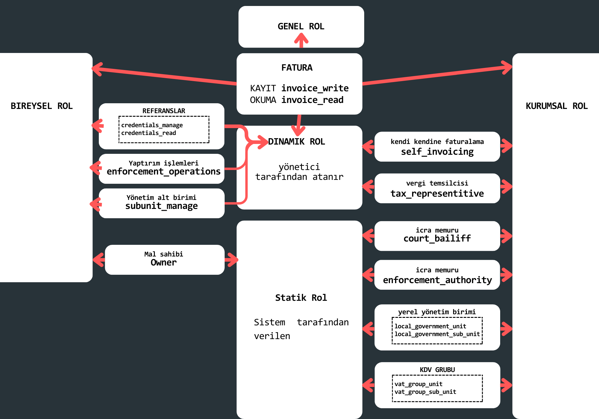

!> Bu izinler OpenAPI spesifikasyonlari altında components kısmına atanmış rollerdir. Örneğin aşağıda `components` altında kullanıcıya atanan bu rollerden `credentials_manage` kullanımı gösterilmiştir. 

```yaml
CredentialsRoleRequestContextBaseType:
      type: object
      properties:
        roleType:
          type: string
          enum:
          - credentials_manage
      required:
      - roleType
```

#### Roller ve açıklamaları:  <!-- {docsify-ignore} -->

- **Sahip** - **owner**, roller tarafından verilen tüm hakların kümesidir.
faturalar - okuma/yazma ve kimlik bilgileri - okuma/yönetme.
- **Faturalar** - **okuma/yazma** - `invoice_read`, `invoice_write` operasyonel roller, yetkilendirme
adı verilen işlevsellik - faturaların düzenlenmesi ve aranması.
- **Kimlik bilgileri** - **okuma/yönetme** - `credentials_read`, `credentials_manage` operasyonel roller,
işlevselliğin adına göre yetkilendirilmesi - kimlik bilgilerinin aranması ve yönetilmesi (verilmesi ve/veya iptal edilmesi).
- **Vergi temsilcisi** - `tax_representative`, tüm vergi temsilcilerinin kümesidir. **Fatura-okuma/yazma** rolleri tarafından verilen haklar, tüzel kişiye aşağıdaki işlemleri gerçekleştirme yetkisi verir
Yetkiyi veren tüzel kişi adına yukarıdaki işlemleri gerçekleştirir.
- **Kendi kendine faturalama** - `self_invoicing`, bir kuruluşa aşağıdaki durumlarda fatura düzenleme yetkisi verir. Yetkiyi veren tüzel kişi adına. **Faturalama - kayıt**.
- **Mübaşir** - `court_bailiff`, kuruma fatura düzenleme yetkisi verir. icra faturaları. Bu rol yalnızca icra işlemleri rolü ile birlikte çalışır.
- **İcra yetkisi** - `enforcement_authority` bayrak rolü, tüzel kişiye icra faturası düzenleme yetkisi verir. icra faturaları. Bu rol yalnızca icra operasyonları rolü ile birlikte çalışır. 
- **Yerel Yönetim Birimi - geçersiz kılma -** `local_government_unit` işaretleme rolü
kapsayıcı yerel yönetim birimini belirtir.
- **Yerel yönetim birimi - alt birim -** `local_government_sub_unit` bayrak rolü üst yerel yönetim birimi bağlamında alt yerel yönetim biriminin belirtilmesi yerel yönetim.
- **KDV(VAT) grubu - üst -** `vat_group_unit` üst KDV grubu birimini gösteren bayrak rolü.
- **KDV(VAT) grubu - alt -** `vat_group_sub_unit` grubun alt birimini gösteren bayrak rolü Üst KDV grup birimi bağlamında KDV.
- **Alt birim yönetimi** - `subunit_manage` atanabilen operasyonel bir rol yalnızca daha önce Yerel Yönetim Birimi olarak işaretlenmiş olan aynı bağlamda. Yerel Yönetim Birimi - üst veya KDV Grubu - üst.

<br>

### Protokoller 

İstemci sistemleri ile Sistem arasında veri aktarımı için bir protokol kullanılır. HTTP ve buna dayalı REST protokolü. İletişimin taşıma katmanının güvenliği TLS protokolüne dayanmaktadır.

#### HTTP - REST <!-- {docsify-ignore} -->

İletişim, REST mimarisinde, yani tek tip bir arayüz aracılığıyla durum bilgisi olmayan mesajların gönderilmesi yoluyla
gerçekleşir: HTTP yöntemi + bununla ilgili veriler, API'de belirtilen hizmet adresine. HTTP yöntemi, API verilerinin indirilip indirilmeyeceğini veya aranacağını (GET), değiştirileceğini, ekleneceği veya (PUT, POST, DELETE) verileri siliniyor. Hizmetler adres yolu kontrol parametrelerini kullanır, sorgu kontrol parametreleri ve veri akışları. HTTP yanıt durumuyla birlikte hizmetler biçimlendirilmiş verileri desteklenen biçimlerde döndürebilir.

**Örnek yanıt durumları:**

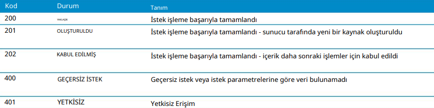

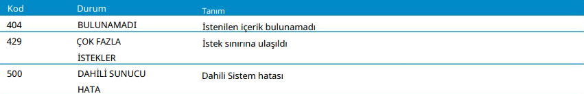

#### TLS <!-- {docsify-ignore} -->

Veri güvenliğini sağlamak için sistem, SSL protokolünün bir uzantısı olan TLS protokolünü kullanarak bağlantı
şifrelemesini zorunlu kılar. Sisteme duyulan güven, Sistemin etki alanını yetkilendirdiği ve şifreli bir oturum kurduğu genel,
nitelikli bir sertifikanın kullanılmasından kaynaklanır.

### Veri formatı

Sistem XML ve JSON metin veri formatlarını ve ikili veri akışını kullanır. `XSD` meta tanımının desteklediği `XML` metin formatı, verilerin sistematik bir şekilde aktarılmasına olanak tanır. 

?> Format ayrıca XAdES imza formatını da destekler.

#### XML Fatura Uygulaması <!-- {docsify-ignore} -->

> [XML fatura belgesini görüntülemek için tıklayın](http://crd.gov.pl/wzor/2023/06/29/12648/schemat.xsd)

Toplu gönderim sürecinin başlatılması için (döküman): `https://ksef.mf.gov.pl/schema/gtw/svc/batch/init/request/2021/10/01/0001/InitRequest`

API gateway:  `%environment_path %/schema/gtw/svc/batch/init/request/2021/10/01/0001/initRequest.xsd`

Etkileşimli bir oturumu başlatma (döküman): `https://ksef.mf.gov.pl/schema/gtw/svc/online/auth/request/2021/10/01/0001/InitSessionTokenRequest` ya da `https://ksef.mf.gov.pl/schema/gtw/svc/online/auth/request/2021/10/01/0001/InitSessionSignedRequest` 

API gateway: `%environment_path %/schema/gtw/svc/online/auth/request/2021/10/01/0001/authRequest.xsd`

> [JSON Fatura Uygulaması sisteminin genel giriş-çıkış iletişimi sorgusu (binary hariç) görüntülemek için tıklayın](#sistem-ortamı-environment_path)

#### Binary Fatura Uygulaması <!-- {docsify-ignore} -->

- Toplu sevkiyat sürecinin başlatılması (imzalı belge): `https://ksef.mf.gov.pl/schema/gtw/svc/batch/init/request/2021/10/01/0001/InitRequest`
API gateway: `%environment_path %/api/batch/Init`

- Etkileşimli bir oturumun başlatılması (belge): `https://ksef.mf.gov.pl/schema/gtw/svc/online/auth/request/2021/10/01/0001/InitSessionTokenRequest` veya imzalı belge `https://ksef.mf.gov.pl/schema/gtw/svc/online/auth/request/2021/10/01/0001/InitSessionSignedRequest`
API gateway: `%environment_path %/api/online/Session/InitSigned`, `%environment_path %/api/online/Session/InitToken`

- Bir toplu gönderim işleminde 'parçaların' gönderimi (bir zip arşivinin şifrelenmiş kısmı) API gateway: `%environment_path %/api/batch/Upload/{ReferenceNumber}/{PartName}`

- Etkileşimli bir oturumda fatura indirme (fatura belgesi) API gateway: `%environment_path %/api/online/Invoice/Get/{KSeFReferenceNumber}`

- Orijinal faturalara ilişkin arama sonuçlarını indirme (arama sonucunun şifrelenmiş kısmı) API gateway: `%environment_path%/api/online/Query/Invoice/Async/Fetch/{QueryElementReferenceNumber}/{PartElementReferenceNumber}` 


?> Sıkıştırma: Toplu sevkiyata tabi fatura paketleri önce paketleme ve sıkıştırma işlemine tabi tutulur. Şu anda izin verilen format
`ZIP`

!> Bu ve bu gibi `request` tabanlı etkileşimlerin hepsinin bulunduğu `yaml` formatlı OpenAPI konfigürasyonlarına [sistem ortamı](#sistem-ortamı-environment_path) bölümünden ulaşabilirsiniz.

# PEF 

E-fatura gönderilmesi, sipariş işleme sürecinde diğer belgelerin değişiminden önce yapılmalıdır veya ayrı bir faaliyet oluşturabilir. Faturalandırmalarda `UBL 2.1` sürümü kullanılmaktadır. Bu bölüm teknik bilgi içermektedir.
ve iki faturlandırmadaki 2 ana senaryodan oluşmaktadır:

- Tamamlanan hizmet sunumunun faturalanması.
- Tamamlanan mal teslimatının faturalanması.

<h5>
e-fatura Kullanım Senaryoları 1 - KDV dahil hizmetler için fatura
</h5>

Kullanım durumu, bir faturanın Satıcıdan Alıcıya aktarılmasına ilişkin basit bir senaryo ile ilgilidir. Fatura, KDV oranı da dahil olmak üzere asgari bilgi kümesini içerir.

> En basit durumda Satıcıdan Alıcıya fatura belgesi gönderilebilir ve tek KDV oranıyla hizmet sunumuna ilişkin olabilir. KDV bilgisi satır düzeyinde ve özetlerde belirtilir.

Aşağıdaki grafikte iki şirketin bahsi geçen ticaret senaryosu görselleştirilerek anlatılmak istenmiştir.

<swimlanes-io>
EDM Bilişim Sistemleri -> Lojistik ve Depolama Enstitüsü: ERP Cloudy Abonelik Faturası
Note: Hizmet bedeli için kesilen tek KDV oranlı fatura    

Lojistik ve Depolama Enstitüsü --> EDM Bilişim Sistemleri: **Feedback**
Note: Hizmet bedeli için kesilen faturada feedback olarak Onay veya Red olması durumu   

</swimlanes-io>

?> Satıcı (`AccountingSupplierParty` öğesi tarafından tanımlanır), Alıcı (`AcountingCustomerParty` öğesi tarafından tanımlanır)

?> Alıcı hizmeti alır ve siparişin yerine getirildiğini onaylar, Satıcı, Alıcıya periyodik bir fatura gönderir. Bu sırada:

1. Satıcı, Alıcının hizmet siparişini aldı.
2. Faturada şu bilgiler yer alıyor:
- tek KDV oranı
- belge düzeyinde ödenek (indirim)
- faturanın miktarı toplamı
- banka hesabı ve vade tarihi
- Sözleşme referansı 
- fatura dönemi (faturanın tamamı için)
3- Faturanın bir satırı şunları içerir
- Sipariş edilen hizmetin KDV dahil açıklaması
4- Fatura, minimum düzeyde kod ve kodlama şeması kullanan bir metin açıklamasına dayanmaktadır.

Sonuç olarak, 

> e-fatura mesajının/belgesinin kullanılması satıcıya aşağıdaki konularda destek olur: 
- Fatura oluşturma ve gönderme sürecinin otomatikleştirilmesi, 
- Değer ve miktar toplamlarının doğrulanması, 
- KDV hesaplamasının doğru olmasını sağlamak. 

> e-fatura mesajının/belgesinin kullanılması Alıcıya aşağıdaki konularda destek olur: 
- Faturanın sözleşmeye bağlanması 
- Fatura alma sürecinin otomasyonu
- Fatura işleme otomasyonu (kabul ve muhasebe süreçleri)

?> Bu senaryonun tüm XML dökümantasyonu [EKLER](#ekler) kısmında Ek-1 olarak belirtilmiştir.

<br>

<h5>
e-fatura Kullanım Senaryoları 2 - tamamlanan mal teslimatının faturalanması
</h5>

Kullanım durumu, bir faturanın Satıcıdan Alıcıya aktarılmasına ilişkin basit bir senaryo ile ilgilidir. Fatura, iki KDV oranı dahil olmak üzere minimum bilgi kümesini içerir.

> En basit durumda Satıcıdan Alıcıya fatura belgesi gönderilebilir ve malın iki KDV oranıyla teslimine ilişkin olabilir. KDV bilgisi belge ve belirli satırlar düzeyinde belirtilir.

Aşağıdaki grafikte iki şirketin bahsi geçen ticaret senaryosu görselleştirilerek anlatılmak istenmiştir.

<swimlanes-io>
Lojistik ve Depolama Enstitüsü -> EDM Bilişim Sistemleri: toplu Bilgisayar klavyesi satışı için faturalandırma
Note: Mal bedeli için kesilen iki KDV oranlı fatura    

EDM Bilişim Sistemleri --> Lojistik ve Depolama Enstitüsü: **Feedback**
Note: Mal bedeli için kesilen faturada feedback olarak Onay veya Red olması durumu   

</swimlanes-io>

?> Satıcı ( `AccountingSupplierParty` öğesi tarafından tanımlanır) Alıcı ( `AccountingCustomerParty` öğesi tarafından tanımlanır)

?> Alıcı hizmeti alır ve siparişin yerine getirildiğini onaylar, Satıcı, Alıcıya periyodik bir fatura gönderir. Bu sırada:

1. Satıcı, Alıcının iki tür malın tesliminin siparişini aldı ve yerine getirdi.
2. Fatura aşağıdaki bilgileri içerir:
- iki KDV oranı, 
- Faturanın miktar ve değerinin toplamı 
- Banka hesabı ve ödeme tarihi
- sözleşme referansı
- fatura dönemi (faturanın tamamı için)
3. Sipariş edilen ürünlerin KDV dahil tanımları, adetleri ve birim fiyatlarını içeren iki satırlık bir fatura tanımlandı.
4. Fatura, minimum düzeyde kod ve kodlama şeması kullanan bir metin açıklamasına dayanmaktadır.

Sonuç olarak,

> e-fatura mesajının/belgesinin kullanılması Satıcıya aşağıdaki konularda destek olur: 
- Fatura oluşturma ve gönderme sürecinin otomatikleştirilmesi 
- Değer ve miktar toplamlarının doğrulanması 
- KDV hesaplamasının doğru olmasını sağlamak. 

> e-fatura mesajının/belgesinin kullanılması Alıcıya aşağıdaki konularda destek olur: 
- Faturanın sözleşmeye bağlanması 
- Fatura alma sürecinin otomasyonu
- fatura işleme otomasyonu (kabul ve muhasebe süreçleri)

?> Bu senaryonun tüm XML dökümantasyonu [EKLER](#ekler) kısmında Ek-2 olarak belirtilmiştir.

<h4>Yapının ve veri öğelerinin açıklaması</h4>

Bir fatura belgesinin başlangıcında, aşağıdaki şekilde tanımlanan bir dizi kimlik verisi bulunur

```XML
<cbc:CustomizationID>
urn:cen.eu:en16931:2017#compliant#urn:fdc:peppol.eu:2017:poacc:billing:3.0
</cbc:CustomizationID>
<cbc:ProfileID>urn:fdc:peppol.eu:2017:poacc:billing:01:1.0</cbc:ProfileID> 
<cbc:ID>INVOICE_PEF_1.0</cbc:ID> 
<cbc:IssueDate>2018-03-23</cbc:IssueDate>
<cbc:DueDate>2018-03-23</cbc:DueDate> 
<cbc:InvoiceTypeCode>380</cbc:InvoiceTypeCode> 
<cbc:Note>sicil mahkemesi, kurucu sermaye, işletme sermayesi</cbc:Note>
<cbc:TaxPointDate>2018-03-23</cbc:TaxPointDate> 
<cbc:DocumentCurrencyCode>PLN</cbc:DocumentCurrencyCode> 
<cbc:TaxCurrencyCode>EUR</cbc:TaxCurrencyCode> 
<cbc:AccountingCost>maliyetler 123</cbc:AccountingCost> 
<cbc:BuyerReference>aaa123</cbc:BuyerReference> 
<cac:InvoicePeriod>
<cbc:StartDate>2018-03-01</cbc:StartDate> 
<cbc:EndDate>2018-03-15</cbc:EndDate> 
<cbc:DescriptionCode>35</cbc:DescriptionCode> 
</cac:InvoicePeriod>
```

?> Yukarıda belirtilen elementler ve tanımları

- `CustomizationID` **Mesaj sürümü** spesifikasyon verilerinin uyduğu anlamsal içerik, veri gereksinimleri ve iş kurallarına ilişkin kuralların tam bir açıklamasını içeren spesifikasyonun versiyon 
tanımlayıcısıdır
- `ProfileID` **profil tanımlayıcı** belge tarafından gerçekleştirilen iş sürecinin tanımlayıcısı, burada: faturalama
- `ID` **fatura numarası** faturayı benzersiz bir şekilde tanımlamak için gereken, 2016/112/AB sayılı Direktifin 226(2) Maddesi gerekliliklerine uygun olarak benzersiz, ardışık bir fatura numarası
- `IssueDate` faturanın düzenlenme tarihi
- `DueDate` son ödeme tarihi
- `InvoiceTypeCode` fatura türü tanımlayıcı
- `Note` faturaya ilişkin metinsel açıklamalar - ör. kayıt verileri, ayrılma bilgileri
- `TaxPointDate` faturanın düzenlenme tarihinden farklı ise vergi yükümlülüğünün doğduğu tarih
- `DocumentCurrencyCode` fatura para birimi kodu
- `TaxCurrencyCode` KDV para birimi kodu
- `AccountingCost` muhasebe referans numarası (maliyet kalemi)
- `BuyerReference` alıcı referansı - alıcının dahili amaçlarına yönelik bilgiler
- `InvoicePeriod` tarih tanılama elementi
- `StartDate` fatura döneminin başlangıç tarihi
- `EndDate` fatura döneminin bitiş tarihi
- `DescriptionCode` vergi hesaplama tarihi kodu (UNTDID 2005'e göre)

<h4>Faturayla ilgili belgelere yapılan atıflar</h4>

- Satın alma sipariş numarası 
- Sözleşme numarası 
- Gönderim tavsiye numarası 
- Makbuz numarasının teyidi 
- Satıcıya göre sipariş numarası 
- Teslimat programının numarası 
- Spesifikasyon numarası (ek ürün açıklamasının)

İlgili dokümanların fatura dokümanına ek olarak gösterilmesi mümkündür.

```XML
<cac:OrderReference>
	<cbc:ID>123</cbc:ID> (1)

	<cbc:SalesOrderID>O12345</cbc:SalesOrderID> (2)

</cac:OrderReference>
<cac:BillingReference>
	<cac:InvoiceDocumentReference>
		<cbc:ID>1234</cbc:ID> (3)

		<cbc:IssueDate>2017-06-04</cbc:IssueDate> (4)

	</cac:InvoiceDocumentReference>
</cac:BillingReference>
<cac:DespatchDocumentReference>
	<cbc:ID>1234</cbc:ID> (5)

</cac:DespatchDocumentReference>
<cac:ReceiptDocumentReference>
	<cbc:ID>1234</cbc:ID> (6)

</cac:ReceiptDocumentReference>
<cac:OriginatorDocumentReference>
	<cbc:ID>1234</cbc:ID> (7)

</cac:OriginatorDocumentReference>
<cac:ContractDocumentReference>
	<cbc:ID>Contract321</cbc:ID> (8)

</cac:ContractDocumentReference>
<cac:AdditionalDocumentReference>
	<cbc:ID schemeID=" "
3>1234</cbc:ID> (9)

	<cbc:DocumentTypeCode>270</cbc:DocumentTypeCode> (10)

	<cbc:DocumentDescription> Delivery note </cbc:DocumentDescription> (11)

</cac:AdditionalDocumentReference>
<cac:ProjectReference>
	<cbc:ID>Proj1234</cbc:ID> (12)

</cac:ProjectReference>
```

?> Yukarıda belirtilen elementler ve tanımları

- `OrderReference` `ID` sipariş tanımlayıcı (sayı) 
- `SalesOrderID`  Satıcıya göre sipariş numarası 
- `InvoiceDocumentReference` `ID` önceki faturanın numarası (atıfta bulunulan/ilişkili) 
- `IssueDate` önceki faturanın tarihi (atıfta bulunulan/ilgili) 
- `DespatchDocumentReference` `ID`sevk ihbar belgesinin numarası 
- `ReceiptDocumentReference` `ID`alımı teyit eden belgenin numarası 
- `OriginatorDocumentReference` `ID`bir kamu sözleşmesinin veya faturanın ilgili olduğu bir kısmının yapılmasına ilişkin ihale davet mektubunun numarası/imzası 
- `ContractDocumentReference` `ID` sözleşme numarası 
- teslimatı belgeleyen diğer belge sayısı ve belge tanımlama şemasının tanımlayıcısı 
- `DocumentTypeCode` belge türü kodu (9. öğede belirtilmiştir)
- `DocumentDescription` belge türünün metinsel açıklaması 
- `ProjectReference` `ID`faturanın ilgili olduğu projenin tanımlayıcısı

<h5>Referanslar</h5>

- [Şuanki PEPPOL BIS 3.0 faturalandırma sürümü - 3.0.9](https://docs.peppol.eu/poacc/billing/3.0/)

- [e-faturanın bilgi unsurlarının tam listesi ve bunların nitelikleri bu adreste bulunabilir](https://docs.peppol.eu/poacc/billing/3.0/syntax/ubl-invoice/tree/)

- [`Namespace`'lerin açıklamalarına bu linkten ulaşılabilir](https://docs.oasis-open.org/ubl/os-UBL-2.1/xsd/maindoc/UBL-Invoice-2.1.xsd) 

# Ekler 

### KSeF EK-1 API <!-- {docsify-ignore} -->

> Kimlik doğrulama gerektirmeden Sisteme erişimi sağlayan genel işlemler için **API endpointler** [swagger editörde görüntülemek için tıklayınız](https://editor-next.swagger.io/) 

```yaml
openapi: 3.0.1
info:
  contact:
    email: info.ksef@mf.gov.pl
    name: Info
    url: https://ksef.mf.gov.pl
  description: Krajowy System e-Faktur
  title: KSeF
  version: 2.0.4
externalDocs:
  description: Dökümantasyon
  url: https://www.gov.pl/web/kas/krajowy-system-e-faktur
servers:
- description: Üretim ortamı
  url: https://ksef.mf.gov.pl/api
  variables: {}
- description: Gösteri ortamı
  url: https://ksef-demo.mf.gov.pl/api
  variables: {}
- description: Test ortamı
  url: https://ksef-test.mf.gov.pl/api
  variables: {}
tags:
- description: Ulusal e-Fatura Sistemi
  externalDocs:
    description: Ulusal e-Fatura Sistemi
    url: https://ksef.mf.gov.pl
  name: KSeF
paths:
  /common/Invoice/KSeF:
    post:
      description: KSeF havuzundan bir faturanın aşağıdaki kriterlere dayalı olarak alınması
        KSeF numarasına göre
      operationId: common.invoice.ksef
      requestBody:
        content:
          application/json:
            schema:
              $ref: '#/components/schemas/InvoiceRequestKSeF'
        required: true
      responses:
        "200":
          content:
            application/octet-stream:
              schema:
                type: object
          description: OK
        "400":
          content:
            application/json:
              schema:
                $ref: '#/components/schemas/ExceptionResponse'
          description: Yanlış arama
        "404":
          content:
            application/json: {}
          description: Aranan içerik bulunamadı
      summary: KSeF havuzundan bir fatura indirme - KSeF numarasına dayalı kriterler
      tags:
      - Ortak arayüzler - fatura indirme
  /common/Status/{ReferenceNumber}:
    get:
      description: Toplu işlem durumunu kontrol etme
      operationId: common.status
      parameters:
      - in: path
        name: ReferenceNumber
        required: true
        schema:
          type: string
          pattern: "(20[2-9][0-9]|2[1-9][0-9]{2}|[3-9][0-9]{3})(0[1-9]|1[0-2])(0[1-9]|[1-2][0-9]|3[0-1])-([0-9A-Z]{2})-([0-9A-F]{10})-([0-9A-F]{10})-([0-9A-F]{2})"
      responses:
        "200":
          content:
            application/json:
              schema:
                $ref: '#/components/schemas/StatusResponse'
            application/vnd.v3+json:
              schema:
                $ref: '#/components/schemas/V3_StatusResponse'
          description: OK
        "400":
          content:
            application/json:
              schema:
                $ref: '#/components/schemas/ExceptionResponse'
          description: Yanlış arama
      summary: Toplu işlem durumunu indirmek için ortak arayüz
      tags:
      - Ortak arayüzler - status
  /common/Upo/{ReferenceNumber}/{UpoReferenceNumber}:
    get:
      description: UPO'yu İndirme
      operationId: common.upo
      parameters:
      - in: path
        name: ReferenceNumber
        required: true
        schema:
          type: string
          pattern: "(20[2-9][0-9]|2[1-9][0-9]{2}|[3-9][0-9]{3})(0[1-9]|1[0-2])(0[1-9]|[1-2][0-9]|3[0-1])-([0-9A-Z]{2})-([0-9A-F]{10})-([0-9A-F]{10})-([0-9A-F]{2})"
      - in: path
        name: UpoReferenceNumber
        required: true
        schema:
          type: string
          pattern: "(20[2-9][0-9]|2[1-9][0-9]{2}|[3-9][0-9]{3})(0[1-9]|1[0-2])(0[1-9]|[1-2][0-9]|3[0-1])-([0-9A-Z]{2})-([0-9A-F]{10})-([0-9A-F]{10})-([0-9A-F]{2})"
      responses:
        "200":
          content:
            application/vnd.v3+octet-stream:
              schema:
                type: object
          description: OK
        "400":
          content:
            application/json:
              schema:
                $ref: '#/components/schemas/ExceptionResponse'
          description: Yanlış arama
        "404":
          content:
            application/json: {}
          description: Aranan içerik bulunamadı
      summary: UPO ortak indirme arayüzü
      tags:
      - Ortak arayüzler - UPO
components:
  schemas:
    AnonymousSubjectIdentifierToCompanyType:
      type: object
      allOf:
      - $ref: '#/components/schemas/AnonymousSubjectIdentifierToType'
      - type: object
        properties:
          identifier:
            type: string
            pattern: "[1-9]((\\d[1-9])|([1-9]\\d))\\d{7}"
      required:
      - identifier
    AnonymousSubjectIdentifierToNoneType:
      type: object
      allOf:
      - $ref: '#/components/schemas/AnonymousSubjectIdentifierToType'
    AnonymousSubjectIdentifierToOtherTaxType:
      type: object
      allOf:
      - $ref: '#/components/schemas/AnonymousSubjectIdentifierToType'
      - type: object
        properties:
          identifier:
            type: string
            maxLength: 50
            minLength: 1
      required:
      - identifier
    AnonymousSubjectIdentifierToType:
      type: object
      discriminator:
        mapping:
          none: '#/components/schemas/AnonymousSubjectIdentifierToNoneType'
          onip: '#/components/schemas/AnonymousSubjectIdentifierToCompanyType'
          other: '#/components/schemas/AnonymousSubjectIdentifierToOtherTaxType'
        propertyName: type
      properties:
        type:
          type: string
      required:
      - type
    AnonymousSubjectToType:
      type: object
      properties:
        issuedToIdentifier:
          $ref: '#/components/schemas/AnonymousSubjectIdentifierToType'
        issuedToName:
          $ref: '#/components/schemas/SubjectNameType'
      required:
      - issuedToIdentifier
      - issuedToName
    ExceptionDetailType:
      type: object
      properties:
        exceptionCode:
          type: integer
          format: int32
          minimum: 0
        exceptionDescription:
          type: string
          maxLength: 256
          minLength: 1
      required:
      - exceptionCode
      - exceptionDescription
    ExceptionResponse:
      type: object
      properties:
        exception:
          $ref: '#/components/schemas/ExceptionType'
      required:
      - exception
    ExceptionType:
      type: object
      properties:
        exceptionDetailList:
          type: array
          items:
            $ref: '#/components/schemas/ExceptionDetailType'
          maxItems: 100
          minItems: 1
        referenceNumber:
          type: string
          pattern: "(20[2-9][0-9]|2[1-9][0-9]{2}|[3-9][0-9]{3})(0[1-9]|1[0-2])(0[1-9]|[1-2][0-9]|3[0-1])-([0-9A-Z]{2})-([0-9A-F]{10})-([0-9A-F]{10})-([0-9A-F]{2})"
        serviceCode:
          type: string
          maxLength: 64
          minLength: 1
        serviceCtx:
          type: string
          maxLength: 64
          minLength: 1
        serviceName:
          type: string
          maxLength: 64
          minLength: 1
        timestamp:
          type: string
          format: date-time
      required:
      - exceptionDetailList
      - serviceCode
      - serviceCtx
      - serviceName
      - timestamp
    InvoiceQueryDetailsType:
      type: object
      properties:
        dueValue:
          type: string
          pattern: "(\\-)?\\d{1,10}(\\.\\d{2})?"
        invoiceOryginalNumber:
          type: string
          maxLength: 256
          minLength: 1
        subjectTo:
          $ref: '#/components/schemas/AnonymousSubjectToType'
      required:
      - dueValue
      - invoiceOryginalNumber
      - subjectTo
    InvoiceRequestKSeF:
      type: object
      properties:
        invoiceDetails:
          $ref: '#/components/schemas/InvoiceQueryDetailsType'
        ksefReferenceNumber:
          type: string
          pattern: "([1-9]((\\d[1-9])|([1-9]\\d))\\d{7}|M\\d{9}|[A-Z]{3}\\d{7})-(20[2-9][0-9]|2[1-9][0-9]{2}|[3-9][0-9]{3})(0[1-9]|1[0-2])(0[1-9]|[1-2][0-9]|3[0-1])-([0-9A-F]{6})-?([0-9A-F]{6})-([0-9A-F]{2})"
      required:
      - invoiceDetails
      - ksefReferenceNumber
    StatusResponse:
      type: object
      properties:
        processingCode:
          type: integer
          format: int32
          maximum: 999
          minimum: 100
        processingDescription:
          type: string
          maxLength: 256
          minLength: 1
        referenceNumber:
          type: string
          pattern: "(20[2-9][0-9]|2[1-9][0-9]{2}|[3-9][0-9]{3})(0[1-9]|1[0-2])(0[1-9]|[1-2][0-9]|3[0-1])-([0-9A-Z]{2})-([0-9A-F]{10})-([0-9A-F]{10})-([0-9A-F]{2})"
        timestamp:
          type: string
          format: date-time
        upo:
          type: string
          format: binary
      required:
      - processingCode
      - processingDescription
      - referenceNumber
      - timestamp
    SubjectFullNameType:
      type: object
      allOf:
      - $ref: '#/components/schemas/SubjectNameType'
      - type: object
        properties:
          fullName:
            type: string
            maxLength: 256
            minLength: 1
      required:
      - fullName
    SubjectNameType:
      type: object
      discriminator:
        mapping:
          fn: '#/components/schemas/SubjectFullNameType'
          none: '#/components/schemas/SubjectNoneType'
          pn: '#/components/schemas/SubjectPersonNameType'
        propertyName: type
      properties:
        tradeName:
          type: string
          maxLength: 256
          minLength: 1
          nullable: true
        type:
          type: string
      required:
      - type
    SubjectNoneType:
      type: object
      allOf:
      - $ref: '#/components/schemas/SubjectNameType'
    SubjectPersonNameType:
      type: object
      allOf:
      - $ref: '#/components/schemas/SubjectNameType'
      - type: object
        properties:
          firstName:
            type: string
            maxLength: 30
            minLength: 1
          surname:
            type: string
            maxLength: 81
            minLength: 1
      required:
      - firstName
      - surname
    V3_StatusResponse:
      type: object
      properties:
        processingCode:
          type: integer
          format: int32
          maximum: 999
          minimum: 100
        processingDescription:
          type: string
          maxLength: 256
          minLength: 1
        referenceNumber:
          type: string
          pattern: "(20[2-9][0-9]|2[1-9][0-9]{2}|[3-9][0-9]{3})(0[1-9]|1[0-2])(0[1-9]|[1-2][0-9]|3[0-1])-([0-9A-Z]{2})-([0-9A-F]{10})-([0-9A-F]{10})-([0-9A-F]{2})"
        timestamp:
          type: string
          format: date-time
        upoReferenceNumber:
          type: string
          pattern: "(20[2-9][0-9]|2[1-9][0-9]{2}|[3-9][0-9]{3})(0[1-9]|1[0-2])(0[1-9]|[1-2][0-9]|3[0-1])-([0-9A-Z]{2})-([0-9A-F]{10})-([0-9A-F]{10})-([0-9A-F]{2})"
        upoUrl:
          type: string
          maxLength: 512
          minLength: 1
          pattern: "http[s]?:\\/{2}([0-9a-z][0-9a-z_-]*\\.)+[0-9a-z][0-9a-z_-]*(([0-9a-zA-Z][0-9a-zA-Z_-]*\\\
            .?)*\\/?)*"
      required:
      - processingCode
      - processingDescription
      - referenceNumber
      - timestamp
```

### KSeF EK-2 API <!-- {docsify-ignore} -->

>  Aynı anda birçok fatura düzenlemenize olanak tanıyan bir dizi işlemden oluşan toplu gönderim **API endpointler** [swagger editörde görüntülemek için tıklayınız](https://editor-next.swagger.io/) 

```yaml
openapi: 3.0.1
info:
  contact:
    email: info.ksef@mf.gov.pl
    name: Info
    url: https://ksef.mf.gov.pl
  description: Krajowy System e-Faktur
  title: KSeF
  version: 2.0.0
externalDocs:
  description: Dökümantasyon
  url: https://www.gov.pl/web/kas/krajowy-system-e-faktur
servers:
- description: Üretim ortamı
  url: https://ksef.mf.gov.pl/api
  variables: {}
- description: Demonstrasyon ortamı
  url: https://ksef-demo.mf.gov.pl/api
  variables: {}
- description: Test Ortamı
  url: https://ksef-test.mf.gov.pl/api
  variables: {}
tags:
- description: Krajowy System e-Faktur
  externalDocs:
    description: Ulusal e-Fatura Sistemi
    url: https://ksef.mf.gov.pl
  name: KSeF
paths:
  /batch/Finish:
    post:
      description: Toplu fatura gönderiminin sonuçlandırılması
      operationId: batch.finish
      requestBody:
        content:
          application/json:
            schema:
              $ref: '#/components/schemas/FinishRequest'
        required: true
      responses:
        "200":
          content:
            application/json:
              schema:
                $ref: '#/components/schemas/FinishResponse'
          description: Fatura toplu gönderimi sonlandırması doğru
        "400":
          content:
            application/json:
              schema:
                $ref: '#/components/schemas/ExceptionResponse'
          description: Yanlış arama
      summary: Fatura paketinin KSeF'ye toplu gönderimi - sonuçlandırma
      tags:
      - Toplu gönderim
  /batch/Init:
    post:
      description: Fatura paketinin toplu sevkiyatının başlatılması. İmzalı belge
        http://ksef.mf.gov.pl/schema/gtw/svc/batch/init/request/2021/10/01/0001/InitRequest
      operationId: batch.init
      requestBody:
        content:
          application/octet-stream:
            schema:
              type: string
              format: binary
        required: true
      responses:
        "201":
          content:
            application/json:
              schema:
                $ref: '#/components/schemas/InitResponse'
          description: Fatura toplu gönderimi başlatma doğru
        "400":
          content:
            application/json:
              schema:
                $ref: '#/components/schemas/ExceptionResponse'
          description: Yanlış arama
      summary: Bir grup faturanın KSeF'e toplu olarak gönderilmesi - başlatma
      tags:
      - Toplu gönderim
  /batch/Upload/{ReferenceNumber}/{PartName}:
    put:
      description: Paketin şifrelenmiş kısımlarının yüklenmesi
      operationId: batch.upload
      parameters:
      - in: path
        name: ReferenceNumber
        required: true
        schema:
          type: string
      - in: path
        name: PartName
        required: true
        schema:
          type: string
      requestBody:
        content:
          application/octet-stream:
            schema:
              type: string
              format: binary
        description: içinde bildirilen simetrik anahtar ile paketin şifrelenmiş kısmı.
          Başlangıç belgesinde
        required: true
      responses:
        "201":
          content:
            application/json:
              schema:
                $ref: '#/components/schemas/UploadResponse'
          description: Paketin bir kısmını doğru yükleme
        "400":
          content:
            application/json:
              schema:
                $ref: '#/components/schemas/ExceptionResponse'
          description: Yanlış arama
      summary: Bir grup faturanın KSeF'e toplu olarak gönderilmesi - bir grubun bir kısmının yüklenmesi
      tags:
      - Toplu gönderim
components:
  schemas:
    ExceptionDetailType:
      type: object
      properties:
        exceptionCode:
          type: integer
          format: int32
          minimum: 0
        exceptionDescription:
          type: string
          maxLength: 256
          minLength: 1
      required:
      - exceptionCode
      - exceptionDescription
    ExceptionResponse:
      type: object
      properties:
        exception:
          $ref: '#/components/schemas/ExceptionType'
      required:
      - exception
    ExceptionType:
      type: object
      properties:
        exceptionDetailList:
          type: array
          items:
            $ref: '#/components/schemas/ExceptionDetailType'
          maxItems: 100
          minItems: 1
        referenceNumber:
          type: string
          pattern: "(20[2-9][0-9]|2[1-9][0-9]{2}|[3-9][0-9]{3})(0[1-9]|1[0-2])(0[1-9]|[1-2][0-9]|3[0-1])-([0-9A-Z]{2})-([0-9A-F]{10})-([0-9A-F]{10})-([0-9A-F]{2})"
        serviceCode:
          type: string
          maxLength: 64
          minLength: 1
        serviceCtx:
          type: string
          maxLength: 64
          minLength: 1
        serviceName:
          type: string
          maxLength: 64
          minLength: 1
        timestamp:
          type: string
          format: date-time
      required:
      - exceptionDetailList
      - serviceCode
      - serviceCtx
      - serviceName
      - timestamp
    FinishRequest:
      type: object
      properties:
        referenceNumber:
          type: string
          pattern: "(20[2-9][0-9]|2[1-9][0-9]{2}|[3-9][0-9]{3})(0[1-9]|1[0-2])(0[1-9]|[1-2][0-9]|3[0-1])-([0-9A-Z]{2})-([0-9A-F]{10})-([0-9A-F]{10})-([0-9A-F]{2})"
      required:
      - referenceNumber
    FinishResponse:
      type: object
      properties:
        referenceNumber:
          type: string
          pattern: "(20[2-9][0-9]|2[1-9][0-9]{2}|[3-9][0-9]{3})(0[1-9]|1[0-2])(0[1-9]|[1-2][0-9]|3[0-1])-([0-9A-Z]{2})-([0-9A-F]{10})-([0-9A-F]{10})-([0-9A-F]{2})"
        timestamp:
          type: string
          format: date-time
      required:
      - referenceNumber
      - timestamp
    HeaderEntryType:
      type: object
      properties:
        key:
          type: string
          maxLength: 64
          minLength: 1
        value:
          type: string
          maxLength: 128
          minLength: 1
      required:
      - key
      - value
    InitResponse:
      type: object
      properties:
        packageSignature:
          $ref: '#/components/schemas/PackageSignatureInitResponseType'
        referenceNumber:
          type: string
          pattern: "(20[2-9][0-9]|2[1-9][0-9]{2}|[3-9][0-9]{3})(0[1-9]|1[0-2])(0[1-9]|[1-2][0-9]|3[0-1])-([0-9A-Z]{2})-([0-9A-F]{10})-([0-9A-F]{10})-([0-9A-F]{2})"
        timestamp:
          type: string
          format: date-time
      required:
      - packageSignature
      - referenceNumber
      - timestamp
    PackagePartSignatureInitResponseType:
      type: object
      properties:
        headerEntryList:
          type: array
          items:
            $ref: '#/components/schemas/HeaderEntryType'
          maxItems: 100
          minItems: 1
          uniqueItems: true
        method:
          type: string
          enum:
          - POST
          - PUT
        ordinalNumber:
          type: integer
          format: int32
          minimum: 0
        partFileName:
          type: string
          pattern: "[a-zA-Z0-9_\\.\\-]{5,100}"
        url:
          type: string
          maxLength: 512
          minLength: 1
          pattern: "http[s]?:\\/{2}([0-9a-z][0-9a-z_-]*\\.)+[0-9a-z][0-9a-z_-]*(([0-9a-zA-Z][0-9a-zA-Z_-]*\\\
            .?)*\\/?)*"
      required:
      - method
      - ordinalNumber
      - partFileName
      - url
    PackageSignatureInitResponseType:
      type: object
      properties:
        packageName:
          type: string
          pattern: "[a-zA-Z0-9_\\.\\-]{5,100}"
        packagePartSignatureList:
          type: array
          items:
            $ref: '#/components/schemas/PackagePartSignatureInitResponseType'
          maxItems: 100
          minItems: 1
          uniqueItems: true
      required:
      - packageName
      - packagePartSignatureList
    UploadResponse:
      type: object
      properties:
        referenceNumber:
          type: string
          pattern: "(20[2-9][0-9]|2[1-9][0-9]{2}|[3-9][0-9]{3})(0[1-9]|1[0-2])(0[1-9]|[1-2][0-9]|3[0-1])-([0-9A-Z]{2})-([0-9A-F]{10})-([0-9A-F]{10})-([0-9A-F]{2})"
        timestamp:
          type: string
          format: date-time
      required:
      - referenceNumber
      - timestamp
```

### KSeF EK-3 API <!-- {docsify-ignore} -->

> Kimlik bilgisi yönetimi, hızlı teslimat, faturaları arama ve bunlara erişme **API endpointler** [swagger editörde görüntülemek için tıklayınız](https://editor-next.swagger.io/)

```YAML
openapi: 3.0.1
info:
  contact:
    email: info.ksef@mf.gov.pl
    name: Info
    url: https://ksef.mf.gov.pl
  description: Krajowy System e-Faktur
  title: KSeF
  version: 2.0.4
externalDocs:
  description: Dokümantasyon
  url: https://www.gov.pl/web/kas/krajowy-system-e-faktur
servers:
- description: Üretim ortamı
  url: https://ksef.mf.gov.pl/api
  variables: {}
- description: Gösteri ortamı
  url: https://ksef-demo.mf.gov.pl/api
  variables: {}
- description: Test ortamı
  url: https://ksef-test.mf.gov.pl/api
  variables: {}
tags:
- description: Krajowy System e-Faktur
  externalDocs:
    description: Ulusal e-Fatura Sistemi
    url: https://ksef.mf.gov.pl
  name: KSeF
paths:
  /online/Credentials/ContextGrant:
    post:
      description: Bağlamsal kimlik bilgileri atama
      operationId: online.credentials.credentials.context.grant
      requestBody:
        content:
          application/json:
            schema:
              $ref: '#/components/schemas/GrantContextCredentialsRequest'
        required: true
      responses:
        "202":
          content:
            application/json:
              schema:
                $ref: '#/components/schemas/StatusCredentialsResponse'
          description: Veriler kaydedildi
        "400":
          content:
            application/json:
              schema:
                $ref: '#/components/schemas/ExceptionResponse'
          description: Veri bulunamadı
        "401":
          content:
            application/json:
              schema:
                $ref: '#/components/schemas/ExceptionResponse'
          description: Yetkisiz erişim
        "404":
          content:
            application/json: {}
          description: Aranan içerik bulunamadı
      security:
      - SessionToken: []
      summary: Bağlamsal kimlik bilgileri atama
      tags:
      - Etkileşimli arayüzler - Sertifikalar
  /online/Credentials/ContextRevoke:
    post:
      description: Bağlamsal kimlik bilgilerinin alınması
      operationId: online.credentials.credentials.context.revoke
      requestBody:
        content:
          application/json:
            schema:
              $ref: '#/components/schemas/RevokeContextCredentialsRequest'
        required: true
      responses:
        "202":
          content:
            application/json:
              schema:
                $ref: '#/components/schemas/StatusCredentialsResponse'
          description: Veriler kaydedildi
        "400":
          content:
            application/json:
              schema:
                $ref: '#/components/schemas/ExceptionResponse'
          description: Veri bulunamadı
        "401":
          content:
            application/json:
              schema:
                $ref: '#/components/schemas/ExceptionResponse'
          description: Yetkisiz erişim
        "404":
          content:
            application/json: {}
          description: Aranan içerik bulunamadı
      security:
      - SessionToken: []
      summary: Bağlamsal kimlik bilgilerinin alınması
      tags:
      - Etkileşimli arayüzler - Sertifikalar
  /online/Credentials/GenerateToken:
    post:
      description: Yetkilendirme belirtecinin oluşturulması
      operationId: online.credentials.generate.token
      requestBody:
        content:
          application/json:
            schema:
              $ref: '#/components/schemas/GenerateTokenRequest'
        required: true
      responses:
        "200":
          content:
            application/json:
              schema:
                $ref: '#/components/schemas/GenerateTokenResponse'
          description: Veriler kaydedildi
        "400":
          content:
            application/json:
              schema:
                $ref: '#/components/schemas/ExceptionResponse'
          description: Veri bulunamadı
        "401":
          content:
            application/json:
              schema:
                $ref: '#/components/schemas/ExceptionResponse'
          description: Yetkisiz erişim
        "404":
          content:
            application/json: {}
          description: Aranan içerik bulunamadı
      security:
      - SessionToken: []
      summary: Yetkilendirme belirtecinin oluşturulması
      tags:
      - Etkileşimli arayüzler - Sertifikalar
  /online/Credentials/Grant:
    post:
      description: Sertifikaların tahsisi
      operationId: online.credentials.credentials.grant
      requestBody:
        content:
          application/json:
            schema:
              $ref: '#/components/schemas/GrantCredentialsRequest'
        required: true
      responses:
        "202":
          content:
            application/json:
              schema:
                $ref: '#/components/schemas/StatusCredentialsResponse'
          description: Veriler kaydedildi
        "400":
          content:
            application/json:
              schema:
                $ref: '#/components/schemas/ExceptionResponse'
          description: Veri bulunamadı
        "401":
          content:
            application/json:
              schema:
                $ref: '#/components/schemas/ExceptionResponse'
          description: Yetkisiz erişim
        "404":
          content:
            application/json: {}
          description: Aranan içerik bulunamadı
      security:
      - SessionToken: []
      summary: Sertifikaların tahsisi
      tags:
      - Etkileşimli arayüzler - Sertifikalar
  /online/Credentials/Revoke:
    post:
      description: Sertifikaların alınması
      operationId: online.credentials.credentials.revoke
      requestBody:
        content:
          application/json:
            schema:
              $ref: '#/components/schemas/RevokeCredentialsRequest'
        required: true
      responses:
        "202":
          content:
            application/json:
              schema:
                $ref: '#/components/schemas/StatusCredentialsResponse'
          description: Veriler kaydedildi
        "400":
          content:
            application/json:
              schema:
                $ref: '#/components/schemas/ExceptionResponse'
          description: Veri bulunamadı
        "401":
          content:
            application/json:
              schema:
                $ref: '#/components/schemas/ExceptionResponse'
          description: Yetkisiz erişim
        "404":
          content:
            application/json: {}
          description: Aranan içerik bulunamadı
      security:
      - SessionToken: []
      summary: Sertifikaların alınması
      tags:
      - Etkileşimli arayüzler - Sertifikalar
  /online/Credentials/RevokeToken:
    post:
      description: Yetkilendirme belirtecinin silinmesi
      operationId: online.credentials.revoke.token
      requestBody:
        content:
          application/json:
            schema:
              $ref: '#/components/schemas/RevokeTokenRequest'
          application/vnd.v2+json:
            schema:
              $ref: '#/components/schemas/V2_RevokeTokenRequest'
        required: true
      responses:
        "202":
          content:
            application/json:
              schema:
                $ref: '#/components/schemas/StatusCredentialsResponse'
            application/vnd.v2+json:
              schema:
                $ref: '#/components/schemas/V2_RevokeTokenResponse'
          description: Veriler kaydedildi
        "400":
          content:
            application/json:
              schema:
                $ref: '#/components/schemas/ExceptionResponse'
          description: Veri bulunamadı
        "401":
          content:
            application/json:
              schema:
                $ref: '#/components/schemas/ExceptionResponse'
          description: Yetkisiz erişim
        "404":
          content:
            application/json: {}
          description: Aranan içerik bulunamadı
      security:
      - SessionToken: []
      summary: Yetkilendirme belirtecinin silinmesi
      tags:
      - Etkileşimli arayüzler - Sertifikalar
  /online/Credentials/Status/{CredentialsElementReferenceNumber}:
    get:
      description: Kimlik bilgilerinin durumunu kontrol etme
      operationId: online.credentials.credentials.status
      parameters:
      - in: path
        name: CredentialsElementReferenceNumber
        required: true
        schema:
          type: string
          pattern: "(20[2-9][0-9]|2[1-9][0-9]{2}|[3-9][0-9]{3})(0[1-9]|1[0-2])(0[1-9]|[1-2][0-9]|3[0-1])-([0-9A-Z]{2})-([0-9A-F]{10})-([0-9A-F]{10})-([0-9A-F]{2})"
      responses:
        "200":
          content:
            application/json:
              schema:
                $ref: '#/components/schemas/StatusCredentialsResponse'
          description: Sertifikasyonun doğru yapılması
        "400":
          content:
            application/json:
              schema:
                $ref: '#/components/schemas/ExceptionResponse'
          description: Yanlış arama
        "401":
          content:
            application/json:
              schema:
                $ref: '#/components/schemas/ExceptionResponse'
          description: Yetkisiz erişim
        "404":
          content:
            application/json: {}
          description: Aranan içerik bulunamadı
      security:
      - SessionToken: []
      summary: Kimlik bilgilerinin durumunu kontrol etme
      tags:
      - Etkileşimli arayüzler - Sertifikalar
  /online/Invoice/Get/{KSeFReferenceNumber}:
    get:
      description: Fatura indirme
      operationId: online.invoice.invoice.get
      parameters:
      - in: path
        name: KSeFReferenceNumber
        required: true
        schema:
          type: string
          pattern: "([1-9]((\\d[1-9])|([1-9]\\d))\\d{7}|M\\d{9}|[A-Z]{3}\\d{7})-(20[2-9][0-9]|2[1-9][0-9]{2}|[3-9][0-9]{3})(0[1-9]|1[0-2])(0[1-9]|[1-2][0-9]|3[0-1])-([0-9A-F]{6})-?([0-9A-F]{6})-([0-9A-F]{2})"
      responses:
        "200":
          content:
            application/octet-stream:
              schema:
                type: object
          description: OK
        "400":
          content:
            application/json:
              examples:
                response example:
                  description: Yanlış cevap örneği
                  summary: Yanlış cevap örneği
                  value:
                    exception:
                      serviceCtx: srvDVAKA
                      serviceCode: 20211001-EX-FFFFFFFFFF-FFFFFFFFFF-FF
                      serviceName: online.invoice.invoice.get
                      timestamp: 2021-10-01T12:13:14.999Z
                      referenceNumber: 20211001-SE-FFFFFFFFFF-FFFFFFFFFF-FF
                      exceptionDetailList:
                      - exceptionCode: 12345
                        exceptionDescription: Hatanın açıklaması.
              schema:
                $ref: '#/components/schemas/ExceptionResponse'
          description: Yanlış arama
        "401":
          content:
            application/json:
              examples:
                response example:
                  description: Yanlış cevap örneği
                  summary: Yanlış cevap örneği
                  value:
                    exception:
                      serviceCtx: srvDVAKA
                      serviceCode: 20211001-EX-FFFFFFFFFF-FFFFFFFFFF-FF
                      serviceName: online.invoice.invoice.get
                      timestamp: 2021-10-01T12:13:14.999Z
                      referenceNumber: 20211001-SE-FFFFFFFFFF-FFFFFFFFFF-FF
                      exceptionDetailList:
                      - exceptionCode: 12345
                        exceptionDescription: Hatanın açıklaması.
              schema:
                $ref: '#/components/schemas/ExceptionResponse'
          description: Yetkisiz erişim
        "404":
          content:
            application/json: {}
          description: Aranan içerik bulunamadı
      security:
      - SessionToken: []
      summary: Fatura indirme
      tags:
      - Etkileşimli arayüzler - faturalar
  /online/Invoice/Send:
    put:
      description: 'Faturanın gönderilmesi '
      operationId: online.invoice.invoice.send
      requestBody:
        content:
          application/json:
            examples:
              request example:
                description: Talep örneği
                summary: Talep örneği
                value:
                  invoiceHash:
                    hashSHA:
                      algorithm: SHA-256
                      encoding: Base64
                      value: ndeJt2MSJXAPbidtqM8Hnq7c2iIa7qY/y/dgkJUaQT4=
                    fileSize: 2135
                  invoicePayload:
                    type: encrypted
                    encryptedInvoiceHash:
                      hashSHA:
                        algorithm: SHA-256
                        encoding: Base64
                        value: CpecTP+QmTAbzC4i1rlJ0VKVZwJSXp/cKxkkvdElFG0=
                      fileSize: 2144
                    encryptedInvoiceBody: RJ1H3kOesCQHUkcpTi7GTbIQkF0IMdKuUFGrduK+471oGc/HjH3td7M/PXVdoTPDBWIY8oIMrwNbGXEpSBo0muK+iAtt/XOQCsEBiXw1lO0O8YVd62AScttHcx4I9hOlKGSFj4/f8wkuOfM5D7Uoh3vsB0wktx0GvNNAWNM6F9XJ5LRjnIOFGy9hWoWDT2YccFtgxBSmiQD6GS0qm4KnQzVebV6ICPrmaN08d1WdYBod3JEFCA8rFNBN4e617apjvUiLO7IV/vNp5zTps59/NW9DddoiUnYR/AubKwSD93ztcsCM8rcN3XzMnYdJ3rNdg9e8n4UhAMc8DcvuHW8GY9EGcbaVDPaFSlEAJj5ubpbpqOM6Xb1XfeXLlGRn7WLHDhPDyGh+aIKc4a94pXKRzoo6Vc7j8fzrCrIr6TgEr6OmIlfaSS9QBmgn2PyzruC1ORDwgLdWdGLpZz9ic4pGj1rJPxchL5TfJzOunYqCUEt7VMW1V0H4/7cK48HctvHPBKrhu99RxPY7vddGeE2l9o8yPAjFlgYa5z4AkQPH3m3YBW+1WNl57nhlC/R5sv59BnG1W/p/OtFA3PkyNRZNzKh9u74n/1/fWy1jWcMnIuZHnqJdr6MvUBr9w3AL1sSpyv8t7v7nQvlvjFKSHeqi6QFr2umW1DOdwSerttRii571xLLONEpwChzgEMCL0G/o5p8vtD93Gaat7LvY6sxeOR8QJ5AJlif5ViguHsvlTMEnAN9F1O2h3eozkCfrm3Fh9dIrLOOOMOAWLmq8jhHSEp1gUc8RRnYqKFgagSwn8f2kzMGOSlFAY1Wz0ODaZlTKINXtCoDznjdqJ72PP3MPAB7PCw7TJbXsT9RsbfyCX9K0oTEAIe8VQj1rJ//GJ3Uugav2b5eTvMATlAzzLMdkTWoiE/LPZsoBqbq0wJZbVmcInXYZ7eI7x7FGbNO638EWfV146sUOhO6JMAKwBiKU0gMqnE+AgaNBqKve0reVdEUWs2pX2iLaXhLObbuY+ADS8odED1mz0dx4d2bPy9H9uK0WiFLTQU014oP2juYwi4JRln0lbLTYu2+R4R5J/fL1kgkH2Vd8i0wZPZKv+OyrYzT+K1vWB/kbSExw2vuxD4OYXEItiCBN4+rJh57S6hS/7kN1b2X42TiqQhgmh8pDHsjlFwjYns7laxn71VaBDoyBaU3CZj8OJrDwZPP87ZGd5GIukBandjV4/uVSVvuNlsMsfHm7zI8+b2skQpwbtbL8zEYkfqYyh2s/+Aak9wAcPl523QilLaZ89/lRUvXJhjuiHAco5Bxiod9B8jUjvZoaEZu9bNNUuEbuXDPhC8zOqisnTADyVbxQlQo64ZOb0iGbsDzK77TGiAOrYjQM9nXDMCB5QgmQ47jgVB/yt3S+lb6E+k14GwP39LKt+A5Icgl8Ztji28NT7buz8BhQyeTENcafosOkI9xiWh3ZvGqLUG0/pv926bLRLipIBUY4vqRqtAF0fQKyswqI0C6XbCBri1Kb4pv1QEC69h3N7ZlhiiAtJkZ3i1Bjj6H4Qrqw7uvA/ULVkn4Rm35aYwIP/jxf4grNGZt+A28JeXKAT1P4eqRnNYa62uSnVBel1KZJIU9Ql1Zxss7ZtGkBNS/1nlH4/I+BAYBV0zkI86Ib/ZdD4eSHnlEkCbJqtWjW3YfAFGwCcnSqlPWVtmNP+hYuCbGKGXiCmg5oyiJkvxrBH7fvWmPftnrN3pn0SDPm7stO0ogI0ksFfaxzJ+2oc5ckMUYgHYPG56A4tETOQzLlRjWTGlrzsSwkh050K8Ev57vHJ0AxckW9ynlfGBnzV4wAFm91yWhewOzOTaEtTeUJrsP9xoruGQPkglmseujG43Fj4uA76v/X4iZfr4BAHvuAYKOo3GTQK2r6ZYGZSqTskiO0hdBUJxjK4x8OEqMs8Q78WGTZQdEo87/dOwGS4HoBYeETZ5GtAR27LlyLNepQ9TKkaWdhmQ3UF4F5DFX1Sll+d5KLGLJEaGecWuTPEkV5Uaj4mVLogWwFNiaW2XLXi9cIBO+mPIuVOdF+/88xJO1d0UhU3Gksgxu0xm4B1SM0d4uElSnGdL7ClhPbfOHPgFiPudNXqP8A0zEle5l/VR8zIbCFZfJl4UI5xOMjzjQm7yE9ZHgftGEAY2mb74CvxyzHnsfHTGz7YO6oapZFSNBmfQqiWjp27tWpsTT7HkO+/Q44QcFcA2MqGfMjit9cpEdeMdvSwxSMD9AM2lPx1CqF4ZkT2nKvD61Vu+KGg+E/fn9+P00XrQKlzEVrVvHoPq4Uj7K4ll5sG3tFbfKqX9NrjslzO8czVPZlOth4KeGAqxe5XFFZ2fs7rZg9OOjmURFC6dUMUFnZuKxmCsz51LD12l/iPmMLPxUrY8md1FKZNBJ/8SjbxvIk6U6PlEG10+iIPCjcYHmvHz8ORY+AaUfc+5P1XVyJdphX2RyDtyYFNxoJaJ/iZ5O0O/C5ihtv1BH8urtzfBR9tjT9F540CWuQwJPbx8e7VZP9GeMR6wxE20IIHAm3azhtpILjLRSmaCOreMciKt9TRfV7IOmuPOWKdNMV5yO15+kMBOyZTA91f4INpwSsGbUL7mJQL6oW3dMCOdY2OJglDlLs+QZusbiw38lEvNlWruAGQNDqkvOF2srLSkRYklS4+Q1FZKk+E2z8ncvLdsxLCDad2yfq/d+YtBAS6ws5WIaWCsOK4A2uCICQZg0rQ0510pzghsYLYEmBuAiRGbvTbR8UHBankK9m2h3IOijD9wc6Wfov/67zCcTjbz6KJ9OI/3SdI+2+ZU4W+BPni1FtL/wlKJZUcR3Pcq90eLYh2XMridD0djXwQRA=
            schema:
              $ref: '#/components/schemas/SendInvoiceRequest'
        required: true
      responses:
        "202":
          content:
            application/json:
              examples:
                response example:
                  description: Doğru cevap örneği
                  summary: Doğru cevap örneği
                  value:
                    timestamp: 2021-10-01T12:13:14.999Z
                    referenceNumber: 20211001-SE-FFFFFFFFFF-FFFFFFFFFF-FF
                    processingCode: 100
                    processingDescription: Proces został zarejestrowany.
                    elementReferenceNumber: 20211001-EE-FFFFFFFFFF-FFFFFFFFFF-FF
              schema:
                $ref: '#/components/schemas/SendInvoiceResponse'
          description: Fatura başarıyla gönderildi
        "400":
          content:
            application/json:
              examples:
                response example:
                  description: Yanlış cevap örneği
                  summary: Yanlış cevap örneği
                  value:
                    exception:
                      serviceCtx: srvDVAKA
                      serviceCode: 20211001-EX-FFFFFFFFFF-FFFFFFFFFF-FF
                      serviceName: online.invoice.invoice.send
                      timestamp: 2021-10-01T12:13:14.999Z
                      referenceNumber: 20211001-SE-FFFFFFFFFF-FFFFFFFFFF-FF
                      exceptionDetailList:
                      - exceptionCode: 12345
                        exceptionDescription: Hatanın açıklaması.
              schema:
                $ref: '#/components/schemas/ExceptionResponse'
          description: Yanlış arama
        "401":
          content:
            application/json:
              examples:
                response example:
                  description: Yanlış cevap örneği
                  summary: Yanlış cevap örneği
                  value:
                    exception:
                      serviceCtx: srvDVAKA
                      serviceCode: 20211001-EX-FFFFFFFFFF-FFFFFFFFFF-FF
                      serviceName: online.invoice.invoice.send
                      timestamp: 2021-10-01T12:13:14.999Z
                      referenceNumber: 20211001-SE-FFFFFFFFFF-FFFFFFFFFF-FF
                      exceptionDetailList:
                      - exceptionCode: 12345
                        exceptionDescription: Hatanın açıklaması.
              schema:
                $ref: '#/components/schemas/ExceptionResponse'
          description: Yetkisiz erişim
      security:
      - SessionToken: []
      summary: Faturanın gönderilmesi
      tags:
      - Etkileşimli arayüzler - faturalar
  /online/Invoice/Status/{InvoiceElementReferenceNumber}:
    get:
      description: Gönderilen bir faturanın durumunu kontrol etme
      externalDocs:
        description: |-
         Desteklenen başlık 'ksef-number-variant'
          Desteklenen değerler:
          'v35'
          'v36'
          Bir başlığın olmaması, hizmetteki faturalar/faturalar için döndürülen KSeF numarasının varsayılan 35 karakter uzunluğunu verir.
      operationId: online.invoice.invoice.status
      parameters:
      - in: path
        name: InvoiceElementReferenceNumber
        required: true
        schema:
          type: string
          pattern: "(20[2-9][0-9]|2[1-9][0-9]{2}|[3-9][0-9]{3})(0[1-9]|1[0-2])(0[1-9]|[1-2][0-9]|3[0-1])-([0-9A-Z]{2})-([0-9A-F]{10})-([0-9A-F]{10})-([0-9A-F]{2})"
      responses:
        "200":
          content:
            application/json:
              examples:
                response example:
                  description: Doğru cevap örneği
                  summary: Doğru cevap örneği
                  value:
                    timestamp: 2021-10-01T12:13:14.999Z
                    referenceNumber: 20211001-SE-FFFFFFFFFF-FFFFFFFFFF-FF
                    processingCode: 200
                    processingDescription: Sonuçlandırma ve fesih aşamasının tamamlanması
                      süreç
                    elementReferenceNumber: 20211001-EE-FFFFFFFFFF-FFFFFFFFFF-FF
                    invoiceStatus:
                      invoiceNumber: INV_1111111111_2222222222_4727711098527000
                      ksefReferenceNumber: 1111111111-20211001-FFFFFF-FFFFFF-FF
                      acquisitionTimestamp: 2021-10-01T12:13:14.999Z
              schema:
                $ref: '#/components/schemas/StatusInvoiceResponse'
          description: OK
        "400":
          content:
            application/json:
              examples:
                response example:
                  description: Yanlış cevap örneği
                  summary: Yanlış cevap örneği
                  value:
                    exception:
                      serviceCtx: srvDVAKA
                      serviceCode: 20211001-EX-FFFFFFFFFF-FFFFFFFFFF-FF
                      serviceName: online.invoice.invoice.status
                      timestamp: 2021-10-01T12:13:14.999Z
                      referenceNumber: 20211001-SE-FFFFFFFFFF-FFFFFFFFFF-FF
                      exceptionDetailList:
                      - exceptionCode: 12345
                        exceptionDescription: Hatanın açıklaması.
              schema:
                $ref: '#/components/schemas/ExceptionResponse'
          description: Yanlış arama
        "401":
          content:
            application/json:
              examples:
                response example:
                  description: Yanlış cevap örneği
                  summary: Yanlış cevap örneği
                  value:
                    exception:
                      serviceCtx: srvDVAKA
                      serviceCode: 20211001-EX-FFFFFFFFFF-FFFFFFFFFF-FF
                      serviceName: online.invoice.invoice.status
                      timestamp: 2021-10-01T12:13:14.999Z
                      referenceNumber: 20211001-SE-FFFFFFFFFF-FFFFFFFFFF-FF
                      exceptionDetailList:
                      - exceptionCode: 12345
                        exceptionDescription: Hatanın açıklaması.
              schema:
                $ref: '#/components/schemas/ExceptionResponse'
          description: Yetkisiz erişim
        "404":
          content:
            application/json: {}
          description: Aranan içerik bulunamadı
      security:
      - SessionToken: []
      summary: Gönderilen bir faturanın durumunu kontrol etme
      tags:
      - Etkileşimli arayüzler - faturalar
  /online/Payment/Identifier/GetReferenceNumbers/{PaymentIdentifier}:
    get:
      description: Bir ödeme tanımlayıcısı için fatura listesinin indirilmesi
      operationId: online.payment.payment.identifier.get.reference.numbers
      parameters:
      - in: path
        name: PaymentIdentifier
        required: true
        schema:
          type: string
      responses:
        "200":
          content:
            application/json:
              schema:
                $ref: '#/components/schemas/GetPaymentIdentifierReferenceNumbersResponse'
          description: Pobrano faktury oznaczone identyfikatorem płatności
        "400":
          content:
            application/json:
              schema:
                $ref: '#/components/schemas/ExceptionResponse'
          description: Yanlış arama
        "401":
          content:
            application/json:
              schema:
                $ref: '#/components/schemas/ExceptionResponse'
          description: Yetkisiz erişim
        "404":
          content:
            application/json: {}
          description: Aranan içerik bulunamadı
      security:
      - SessionToken: []
      summary: Bir ödeme tanımlayıcısı için fatura listesinin indirilmesi
      tags:
      - İnteraktif arayüzler - ödemeler
  /online/Payment/Identifier/Request:
    post:
      description: Bir ödeme tanımlayıcısının oluşturulması
      operationId: online.payment.payment.identifier.request
      requestBody:
        content:
          application/json:
            schema:
              $ref: '#/components/schemas/RequestPaymentIdentifierRequest'
        required: true
      responses:
        "201":
          content:
            application/json:
              schema:
                $ref: '#/components/schemas/RequestPaymentIdentifierResponse'
          description: Oluşturulan ödeme kimliği
        "400":
          content:
            application/json:
              schema:
                $ref: '#/components/schemas/ExceptionResponse'
          description: Yanlış arama
        "401":
          content:
            application/json:
              schema:
                $ref: '#/components/schemas/ExceptionResponse'
          description: Yetkisiz erişim
        "404":
          content:
            application/json: {}
          description: Aranan içerik bulunamadı
      security:
      - SessionToken: []
      summary: Bir ödeme tanımlayıcısının oluşturulması
      tags:
      - İnteraktif arayüzler - ödemeler
  /online/Query/Credential/Context/Sync:
    get:
      description: Bir üst kuruluştan sertifika talebi
      operationId: online.query.query.context.credentials
      parameters:
      - description: Bağlam tanımlayıcı
        in: query
        name: contextNip
        schema:
          type: string
      - description: Bağışlayanın tanımlayıcısı
        in: query
        name: sourceIdentifier
        schema:
          type: string
      - description: Hak sahibinin tanımlayıcısı
        in: query
        name: targetIdentifier
        schema:
          type: string
      responses:
        "200":
          content:
            application/json:
              schema:
                $ref: '#/components/schemas/QuerySyncCredentialsResponse'
          description: OK
        "400":
          content:
            application/json:
              schema:
                $ref: '#/components/schemas/ExceptionResponse'
          description: Yanlış arama
        "401":
          content:
            application/json:
              schema:
                $ref: '#/components/schemas/ExceptionResponse'
          description: Yetkisiz erişim
      security:
      - SessionToken: []
      summary: Bir üst kuruluştan sertifika talebi
      tags:
      - Etkileşimli arayüzler - sorgular
  /online/Query/Credential/Sync:
    post:
      description: Sertifika talebi
      operationId: online.query.query.credentials
      requestBody:
        content:
          application/json:
            schema:
              $ref: '#/components/schemas/QuerySyncCredentialsRequest'
        required: true
      responses:
        "200":
          content:
            application/json:
              schema:
                $ref: '#/components/schemas/QuerySyncCredentialsResponse'
          description: OK
        "400":
          content:
            application/json:
              schema:
                $ref: '#/components/schemas/ExceptionResponse'
          description: Yanlış arama
        "401":
          content:
            application/json:
              schema:
                $ref: '#/components/schemas/ExceptionResponse'
          description: Yetkisiz erişim
      security:
      - SessionToken: []
      summary: Sertifika talebi
      tags:
      - Etkileşimli arayüzler - sorgular
  /online/Query/Invoice/Async/Fetch/{QueryElementReferenceNumber}/{PartElementReferenceNumber}:
    get:
      description: Bir fatura sorgulamasının sonuçlarını alma
      operationId: online.query.query.invoice.fetch
      parameters:
      - in: path
        name: QueryElementReferenceNumber
        required: true
        schema:
          type: string
          pattern: "(20[2-9][0-9]|2[1-9][0-9]{2}|[3-9][0-9]{3})(0[1-9]|1[0-2])(0[1-9]|[1-2][0-9]|3[0-1])-([0-9A-Z]{2})-([0-9A-F]{10})-([0-9A-F]{10})-([0-9A-F]{2})"
      - in: path
        name: PartElementReferenceNumber
        required: true
        schema:
          type: string
          pattern: "(20[2-9][0-9]|2[1-9][0-9]{2}|[3-9][0-9]{3})(0[1-9]|1[0-2])(0[1-9]|[1-2][0-9]|3[0-1])-([0-9A-Z]{2})-([0-9A-F]{10})-([0-9A-F]{10})-([0-9A-F]{2})"
      responses:
        "200":
          content:
            application/octet-stream:
              schema:
                type: object
          description: OK
        "400":
          content:
            application/json:
              schema:
                $ref: '#/components/schemas/ExceptionResponse'
          description: Yanlış arama
        "401":
          content:
            application/json:
              schema:
                $ref: '#/components/schemas/ExceptionResponse'
          description: Yetkisiz erişim
        "404":
          content:
            application/json: {}
          description: Aranan içerik bulunamadı
      security:
      - SessionToken: []
      summary: Bir fatura sorgulamasının sonuçlarını alma
      tags:
      - Etkileşimli arayüzler - sorgular
  /online/Query/Invoice/Async/Init:
    post:
      description: Faturalar için bir talebin başlatılması
      operationId: online.query.query.invoice.init
      requestBody:
        content:
          application/json:
            schema:
              $ref: '#/components/schemas/QueryInvoiceRequest'
          application/vnd.v2+json:
            schema:
              $ref: '#/components/schemas/V2_QueryInvoiceRequest'
        required: true
      responses:
        "202":
          content:
            application/json:
              schema:
                $ref: '#/components/schemas/QueryInvoiceAsyncInitResponse'
          description: OK
        "400":
          content:
            application/json:
              schema:
                $ref: '#/components/schemas/ExceptionResponse'
          description: Yanlış arama
        "401":
          content:
            application/json:
              schema:
                $ref: '#/components/schemas/ExceptionResponse'
          description: Yetkisiz erişim
      security:
      - SessionToken: []
      summary: Faturalar için bir talebin başlatılması
      tags:
      - Etkileşimli arayüzler - sorgular
  /online/Query/Invoice/Async/Status/{QueryElementReferenceNumber}:
    get:
      description: Bir fatura sorgusunun durumunu kontrol etme
      operationId: online.query.query.invoice.status
      parameters:
      - in: path
        name: QueryElementReferenceNumber
        required: true
        schema:
          type: string
          pattern: "(20[2-9][0-9]|2[1-9][0-9]{2}|[3-9][0-9]{3})(0[1-9]|1[0-2])(0[1-9]|[1-2][0-9]|3[0-1])-([0-9A-Z]{2})-([0-9A-F]{10})-([0-9A-F]{10})-([0-9A-F]{2})"
      responses:
        "200":
          content:
            application/json:
              schema:
                $ref: '#/components/schemas/QueryInvoiceAsyncStatusResponse'
          description: OK
        "400":
          content:
            application/json:
              schema:
                $ref: '#/components/schemas/ExceptionResponse'
          description: Yanlış arama
        "401":
          content:
            application/json:
              schema:
                $ref: '#/components/schemas/ExceptionResponse'
          description: Yetkisiz erişim
        "404":
          content:
            application/json: {}
          description: Aranan içerik bulunamadı
      security:
      - SessionToken: []
      summary: Bir fatura sorgusunun durumunu kontrol etme
      tags:
      - Etkileşimli arayüzler - sorgular
  /online/Query/Invoice/Sync:
    post:
      description: Faturalar hakkında sorgulama
      externalDocs:
        description: |-
         Desteklenen başlık 'ksef-number-variant'
          Desteklenen değerler:
          'v35'
          'v36'
          Bir başlığın olmaması, hizmetteki faturalar/faturalar için döndürülen KSeF numarasının varsayılan 35 karakter uzunluğunu verir.
      operationId: online.query.query.invoice
      parameters:
      - in: query
        name: PageSize
        required: true
        schema:
          type: integer
          format: int32
          maximum: 100
          minimum: 10
      - in: query
        name: PageOffset
        required: true
        schema:
          type: integer
          format: int32
          maximum: 100
          minimum: 0
      requestBody:
        content:
          application/json:
            schema:
              $ref: '#/components/schemas/QueryInvoiceRequest'
          application/vnd.v2+json:
            schema:
              $ref: '#/components/schemas/V2_QueryInvoiceRequest'
        required: true
      responses:
        "200":
          content:
            application/json:
              schema:
                $ref: '#/components/schemas/QueryInvoiceSyncResponse'
          description: OK
        "400":
          content:
            application/json:
              schema:
                $ref: '#/components/schemas/ExceptionResponse'
          description: Yanlış arama
        "401":
          content:
            application/json:
              schema:
                $ref: '#/components/schemas/ExceptionResponse'
          description: Yetkisiz erişim
      security:
      - SessionToken: []
      summary: Faturalar hakkında sorgulama
      tags:
      - Etkileşimli arayüzler - sorgular
  /online/Session/AuthorisationChallenge:
    post:
      description: Kimlik doğrulama ve yetkilendirme mekanizmasının başlatılması..
      operationId: online.session.authorisation.challenge
      requestBody:
        content:
          application/json:
            examples:
              request example:
                description: Talep örneği
                summary: Talep örneği
                value:
                  contextIdentifier:
                    type: onip
                    identifier: "1111111111"
            schema:
              $ref: '#/components/schemas/AuthorisationChallengeRequest'
        required: true
      responses:
        "201":
          content:
            application/json:
              examples:
                response example:
                  description: Doğru cevap örneği
                  summary: Doğru cevap örneği
                  value:
                    timestamp: 2021-10-01T12:13:14Z
                    challenge: 20211001-CR-FFFFFFFFFF-FFFFFFFFFF-FF
              schema:
                $ref: '#/components/schemas/AuthorisationChallengeResponse'
          description: Etkileşimli oturumun doğru başlatılması
        "400":
          content:
            application/json:
              examples:
                response example:
                  description: Yanlış cevap örneği
                  summary: Yanlış cevap örneği
                  value:
                    exception:
                      serviceCtx: srvDVAKA
                      serviceCode: 20211001-EX-FFFFFFFFFF-FFFFFFFFFF-FF
                      serviceName: online.session.authorisation.challenge
                      timestamp: 2021-10-01T12:13:14.999Z
                      referenceNumber: 20211001-SE-FFFFFFFFFF-FFFFFFFFFF-FF
                      exceptionDetailList:
                      - exceptionCode: 12345
                        exceptionDescription: Hatanın açıklaması.
              schema:
                $ref: '#/components/schemas/ExceptionResponse'
          description: Yanlış arama
      summary: Kimlik doğrulama ve yetkilendirme mekanizmasının başlatılması.
      tags:
      - Etkileşimli arayüzler - oturum
  /online/Session/GenerateInternalIdentifier/{inputDigitsSequence}:
    get:
      description: Nip ve 4 haneye dayalı bir dahili tanımlayıcının oluşturulması
        rakamlar
      operationId: online.session.internal.identifier.generate
      parameters:
      - in: path
        name: inputDigitsSequence
        required: true
        schema:
          type: string
          pattern: "[0-9]{4}"
      responses:
        "200":
          content:
            application/json:
              examples:
                response example:
                  description: Doğru cevap örneği
                  summary: Doğru cevap örneği
                  value:
                    timestamp: 2021-10-01T12:13:14.999Z
                    internalIdentifier: 2366841886-80251
              schema:
                $ref: '#/components/schemas/InternalIdentifierGeneratedResponse'
          description: Oluşturulan tanımlayıcı
        "400":
          content:
            application/json:
              examples:
                response example:
                  description: Yanlış cevap örneği
                  summary: Yanlış cevap örneği
                  value:
                    exception:
                      serviceCtx: srvDVAKA
                      serviceCode: 20211001-EX-FFFFFFFFFF-FFFFFFFFFF-FF
                      serviceName: online.session.internal.identifier.generate
                      timestamp: 2021-10-01T12:13:14.999Z
                      referenceNumber: 20211001-SE-FFFFFFFFFF-FFFFFFFFFF-FF
                      exceptionDetailList:
                      - exceptionCode: 12345
                        exceptionDescription: Hatanın açıklaması.
              schema:
                $ref: '#/components/schemas/ExceptionResponse'
          description: Hatalı giriş verileri
        "401":
          content:
            application/json:
              examples:
                response example:
                  description: Yanlış cevap örneği
                  summary: Yanlış cevap örneği
                  value:
                    exception:
                      serviceCtx: srvDVAKA
                      serviceCode: 20211001-EX-FFFFFFFFFF-FFFFFFFFFF-FF
                      serviceName: online.session.internal.identifier.generate
                      timestamp: 2021-10-01T12:13:14.999Z
                      referenceNumber: 20211001-SE-FFFFFFFFFF-FFFFFFFFFF-FF
                      exceptionDetailList:
                      - exceptionCode: 12345
                        exceptionDescription: Hatanın açıklaması.
              schema:
                $ref: '#/components/schemas/ExceptionResponse'
          description: Yetkisiz erişim
      security:
      - SessionToken: []
      summary: Dahili bir tanımlayıcının oluşturulması
      tags:
      - Etkileşimli arayüzler - oturum
  /online/Session/InitSigned:
    post:
      description: İnteraktif oturumun başlatılması. İmzalı belge http://ksef.mf.gov.pl/schema/gtw/svc/online/auth/request/2021/10/01/0001/InitSessionSignedRequest
      externalDocs:
        description: Talep örneği
        url: document/InitSessionSignedRequestExample/1.0
      operationId: online.session.session.signed.init
      requestBody:
        content:
          application/octet-stream:
            schema:
              type: string
              format: binary
        required: true
      responses:
        "201":
          content:
            application/json:
              examples:
                response example:
                  description: Doğru cevap örneği
                  summary: Doğru cevap örneği
                  value:
                    timestamp: 2021-10-01T12:13:14.999Z
                    referenceNumber: 20211001-SE-FFFFFFFFFF-FFFFFFFFFF-FF
                    sessionToken:
                      token: 161140207201d82aa59bbe17f57c347b7e3e313b69a36756a35a5f31c9f9df5f
                      context:
                        contextIdentifier:
                          type: onip
                          identifier: "1111111111"
                        contextName:
                          type: fn
                          tradeName: null
                          fullName: CN_1111111111
                        credentialsRoleList:
                        - type: standard_plain
                          roleType: owner
                          roleDescription: system
              schema:
                $ref: '#/components/schemas/InitSessionResponse'
            application/vnd.v2+json:
              examples:
                response example:
                  description: Doğru cevap örneği
                  summary: Doğru cevap örneği
                  value:
                    timestamp: 2021-10-01T12:13:14.999Z
                    referenceNumber: 20211001-SE-FFFFFFFFFF-FFFFFFFFFF-FF
                    sessionToken:
                      token: 161140207201d82aa59bbe17f57c347b7e3e313b69a36756a35a5f31c9f9df5f
                      context:
                        contextIdentifier:
                          type: onip
                          identifier: "1111111111"
                        contextName:
                          type: fn
                          tradeName: null
                          fullName: CN_1111111111
                        credentialsRoleList:
                        - type: standard_plain
                          roleType: owner
                          roleDescription: system
              schema:
                $ref: '#/components/schemas/V2_InitSessionResponse'
          description: Etkileşimli oturumun doğru başlatılması
        "400":
          content:
            application/json:
              examples:
                response example:
                  description: Yanlış cevap örneği
                  summary: Yanlış cevap örneği
                  value:
                    exception:
                      serviceCtx: srvDVAKA
                      serviceCode: 20211001-EX-FFFFFFFFFF-FFFFFFFFFF-FF
                      serviceName: online.session.session.signed.init
                      timestamp: 2021-10-01T12:13:14.999Z
                      referenceNumber: 20211001-SE-FFFFFFFFFF-FFFFFFFFFF-FF
                      exceptionDetailList:
                      - exceptionCode: 12345
                        exceptionDescription: Hatanın açıklaması.
              schema:
                $ref: '#/components/schemas/ExceptionResponse'
          description: Yanlış arama
      summary: "İnteraktif oturumun başlatılması. İmzalı belge"
      tags:
      - Etkileşimli arayüzler - oturum
  /online/Session/InitToken:
    post:
      description: Etkileşimli oturumun başlatılması. Açık anahtar ile şifrelenmiş
        KSeF dokument http://ksef.mf.gov.pl/schema/gtw/svc/online/auth/request/2021/10/01/0001/InitSessionTokenRequest
      externalDocs:
        description: Talep örneği
        url: document/InitSessionTokenRequestExample/1.0
      operationId: online.session.session.token.init
      requestBody:
        content:
          application/octet-stream:
            schema:
              type: string
              format: binary
        required: true
      responses:
        "201":
          content:
            application/json:
              examples:
                response example:
                  description: Doğru cevap örneği
                  summary: Doğru cevap örneği
                  value:
                    timestamp: 2021-10-01T12:13:14.999Z
                    referenceNumber: 20211001-SE-FFFFFFFFFF-FFFFFFFFFF-FF
                    sessionToken:
                      token: 161140207201d82aa59bbe17f57c347b7e3e313b69a36756a35a5f31c9f9df5f
                      context:
                        contextIdentifier:
                          type: onip
                          identifier: "1111111111"
                        contextName:
                          type: fn
                          tradeName: null
                          fullName: CN_1111111111
                        credentialsRoleList:
                        - type: standard_plain
                          roleType: owner
                          roleDescription: system
              schema:
                $ref: '#/components/schemas/InitSessionResponse'
            application/vnd.v2+json:
              examples:
                response example:
                  description: Doğru cevap örneği
                  summary: Doğru cevap örneği
                  value:
                    timestamp: 2021-10-01T12:13:14.999Z
                    referenceNumber: 20211001-SE-FFFFFFFFFF-FFFFFFFFFF-FF
                    sessionToken:
                      token: 161140207201d82aa59bbe17f57c347b7e3e313b69a36756a35a5f31c9f9df5f
                      context:
                        contextIdentifier:
                          type: onip
                          identifier: "1111111111"
                        contextName:
                          type: fn
                          tradeName: null
                          fullName: CN_1111111111
                        credentialsRoleList:
                        - type: standard_plain
                          roleType: owner
                          roleDescription: system
              schema:
                $ref: '#/components/schemas/V2_InitSessionResponse'
          description: Etkileşimli oturumun doğru başlatılması
        "400":
          content:
            application/json:
              examples:
                response example:
                  description: Yanlış cevap örneği
                  summary: Yanlış cevap örneği
                  value:
                    exception:
                      serviceCtx: srvDVAKA
                      serviceCode: 20211001-EX-FFFFFFFFFF-FFFFFFFFFF-FF
                      serviceName: online.session.session.token.init
                      timestamp: 2021-10-01T12:13:14.999Z
                      referenceNumber: 20211001-SE-FFFFFFFFFF-FFFFFFFFFF-FF
                      exceptionDetailList:
                      - exceptionCode: 12345
                        exceptionDescription: Hatanın açıklaması.
              schema:
                $ref: '#/components/schemas/ExceptionResponse'
          description: Yanlış arama
      summary: "İnteraktif oturumun başlatılması. İmzalı belge"
      tags:
      - Etkileşimli arayüzler - oturum
  /online/Session/Status:
    get:
      description: Mevcut etkileşimli işlemin durumunu kontrol etme
      externalDocs:
        description: |-
         Desteklenen başlık 'ksef-number-variant'
          Desteklenen değerler:
          'v35'
          'v36'
          Bir başlığın olmaması, hizmetteki faturalar/faturalar için döndürülen KSeF numarasının varsayılan 35 karakter uzunluğunu verir.
      operationId: online.session.session.status.plain
      parameters:
      - in: query
        name: PageSize
        schema:
          type: integer
          format: int32
          default: 10
          maximum: 100
          minimum: 10
      - in: query
        name: PageOffset
        schema:
          type: integer
          format: int32
          default: 0
          minimum: 0
      - in: query
        name: IncludeDetails
        schema:
          type: boolean
          default: true
      responses:
        "200":
          content:
            application/json:
              examples:
                response example:
                  description: Doğru cevap örneği
                  summary: Doğru cevap örneği
                  value:
                    timestamp: 2021-10-01T12:13:14.999Z
                    referenceNumber: 20211001-SE-FFFFFFFFFF-FFFFFFFFFF-FF
                    numberOfElements: 0
                    pageSize: 20
                    pageOffset: 0
                    processingCode: 200
                    processingDescription: Sonuçlandırma ve fesih aşamasının tamamlanması
                    invoiceStatusList: []
              schema:
                $ref: '#/components/schemas/SessionStatusResponse'
          description: Oturum durumu kontrolü başarıyla tamamlandı
        "400":
          content:
            application/json:
              examples:
                response example:
                  description: Yanlış cevap örneği
                  summary: Yanlış cevap örneği
                  value:
                    exception:
                      serviceCtx: srvDVAKA
                      serviceCode: 20211001-EX-FFFFFFFFFF-FFFFFFFFFF-FF
                      serviceName: online.session.session.status.plain
                      timestamp: 2021-10-01T12:13:14.999Z
                      referenceNumber: 20211001-SE-FFFFFFFFFF-FFFFFFFFFF-FF
                      exceptionDetailList:
                      - exceptionCode: 12345
                        exceptionDescription: Hatanın açıklaması.
              schema:
                $ref: '#/components/schemas/ExceptionResponse'
          description: Veri bulunamadı
        "401":
          content:
            application/json:
              examples:
                response example:
                  description: Yanlış cevap örneği
                  summary: Yanlış cevap örneği
                  value:
                    exception:
                      serviceCtx: srvDVAKA
                      serviceCode: 20211001-EX-FFFFFFFFFF-FFFFFFFFFF-FF
                      serviceName: online.session.session.status.plain
                      timestamp: 2021-10-01T12:13:14.999Z
                      referenceNumber: 20211001-SE-FFFFFFFFFF-FFFFFFFFFF-FF
                      exceptionDetailList:
                      - exceptionCode: 12345
                        exceptionDescription: Hatanın açıklaması.
              schema:
                $ref: '#/components/schemas/ExceptionResponse'
          description: Yetkisiz erişim
      security:
      - SessionToken: []
      summary: Etkin bir etkileşimli oturumun durumunu kontrol etme
      tags:
      - Etkileşimli arayüzler - oturum
  /online/Session/Status/{ReferenceNumber}:
    get:
      description: Referans numarasına göre işlem durumunun doğrulanması
      externalDocs:
        description: |-
         Desteklenen başlık 'ksef-number-variant'
          Desteklenen değerler:
          'v35'
          'v36'
          Bir başlığın olmaması, hizmetteki faturalar/faturalar için döndürülen KSeF numarasının varsayılan 35 karakter uzunluğunu verir.
      operationId: online.session.session.status.reference.number
      parameters:
      - in: path
        name: ReferenceNumber
        required: true
        schema:
          type: string
          pattern: "(20[2-9][0-9]|2[1-9][0-9]{2}|[3-9][0-9]{3})(0[1-9]|1[0-2])(0[1-9]|[1-2][0-9]|3[0-1])-([0-9A-Z]{2})-([0-9A-F]{10})-([0-9A-F]{10})-([0-9A-F]{2})"
      - in: query
        name: PageSize
        schema:
          type: integer
          format: int32
          default: 10
          maximum: 100
          minimum: 10
      - in: query
        name: PageOffset
        schema:
          type: integer
          format: int32
          default: 0
          minimum: 0
      - in: query
        name: IncludeDetails
        schema:
          type: boolean
          default: true
      responses:
        "200":
          content:
            application/json:
              examples:
                response example:
                  description: Doğru cevap örneği
                  summary: Doğru cevap örneği
                  value:
                    timestamp: 2021-10-01T12:13:14.999Z
                    referenceNumber: 20211001-SE-FFFFFFFFFF-FFFFFFFFFF-FF
                    numberOfElements: 0
                    pageSize: 20
                    pageOffset: 0
                    processingCode: 200
                    processingDescription:                       süreç
                    invoiceStatusList: []
              schema:
                $ref: '#/components/schemas/SessionStatusResponse'
          description: Oturum durumu kontrolü başarıyla tamamlandı
        "400":
          content:
            application/json:
              examples:
                response example:
                  description: Yanlış cevap örneği
                  summary: Yanlış cevap örneği
                  value:
                    exception:
                      serviceCtx: srvDVAKA
                      serviceCode: 20211001-EX-FFFFFFFFFF-FFFFFFFFFF-FF
                      serviceName: online.session.session.status.reference.number
                      timestamp: 2021-10-01T12:13:14.999Z
                      referenceNumber: 20211001-SE-FFFFFFFFFF-FFFFFFFFFF-FF
                      exceptionDetailList:
                      - exceptionCode: 12345
                        exceptionDescription: Hatanın açıklaması.
              schema:
                $ref: '#/components/schemas/ExceptionResponse'
          description: Veri bulunamadı
        "401":
          content:
            application/json:
              examples:
                response example:
                  description: Yanlış cevap örneği
                  summary: Yanlış cevap örneği
                  value:
                    exception:
                      serviceCtx: srvDVAKA
                      serviceCode: 20211001-EX-FFFFFFFFFF-FFFFFFFFFF-FF
                      serviceName: online.session.session.status.reference.number
                      timestamp: 2021-10-01T12:13:14.999Z
                      referenceNumber: 20211001-SE-FFFFFFFFFF-FFFFFFFFFF-FF
                      exceptionDetailList:
                      - exceptionCode: 12345
                        exceptionDescription: Hatanın açıklaması.
              schema:
                $ref: '#/components/schemas/ExceptionResponse'
          description: Yetkisiz erişim
      security:
      - SessionToken: []
      summary: Sprawdzenie statusu sesji ogólnej
      tags:
      - Etkileşimli arayüzler - oturum
  /online/Session/Terminate:
    get:
      description: Etkin bir etkileşimli oturumu kapatmaya zorlama
      operationId: online.session.session.terminate.plain
      responses:
        "200":
          content:
            application/json:
              examples:
                response example:
                  description: Doğru cevap örneği
                  summary: Doğru cevap örneği
                  value:
                    timestamp: 2021-10-01T12:13:14.999Z
                    referenceNumber: 20211001-SE-FFFFFFFFFF-FFFFFFFFFF-FF
                    processingCode: 350
                    processingDescription: İnteraktif oturum sona erdi. İletişim
                      kapalı.
              schema:
                $ref: '#/components/schemas/TerminateSessionResponse'
          description: Oturum sona erdi
        "400":
          content:
            application/json:
              examples:
                response example:
                  description: Yanlış cevap örneği
                  summary: Yanlış cevap örneği
                  value:
                    exception:
                      serviceCtx: srvDVAKA
                      serviceCode: 20211001-EX-FFFFFFFFFF-FFFFFFFFFF-FF
                      serviceName: online.session.session.terminate.plain
                      timestamp: 2021-10-01T12:13:14.999Z
                      referenceNumber: 20211001-SE-FFFFFFFFFF-FFFFFFFFFF-FF
                      exceptionDetailList:
                      - exceptionCode: 12345
                        exceptionDescription: Hatanın açıklaması.
              schema:
                $ref: '#/components/schemas/ExceptionResponse'
          description: Veri bulunamadı
        "401":
          content:
            application/json:
              examples:
                response example:
                  description: Yanlış cevap örneği
                  summary: Yanlış cevap örneği
                  value:
                    exception:
                      serviceCtx: srvDVAKA
                      serviceCode: 20211001-EX-FFFFFFFFFF-FFFFFFFFFF-FF
                      serviceName: online.session.session.terminate.plain
                      timestamp: 2021-10-01T12:13:14.999Z
                      referenceNumber: 20211001-SE-FFFFFFFFFF-FFFFFFFFFF-FF
                      exceptionDetailList:
                      - exceptionCode: 12345
                        exceptionDescription: Hatanın açıklaması.
              schema:
                $ref: '#/components/schemas/ExceptionResponse'
          description: Yetkisiz erişim
      security:
      - SessionToken: []
      summary: Etkin oturumu kapatmaya zorlama
      tags:
      - Etkileşimli arayüzler - oturum
components:
  schemas:
    AuthenticationIdentifierType:
      type: object
      properties:
        identifier:
          type: string
        type:
          type: string
          enum:
          - onip
          - fingerprint
          - nip
          - pesel
      required:
      - identifier
      - type
    AuthorisationChallengeRequest:
      type: object
      properties:
        contextIdentifier:
          $ref: '#/components/schemas/SubjectIdentifierByType'
      required:
      - contextIdentifier
    AuthorisationChallengeResponse:
      type: object
      properties:
        challenge:
          type: string
          pattern: "(20[2-9][0-9]|2[1-9][0-9]{2}|[3-9][0-9]{3})(0[1-9]|1[0-2])(0[1-9]|[1-2][0-9]|3[0-1])-([0-9A-Z]{2})-([0-9A-F]{10})-([0-9A-F]{10})-([0-9A-F]{2})"
        timestamp:
          type: string
          format: date-time
      required:
      - challenge
      - timestamp
    CredentialsBaseTypeObjectObject:
      type: object
      discriminator:
        mapping:
          list_context: '#/components/schemas/CredentialsContextType'
          list_plain: '#/components/schemas/CredentialsPlainType'
          list_token: '#/components/schemas/CredentialsTokenType'
          single_parent: '#/components/schemas/CredentialsParentType'
        propertyName: type
      properties:
        credentialsRoleList:
          type: array
          items:
            type: object
          uniqueItems: true
        identifier:
          type: object
        type:
          type: string
      required:
      - type
    CredentialsContextType:
      type: object
      allOf:
      - $ref: '#/components/schemas/CredentialsBaseTypeObjectObject'
      - type: object
        properties:
          credentialsRoleList:
            type: array
            items:
              $ref: '#/components/schemas/CredentialsRoleResponseStandardContextDetailsType'
            uniqueItems: true
          identifier:
            $ref: '#/components/schemas/CredentialsIdentifierResponseType'
    CredentialsIdentifierRequestIndividualCertificateFingerprintType:
      type: object
      allOf:
      - $ref: '#/components/schemas/CredentialsIdentifierRequestType'
      - type: object
        properties:
          identifier:
            type: string
            pattern: "[0-9A-F]{64}"
      required:
      - identifier
    CredentialsIdentifierRequestIndividualNipType:
      type: object
      allOf:
      - $ref: '#/components/schemas/CredentialsIdentifierRequestType'
      - type: object
        properties:
          identifier:
            type: string
            pattern: "[1-9]((\\d[1-9])|([1-9]\\d))\\d{7}"
      required:
      - identifier
    CredentialsIdentifierRequestIndividualPeselType:
      type: object
      allOf:
      - $ref: '#/components/schemas/CredentialsIdentifierRequestType'
      - type: object
        properties:
          identifier:
            type: string
            pattern: "[0-9]{4}[0-3][0-9]{6}"
      required:
      - identifier
    CredentialsIdentifierRequestIndividualType:
      type: object
      discriminator:
        mapping:
          fingerprint: '#/components/schemas/CredentialsIdentifierRequestIndividualCertificateFingerprintType'
          nip: '#/components/schemas/CredentialsIdentifierRequestIndividualNipType'
          pesel: '#/components/schemas/CredentialsIdentifierRequestIndividualPeselType'
        propertyName: type
      properties:
        identifier:
          type: string
        type:
          type: string
      required:
      - type
    CredentialsIdentifierRequestInstitutionalNipType:
      type: object
      allOf:
      - $ref: '#/components/schemas/CredentialsIdentifierRequestType'
      - type: object
        properties:
          identifier:
            type: string
            pattern: "[1-9]((\\d[1-9])|([1-9]\\d))\\d{7}"
      required:
      - identifier
    CredentialsIdentifierRequestInstitutionalType:
      type: object
      discriminator:
        mapping:
          int: '#/components/schemas/CredentialsIdentifierRequestInternalType'
          onip: '#/components/schemas/CredentialsIdentifierRequestInstitutionalNipType'
        propertyName: type
      properties:
        identifier:
          type: string
        type:
          type: string
      required:
      - type
    CredentialsIdentifierRequestInternalType:
      type: object
      allOf:
      - $ref: '#/components/schemas/CredentialsIdentifierRequestInstitutionalType'
      - type: object
        properties:
          identifier:
            type: string
            pattern: "[1-9]((\\d[1-9])|([1-9]\\d))\\d{7}-\\d{5}"
      required:
      - identifier
    CredentialsIdentifierRequestType:
      type: object
      discriminator:
        mapping:
          fingerprint: '#/components/schemas/CredentialsIdentifierRequestIndividualCertificateFingerprintType'
          nip: '#/components/schemas/CredentialsIdentifierRequestIndividualNipType'
          onip: '#/components/schemas/CredentialsIdentifierRequestInstitutionalNipType'
          pesel: '#/components/schemas/CredentialsIdentifierRequestIndividualPeselType'
        propertyName: type
      properties:
        identifier:
          type: string
        type:
          type: string
      required:
      - type
    CredentialsIdentifierResponseAuthorisationTokenType:
      type: object
      allOf:
      - $ref: '#/components/schemas/CredentialsIdentifierResponseType'
      - type: object
        properties:
          identifier:
            type: string
            pattern: "(20[2-9][0-9]|2[1-9][0-9]{2}|[3-9][0-9]{3})(0[1-9]|1[0-2])(0[1-9]|[1-2][0-9]|3[0-1])-([0-9A-Z]{2})-([0-9A-F]{10})-([0-9A-F]{10})-([0-9A-F]{2})"
      required:
      - identifier
    CredentialsIdentifierResponseIndividualCertificateFingerprintType:
      type: object
      allOf:
      - $ref: '#/components/schemas/CredentialsIdentifierResponseType'
      - type: object
        properties:
          identifier:
            type: string
            pattern: "[0-9A-F]{64}"
      required:
      - identifier
    CredentialsIdentifierResponseIndividualNipType:
      type: object
      allOf:
      - $ref: '#/components/schemas/CredentialsIdentifierResponseType'
      - type: object
        properties:
          identifier:
            type: string
            pattern: "[1-9]((\\d[1-9])|([1-9]\\d))\\d{7}"
      required:
      - identifier
    CredentialsIdentifierResponseIndividualPeselType:
      type: object
      allOf:
      - $ref: '#/components/schemas/CredentialsIdentifierResponseType'
      - type: object
        properties:
          identifier:
            type: string
            pattern: "[0-9]{4}[0-3][0-9]{6}"
      required:
      - identifier
    CredentialsIdentifierResponseInstitutionalNipType:
      type: object
      properties:
        identifier:
          type: string
          pattern: "[1-9]((\\d[1-9])|([1-9]\\d))\\d{7}"
      required:
      - identifier
    CredentialsIdentifierResponseInternalIdentifierType:
      type: object
      allOf:
      - $ref: '#/components/schemas/CredentialsIdentifierResponseType'
      - type: object
        properties:
          identifier:
            type: string
            pattern: "[1-9]((\\d[1-9])|([1-9]\\d))\\d{7}-\\d{5}"
      required:
      - identifier
    CredentialsIdentifierResponseSystemType:
      type: object
      allOf:
      - $ref: '#/components/schemas/CredentialsIdentifierResponseType'
      - type: object
        properties:
          identifier:
            type: string
            maxLength: 64
            minLength: 1
      required:
      - identifier
    CredentialsIdentifierResponseType:
      type: object
      discriminator:
        mapping:
          fingerprint: '#/components/schemas/CredentialsIdentifierResponseIndividualCertificateFingerprintType'
          int: '#/components/schemas/CredentialsIdentifierResponseInternalIdentifierType'
          nip: '#/components/schemas/CredentialsIdentifierResponseIndividualNipType'
          onip: '#/components/schemas/CredentialsIdentifierResponseInstitutionalNipType'
          pesel: '#/components/schemas/CredentialsIdentifierResponseIndividualPeselType'
          system: '#/components/schemas/CredentialsIdentifierResponseSystemType'
          token: '#/components/schemas/CredentialsIdentifierResponseAuthorisationTokenType'
        propertyName: type
      properties:
        identifier:
          type: string
        type:
          type: string
      required:
      - type
    CredentialsParentType:
      type: object
      allOf:
      - $ref: '#/components/schemas/CredentialsBaseTypeObjectObject'
      - type: object
        properties:
          credentialsRole:
            $ref: '#/components/schemas/CredentialsRoleResponseStandardPlainType'
          credentialsRoleList:
            type: array
            items:
              $ref: '#/components/schemas/CredentialsRoleResponseStandardPlainType'
            uniqueItems: true
          identifier:
            $ref: '#/components/schemas/CredentialsIdentifierResponseType'
    CredentialsPlainType:
      type: object
      properties:
        credentialsRoleList:
          type: array
          items:
            $ref: '#/components/schemas/CredentialsRoleResponseStandardDetailsType'
          uniqueItems: true
        identifier:
          $ref: '#/components/schemas/CredentialsIdentifierResponseType'
    CredentialsRoleRequestContextBaseType:
      type: object
      properties:
        roleType:
          type: string
          enum:
          - credentials_manage
      required:
      - roleType
    CredentialsRoleRequestContextDescribedType:
      type: object
      properties:
        roleDescription:
          type: string
          maxLength: 256
          minLength: 5
        roleType:
          type: string
          enum:
          - credentials_manage
      required:
      - roleDescription
      - roleType
    CredentialsRoleRequestStandardBaseType:
      type: object
      properties:
        roleType:
          type: string
          enum:
          - introspection
          - invoice_read
          - invoice_write
          - payment_confirmation_write
          - credentials_read
          - credentials_manage
          - self_invoicing
          - tax_representative
          - enforcement_operations
          - subunit_manage
      required:
      - roleType
    CredentialsRoleRequestStandardDescribedType:
      type: object
      properties:
        roleDescription:
          type: string
          maxLength: 256
          minLength: 5
        roleType:
          type: string
          enum:
          - introspection
          - invoice_read
          - invoice_write
          - payment_confirmation_write
          - credentials_read
          - credentials_manage
          - self_invoicing
          - tax_representative
          - enforcement_operations
          - subunit_manage
      required:
      - roleDescription
      - roleType
    CredentialsRoleRequestTokenType:
      type: object
      properties:
        roleDescription:
          type: string
          maxLength: 256
          minLength: 5
        roleType:
          type: string
          enum:
          - invoice_read
          - invoice_write
          - payment_confirmation_write
          - credentials_read
          - credentials_manage
          - enforcement_operations
      required:
      - roleDescription
      - roleType
    CredentialsRoleResponseBaseTypeObject:
      type: object
      discriminator:
        mapping:
          context: '#/components/schemas/CredentialsRoleResponseStandardContextDetailsType'
          granted: '#/components/schemas/CredentialsRoleResponseGrantedForInstitutionType'
          standard_details: '#/components/schemas/CredentialsRoleResponseStandardDetailsType'
          standard_plain: '#/components/schemas/CredentialsRoleResponseStandardPlainType'
          token: '#/components/schemas/CredentialsRoleResponseTokenType'
        propertyName: type
      properties:
        roleDescription:
          type: string
        roleType:
          type: object
        startTimestamp:
          type: string
          format: date-time
        type:
          type: string
      required:
      - startTimestamp
      - type
    CredentialsRoleResponseGrantedForInstitutionType:
      type: object
      allOf:
      - $ref: '#/components/schemas/CredentialsRoleResponseBaseTypeObject'
      - type: object
        properties:
          roleGrantorIdentifier:
            $ref: '#/components/schemas/CredentialsIdentifierResponseInstitutionalNipType'
          roleType:
            type: string
            enum:
            - invoice_read
            - invoice_write
            - payment_confirmation_write
            - self_invoicing
            - tax_representative
            - court_bailiff
            - enforcement_authority
            - local_government_unit
            - local_government_sub_unit
            - vat_group_unit
            - vat_group_sub_unit
      required:
      - startTimestamp
    CredentialsRoleResponseStandardContextDetailsType:
      type: object
      allOf:
      - $ref: '#/components/schemas/CredentialsRoleResponseBaseTypeObject'
      - type: object
        properties:
          contextIdentifier:
            $ref: '#/components/schemas/CredentialsIdentifierResponseType'
          credentialsAssignmentType:
            type: string
            enum:
            - system
            - user
          roleType:
            type: string
            enum:
            - owner
            - introspection
            - invoice_read
            - invoice_write
            - payment_confirmation_write
            - credentials_read
            - credentials_manage
            - self_invoicing
            - tax_representative
            - enforcement_operations
            - court_bailiff
            - enforcement_authority
            - subunit_manage
            - local_government_unit
            - local_government_sub_unit
            - vat_group_unit
            - vat_group_sub_unit
          sourceIdentifier:
            $ref: '#/components/schemas/CredentialsIdentifierResponseType'
          targetIdentifier:
            $ref: '#/components/schemas/CredentialsIdentifierResponseType'
      required:
      - startTimestamp
    CredentialsRoleResponseStandardDetailsType:
      type: object
      allOf:
      - $ref: '#/components/schemas/CredentialsRoleResponseBaseTypeObject'
      - type: object
        properties:
          credentialsAssignmentType:
            type: string
            enum:
            - system
            - user
          roleAssigningAuthorIdentifier:
            $ref: '#/components/schemas/CredentialsIdentifierResponseType'
          roleType:
            type: string
            enum:
            - owner
            - introspection
            - invoice_read
            - invoice_write
            - payment_confirmation_write
            - credentials_read
            - credentials_manage
            - self_invoicing
            - tax_representative
            - enforcement_operations
            - court_bailiff
            - enforcement_authority
            - subunit_manage
            - local_government_unit
            - local_government_sub_unit
            - vat_group_unit
            - vat_group_sub_unit
      required:
      - startTimestamp
    CredentialsRoleResponseStandardPlainType:
      type: object
      allOf:
      - $ref: '#/components/schemas/CredentialsRoleResponseBaseTypeObject'
      - type: object
        properties:
          roleType:
            type: string
            enum:
            - owner
            - introspection
            - invoice_read
            - invoice_write
            - payment_confirmation_write
            - credentials_read
            - credentials_manage
            - self_invoicing
            - tax_representative
            - enforcement_operations
            - court_bailiff
            - enforcement_authority
            - subunit_manage
            - local_government_unit
            - local_government_sub_unit
            - vat_group_unit
            - vat_group_sub_unit
      required:
      - startTimestamp
    CredentialsRoleResponseTokenType:
      type: object
      allOf:
      - $ref: '#/components/schemas/CredentialsRoleResponseBaseTypeObject'
      - type: object
        properties:
          roleType:
            type: string
            enum:
            - invoice_read
            - invoice_write
            - payment_confirmation_write
            - credentials_read
            - credentials_manage
            - enforcement_operations
      required:
      - startTimestamp
    CredentialsTokenType:
      type: object
      allOf:
      - $ref: '#/components/schemas/CredentialsBaseTypeObjectObject'
      - type: object
        properties:
          credentialsRoleList:
            type: array
            items:
              $ref: '#/components/schemas/CredentialsRoleResponseTokenType'
            uniqueItems: true
          description:
            type: string
          identifier:
            $ref: '#/components/schemas/CredentialsIdentifierResponseAuthorisationTokenType'
          lastUseTimestamp:
            type: string
            format: date-time
          parent:
            $ref: '#/components/schemas/CredentialsPlainType'
          registrationTimestamp:
            type: string
            format: date-time
          status:
            type: integer
            format: int32
      required:
      - lastUseTimestamp
      - registrationTimestamp
    ExceptionDetailType:
      type: object
      properties:
        exceptionCode:
          type: integer
          format: int32
          minimum: 0
        exceptionDescription:
          type: string
          maxLength: 256
          minLength: 1
      required:
      - exceptionCode
      - exceptionDescription
    ExceptionResponse:
      type: object
      properties:
        exception:
          $ref: '#/components/schemas/ExceptionType'
      required:
      - exception
    ExceptionType:
      type: object
      properties:
        exceptionDetailList:
          type: array
          items:
            $ref: '#/components/schemas/ExceptionDetailType'
          maxItems: 100
          minItems: 1
        referenceNumber:
          type: string
          pattern: "(20[2-9][0-9]|2[1-9][0-9]{2}|[3-9][0-9]{3})(0[1-9]|1[0-2])(0[1-9]|[1-2][0-9]|3[0-1])-([0-9A-Z]{2})-([0-9A-F]{10})-([0-9A-F]{10})-([0-9A-F]{2})"
        serviceCode:
          type: string
          maxLength: 64
          minLength: 1
        serviceCtx:
          type: string
          maxLength: 64
          minLength: 1
        serviceName:
          type: string
          maxLength: 64
          minLength: 1
        timestamp:
          type: string
          format: date-time
      required:
      - exceptionDetailList
      - serviceCode
      - serviceCtx
      - serviceName
      - timestamp
    File1MBHashType:
      type: object
      properties:
        fileSize:
          type: integer
          format: int32
          maximum: 1048576
          minimum: 1
        hashSHA:
          $ref: '#/components/schemas/HashSHAType'
      required:
      - fileSize
      - hashSHA
    File2MBHashType:
      type: object
      properties:
        fileSize:
          type: integer
          format: int32
          maximum: 2097152
          minimum: 1
        hashSHA:
          $ref: '#/components/schemas/HashSHAType'
      required:
      - fileSize
      - hashSHA
    FileUnlimitedHashType:
      type: object
      properties:
        fileSize:
          type: integer
          format: int32
          minimum: 1
        hashSHA:
          $ref: '#/components/schemas/HashSHAType'
      required:
      - fileSize
      - hashSHA
    GenerateTokenRequest:
      type: object
      properties:
        generateToken:
          $ref: '#/components/schemas/GenerateTokenRequestType'
      required:
      - generateToken
    GenerateTokenRequestType:
      type: object
      properties:
        credentialsRoleList:
          type: array
          items:
            $ref: '#/components/schemas/CredentialsRoleRequestTokenType'
          maxItems: 6
          minItems: 1
          uniqueItems: true
        description:
          type: string
          maxLength: 256
          minLength: 5
      required:
      - credentialsRoleList
      - description
    GenerateTokenResponse:
      type: object
      properties:
        authorisationToken:
          type: string
          pattern: "[0-9A-F]{64}"
        elementReferenceNumber:
          type: string
          pattern: "(20[2-9][0-9]|2[1-9][0-9]{2}|[3-9][0-9]{3})(0[1-9]|1[0-2])(0[1-9]|[1-2][0-9]|3[0-1])-([0-9A-Z]{2})-([0-9A-F]{10})-([0-9A-F]{10})-([0-9A-F]{2})"
        processingCode:
          type: integer
          format: int32
          maximum: 999
          minimum: 100
        processingDescription:
          type: string
          maxLength: 256
          minLength: 1
        referenceNumber:
          type: string
          pattern: "(20[2-9][0-9]|2[1-9][0-9]{2}|[3-9][0-9]{3})(0[1-9]|1[0-2])(0[1-9]|[1-2][0-9]|3[0-1])-([0-9A-Z]{2})-([0-9A-F]{10})-([0-9A-F]{10})-([0-9A-F]{2})"
        timestamp:
          type: string
          format: date-time
      required:
      - authorisationToken
      - elementReferenceNumber
      - processingCode
      - processingDescription
      - referenceNumber
      - timestamp
    GetPaymentIdentifierReferenceNumbersResponse:
      type: object
      properties:
        ksefReferenceNumberList:
          type: array
          items:
            type: string
          maxItems: 100
          minItems: 1
          uniqueItems: true
        referenceNumber:
          type: string
          pattern: "(20[2-9][0-9]|2[1-9][0-9]{2}|[3-9][0-9]{3})(0[1-9]|1[0-2])(0[1-9]|[1-2][0-9]|3[0-1])-([0-9A-Z]{2})-([0-9A-F]{10})-([0-9A-F]{10})-([0-9A-F]{2})"
        timestamp:
          type: string
          format: date-time
      required:
      - ksefReferenceNumberList
      - referenceNumber
      - timestamp
    GrantContextCredentialsRequest:
      type: object
      properties:
        grantContextCredentials:
          $ref: '#/components/schemas/GrantContextCredentialsRequestType'
      required:
      - grantContextCredentials
    GrantContextCredentialsRequestType:
      type: object
      properties:
        contextIdentifier:
          $ref: '#/components/schemas/CredentialsIdentifierRequestInstitutionalType'
        credentialsIdentifier:
          $ref: '#/components/schemas/CredentialsIdentifierRequestIndividualType'
        credentialsRole:
          $ref: '#/components/schemas/CredentialsRoleRequestContextDescribedType'
      required:
      - contextIdentifier
      - credentialsIdentifier
      - credentialsRole
    GrantCredentialsRequest:
      type: object
      properties:
        grantCredentials:
          $ref: '#/components/schemas/GrantCredentialsRequestType'
      required:
      - grantCredentials
    GrantCredentialsRequestType:
      type: object
      properties:
        credentialsIdentifier:
          $ref: '#/components/schemas/CredentialsIdentifierRequestType'
        credentialsRoleList:
          type: array
          items:
            $ref: '#/components/schemas/CredentialsRoleRequestStandardDescribedType'
          maxItems: 10
          minItems: 1
          uniqueItems: true
      required:
      - credentialsIdentifier
      - credentialsRoleList
    HashSHAType:
      type: object
      properties:
        algorithm:
          type: string
          pattern: SHA-256
        encoding:
          type: string
          pattern: Base64
        value:
          type: string
          format: binary
          maxLength: 44
          minLength: 44
      required:
      - algorithm
      - encoding
      - value
    InitSessionResponse:
      type: object
      deprecated: true
      properties:
        referenceNumber:
          type: string
          pattern: "(20[2-9][0-9]|2[1-9][0-9]{2}|[3-9][0-9]{3})(0[1-9]|1[0-2])(0[1-9]|[1-2][0-9]|3[0-1])-([0-9A-Z]{2})-([0-9A-F]{10})-([0-9A-F]{10})-([0-9A-F]{2})"
        sessionToken:
          $ref: '#/components/schemas/InitialisedSessionType'
        timestamp:
          type: string
          format: date-time
      required:
      - referenceNumber
      - sessionToken
      - timestamp
    InitialisedSessionType:
      type: object
      properties:
        context:
          $ref: '#/components/schemas/SessionContextType'
        token:
          type: string
          maxLength: 64
          minLength: 64
      required:
      - context
      - token
    InternalIdentifierGeneratedResponse:
      type: object
      properties:
        internalIdentifier:
          type: string
          pattern: "[1-9]((\\d[1-9])|([1-9]\\d))\\d{7}-\\d{5}"
        timestamp:
          type: string
          format: date-time
      required:
      - internalIdentifier
      - timestamp
    InvoiceDivisionPlainPartType:
      type: object
      properties:
        partExpiration:
          type: string
          format: date-time
        partName:
          type: string
          maxLength: 100
          minLength: 1
        partNumber:
          type: integer
          format: int32
          minimum: 0
        partRangeFrom:
          type: string
          format: date-time
        partRangeTo:
          type: string
          format: date-time
        partReferenceNumber:
          type: string
          pattern: "(20[2-9][0-9]|2[1-9][0-9]{2}|[3-9][0-9]{3})(0[1-9]|1[0-2])(0[1-9]|[1-2][0-9]|3[0-1])-([0-9A-Z]{2})-([0-9A-F]{10})-([0-9A-F]{10})-([0-9A-F]{2})"
        plainPartHash:
          $ref: '#/components/schemas/FileUnlimitedHashType'
      required:
      - partExpiration
      - partName
      - partNumber
      - partRangeFrom
      - partRangeTo
      - partReferenceNumber
      - plainPartHash
    InvoiceHeaderType:
      type: object
      properties:
        acquisitionTimestamp:
          type: string
          format: date-time
        currency:
          type: string
          pattern: "[A-Z]{3}"
        faP17Annotation:
          type: boolean
        gross:
          type: string
          pattern: "(\\-)?\\d{1,10}(\\.\\d{2})?"
        invoiceHash:
          $ref: '#/components/schemas/FileUnlimitedHashType'
        invoiceReferenceNumber:
          type: string
          maxLength: 256
          minLength: 1
        invoiceType:
          type: string
          enum:
          - VAT
          - KOR
          - ZAL
          - ROZ
          - UPR
          - KOR_ZAL
          - KOR_ROZ
        invoicingDate:
          type: string
          format: date
        ksefReferenceNumber:
          type: string
          pattern: "([1-9]((\\d[1-9])|([1-9]\\d))\\d{7}|M\\d{9}|[A-Z]{3}\\d{7})-(20[2-9][0-9]|2[1-9][0-9]{2}|[3-9][0-9]{3})(0[1-9]|1[0-2])(0[1-9]|[1-2][0-9]|3[0-1])-([0-9A-F]{6})-?([0-9A-F]{6})-([0-9A-F]{2})"
        net:
          type: string
          pattern: "(\\-)?\\d{1,10}(\\.\\d{2})?"
        schemaVersion:
          type: string
        subjectBy:
          $ref: '#/components/schemas/SubjectByType'
        subjectByK:
          $ref: '#/components/schemas/SubjectByType'
        subjectTo:
          $ref: '#/components/schemas/SubjectToType'
        subjectToKList:
          type: array
          items:
            $ref: '#/components/schemas/SubjectToType'
          maxItems: 100
          minItems: 1
        subjectsAuthorizedList:
          type: array
          items:
            $ref: '#/components/schemas/SubjectAuthorizedType'
          maxItems: 1
          minItems: 1
        subjectsOtherList:
          type: array
          items:
            $ref: '#/components/schemas/SubjectOtherType'
          maxItems: 100
          minItems: 1
        vat:
          type: string
          pattern: "(\\-)?\\d{1,10}(\\.\\d{2})?"
      required:
      - acquisitionTimestamp
      - currency
      - faP17Annotation
      - gross
      - invoiceHash
      - invoiceReferenceNumber
      - invoiceType
      - invoicingDate
      - ksefReferenceNumber
      - net
      - subjectBy
      - subjectTo
      - vat
    InvoicePayloadEncryptedType:
      type: object
      allOf:
      - $ref: '#/components/schemas/InvoicePayloadType'
      - type: object
        properties:
          encryptedInvoiceBody:
            type: string
            format: binary
          encryptedInvoiceHash:
            $ref: '#/components/schemas/File2MBHashType'
      required:
      - encryptedInvoiceBody
      - encryptedInvoiceHash
    InvoicePayloadPlainType:
      type: object
      allOf:
      - $ref: '#/components/schemas/InvoicePayloadType'
      - type: object
        properties:
          invoiceBody:
            type: string
            format: binary
      required:
      - invoiceBody
    InvoicePayloadType:
      type: object
      discriminator:
        mapping:
          encrypted: '#/components/schemas/InvoicePayloadEncryptedType'
          plain: '#/components/schemas/InvoicePayloadPlainType'
        propertyName: type
      properties:
        type:
          type: string
      required:
      - type
    InvoiceStatusType:
      type: object
      properties:
        acquisitionTimestamp:
          type: string
          format: date-time
        invoiceNumber:
          type: string
          maxLength: 256
          minLength: 1
        ksefReferenceNumber:
          type: string
          pattern: "([1-9]((\\d[1-9])|([1-9]\\d))\\d{7}|M\\d{9}|[A-Z]{3}\\d{7})-(20[2-9][0-9]|2[1-9][0-9]{2}|[3-9][0-9]{3})(0[1-9]|1[0-2])(0[1-9]|[1-2][0-9]|3[0-1])-([0-9A-F]{12})-([0-9A-F]{2})"
    QueryCriteriaCredentialsAllType:
      type: object
      allOf:
      - $ref: '#/components/schemas/QueryCriteriaCredentialsType'
      - type: object
        properties:
          queryCredentialsScopeResultType:
            type: string
            enum:
            - current
          queryCredentialsTypeResultType:
            type: string
            enum:
            - all
            - standard
            - token
      required:
      - queryCredentialsScopeResultType
      - queryCredentialsTypeResultType
    QueryCriteriaCredentialsIdType:
      type: object
      allOf:
      - $ref: '#/components/schemas/QueryCriteriaCredentialsType'
      - type: object
        properties:
          credentialsIdentifier:
            $ref: '#/components/schemas/CredentialsIdentifierRequestType'
          queryCredentialsScopeResultType:
            type: string
            enum:
            - current
          queryCredentialsTypeResultType:
            type: string
            enum:
            - all
            - standard
            - token
      required:
      - credentialsIdentifier
      - queryCredentialsScopeResultType
      - queryCredentialsTypeResultType
    QueryCriteriaCredentialsType:
      type: object
      discriminator:
        mapping:
          list_all: '#/components/schemas/QueryCriteriaCredentialsAllType'
          list_id: '#/components/schemas/QueryCriteriaCredentialsIdType'
        propertyName: type
      properties:
        type:
          type: string
      required:
      - type
    QueryCriteriaInvoiceDetailType:
      type: object
      allOf:
      - $ref: '#/components/schemas/QueryCriteriaInvoiceType'
      - type: object
        properties:
          amountFrom:
            type: number
          amountTo:
            type: number
          amountType:
            type: string
            enum:
            - brutto
            - netto
            - vat
          currencyCodes:
            type: array
            items:
              type: string
              enum:
              - AED
              - AFN
              - ALL
              - AMD
              - ANG
              - AOA
              - ARS
              - AUD
              - AWG
              - AZN
              - BAM
              - BBD
              - BDT
              - BGN
              - BHD
              - BIF
              - BMD
              - BND
              - BOB
              - BOV
              - BRL
              - BSD
              - BTN
              - BWP
              - BYN
              - BZD
              - CAD
              - CDF
              - CHE
              - CHF
              - CHW
              - CLF
              - CLP
              - CNY
              - COP
              - COU
              - CRC
              - CUC
              - CUP
              - CVE
              - CZK
              - DJF
              - DKK
              - DOP
              - DZD
              - EGP
              - ERN
              - ETB
              - EUR
              - FJD
              - FKP
              - GBP
              - GEL
              - GGP
              - GHS
              - GIP
              - GMD
              - GNF
              - GTQ
              - GYD
              - HKD
              - HNL
              - HRK
              - HTG
              - HUF
              - IDR
              - ILS
              - IMP
              - INR
              - IQD
              - IRR
              - ISK
              - JEP
              - JMD
              - JOD
              - JPY
              - KES
              - KGS
              - KHR
              - KMF
              - KPW
              - KRW
              - KWD
              - KYD
              - KZT
              - LAK
              - LBP
              - LKR
              - LRD
              - LSL
              - LYD
              - MAD
              - MDL
              - MGA
              - MKD
              - MMK
              - MNT
              - MOP
              - MRU
              - MUR
              - MVR
              - MWK
              - MXN
              - MXV
              - MYR
              - MZN
              - NAD
              - NGN
              - NIO
              - NOK
              - NPR
              - NZD
              - OMR
              - PAB
              - PEN
              - PGK
              - PHP
              - PKR
              - PLN
              - PYG
              - QAR
              - RON
              - RSD
              - RUB
              - RWF
              - SAR
              - SBD
              - SCR
              - SDG
              - SEK
              - SGD
              - SHP
              - SLL
              - SOS
              - SRD
              - SSP
              - STN
              - SVC
              - SYP
              - SZL
              - THB
              - TJS
              - TMT
              - TND
              - TOP
              - TRY
              - TTD
              - TWD
              - TZS
              - UAH
              - UGX
              - USD
              - USN
              - UYI
              - UYU
              - UYW
              - UZS
              - VES
              - VND
              - VUV
              - WST
              - XAF
              - XAG
              - XAU
              - XBA
              - XBB
              - XBC
              - XBD
              - XCD
              - XDR
              - XOF
              - XPD
              - XPF
              - XPT
              - XSU
              - XUA
              - XXX
              - YER
              - ZAR
              - ZMW
              - ZWL
            uniqueItems: true
          faP17Annotation:
            type: boolean
          invoiceNumber:
            type: string
            maxLength: 256
            minLength: 1
          invoiceTypes:
            type: array
            items:
              type: string
              enum:
              - VAT
              - KOR
              - ZAL
              - ROZ
              - UPR
              - KOR_ZAL
              - KOR_ROZ
            uniqueItems: true
          invoicingDateFrom:
            type: string
            format: date-time
            description: yyyy-MM-dd'T'HH:mm:ss | minimum date range is 2022-01-01
          invoicingDateTo:
            type: string
            format: date-time
            description: "yyyy-MM-dd'T'HH:mm:ss | maximum date range is current time\
              \ (+ max 6 hours), the difference between date field and #invoicingDateFrom\
              \ cannot be greater than 24 months, date field cannot be before #invoicingDateFrom"
          ksefReferenceNumber:
            type: string
            pattern: "([1-9]((\\d[1-9])|([1-9]\\d))\\d{7}|M\\d{9}|[A-Z]{3}\\d{7})-(20[2-9][0-9]|2[1-9][0-9]{2}|[3-9][0-9]{3})(0[1-9]|1[0-2])(0[1-9]|[1-2][0-9]|3[0-1])-([0-9A-F]{6})-?([0-9A-F]{6})-([0-9A-F]{2})"
          subjectBy:
            $ref: '#/components/schemas/SubjectByType'
          subjectTo:
            $ref: '#/components/schemas/SubjectToType'
      required:
      - invoicingDateFrom
      - invoicingDateTo
      - subjectType
    QueryCriteriaInvoiceIncrementalType:
      type: object
      allOf:
      - $ref: '#/components/schemas/QueryCriteriaInvoiceType'
      - type: object
        properties:
          acquisitionTimestampThresholdFrom:
            type: string
            format: date-time
            description: yyyy-MM-dd'T'HH:mm:ss | minimum date range is 2022-01-01
          acquisitionTimestampThresholdTo:
            type: string
            format: date-time
            description: "yyyy-MM-dd'T'HH:mm:ss | maximum date range is current time\
              \ (+ max 6 hours), the difference between date field and #acquisitionTimestampThresholdFrom\
              \ cannot be greater than 24 months, date field cannot be before #acquisitionTimestampThresholdFrom"
      required:
      - acquisitionTimestampThresholdFrom
      - acquisitionTimestampThresholdTo
      - subjectType
    QueryCriteriaInvoiceRangeType:
      type: object
      allOf:
      - $ref: '#/components/schemas/QueryCriteriaInvoiceType'
      - type: object
        properties:
          invoicingDateFrom:
            type: string
            format: date-time
            description: yyyy-MM-dd'T'HH:mm:ss | minimum date range is 2022-01-01
          invoicingDateTo:
            type: string
            format: date-time
            description: "yyyy-MM-dd'T'HH:mm:ss | maximum date range is current time\
              \ (+ max 6 hours), the difference between date field and #invoicingDateFrom\
              \ cannot be greater than 24 months, date field cannot be before #invoicingDateFrom"
      required:
      - invoicingDateFrom
      - invoicingDateTo
      - subjectType
    QueryCriteriaInvoiceType:
      type: object
      discriminator:
        mapping:
          detail: '#/components/schemas/QueryCriteriaInvoiceDetailType'
          incremental: '#/components/schemas/QueryCriteriaInvoiceIncrementalType'
          range: '#/components/schemas/QueryCriteriaInvoiceRangeType'
        propertyName: type
      properties:
        subjectType:
          type: string
          enum:
          - subject1
          - subject2
          - subject3
          - subjectAuthorized
        type:
          type: string
      required:
      - subjectType
      - type
    QueryInvoiceAsyncInitResponse:
      type: object
      properties:
        elementReferenceNumber:
          type: string
          pattern: "(20[2-9][0-9]|2[1-9][0-9]{2}|[3-9][0-9]{3})(0[1-9]|1[0-2])(0[1-9]|[1-2][0-9]|3[0-1])-([0-9A-Z]{2})-([0-9A-F]{10})-([0-9A-F]{10})-([0-9A-F]{2})"
        processingCode:
          type: integer
          format: int32
          maximum: 999
          minimum: 100
        processingDescription:
          type: string
          maxLength: 256
          minLength: 1
        referenceNumber:
          type: string
          pattern: "(20[2-9][0-9]|2[1-9][0-9]{2}|[3-9][0-9]{3})(0[1-9]|1[0-2])(0[1-9]|[1-2][0-9]|3[0-1])-([0-9A-Z]{2})-([0-9A-F]{10})-([0-9A-F]{10})-([0-9A-F]{2})"
        timestamp:
          type: string
          format: date-time
      required:
      - elementReferenceNumber
      - processingCode
      - processingDescription
      - referenceNumber
      - timestamp
    QueryInvoiceAsyncStatusResponse:
      type: object
      properties:
        elementReferenceNumber:
          type: string
          pattern: "(20[2-9][0-9]|2[1-9][0-9]{2}|[3-9][0-9]{3})(0[1-9]|1[0-2])(0[1-9]|[1-2][0-9]|3[0-1])-([0-9A-Z]{2})-([0-9A-F]{10})-([0-9A-F]{10})-([0-9A-F]{2})"
        numberOfElements:
          type: integer
          format: int64
          minimum: 0
        numberOfParts:
          type: integer
          format: int32
          minimum: 0
        partList:
          type: array
          items:
            $ref: '#/components/schemas/InvoiceDivisionPlainPartType'
          maxItems: 200
          minItems: 0
          uniqueItems: true
        processingCode:
          type: integer
          format: int32
          maximum: 999
          minimum: 100
        processingDescription:
          type: string
          maxLength: 256
          minLength: 1
        referenceNumber:
          type: string
          pattern: "(20[2-9][0-9]|2[1-9][0-9]{2}|[3-9][0-9]{3})(0[1-9]|1[0-2])(0[1-9]|[1-2][0-9]|3[0-1])-([0-9A-Z]{2})-([0-9A-F]{10})-([0-9A-F]{10})-([0-9A-F]{2})"
        timestamp:
          type: string
          format: date-time
      required:
      - elementReferenceNumber
      - processingCode
      - processingDescription
      - referenceNumber
      - timestamp
    QueryInvoiceRequest:
      type: object
      deprecated: true
      properties:
        queryCriteria:
          $ref: '#/components/schemas/QueryCriteriaInvoiceType'
      required:
      - queryCriteria
    QueryInvoiceSyncResponse:
      type: object
      properties:
        invoiceHeaderList:
          type: array
          items:
            $ref: '#/components/schemas/InvoiceHeaderType'
          maxItems: 100
          minItems: 0
          uniqueItems: true
        numberOfElements:
          type: integer
          format: int64
          minimum: 0
        pageOffset:
          type: integer
          format: int32
          maximum: 100
          minimum: 0
        pageSize:
          type: integer
          format: int32
          maximum: 100
          minimum: 10
        referenceNumber:
          type: string
          pattern: "(20[2-9][0-9]|2[1-9][0-9]{2}|[3-9][0-9]{3})(0[1-9]|1[0-2])(0[1-9]|[1-2][0-9]|3[0-1])-([0-9A-Z]{2})-([0-9A-F]{10})-([0-9A-F]{10})-([0-9A-F]{2})"
        timestamp:
          type: string
          format: date-time
      required:
      - invoiceHeaderList
      - numberOfElements
      - pageOffset
      - pageSize
      - referenceNumber
      - timestamp
    QuerySyncCredentialsRequest:
      type: object
      properties:
        queryCriteria:
          $ref: '#/components/schemas/QueryCriteriaCredentialsType'
      required:
      - queryCriteria
    QuerySyncCredentialsResponse:
      type: object
      properties:
        credentialsList:
          type: array
          items:
            $ref: '#/components/schemas/CredentialsBaseTypeObjectObject'
          maxItems: 1000
          minItems: 0
          uniqueItems: true
        referenceNumber:
          type: string
          pattern: "(20[2-9][0-9]|2[1-9][0-9]{2}|[3-9][0-9]{3})(0[1-9]|1[0-2])(0[1-9]|[1-2][0-9]|3[0-1])-([0-9A-Z]{2})-([0-9A-F]{10})-([0-9A-F]{10})-([0-9A-F]{2})"
        timestamp:
          type: string
          format: date-time
      required:
      - credentialsList
      - referenceNumber
      - timestamp
    RequestPaymentIdentifierRequest:
      type: object
      properties:
        ksefReferenceNumberList:
          type: array
          items:
            type: string
          maxItems: 100
          minItems: 1
          uniqueItems: true
      required:
      - ksefReferenceNumberList
    RequestPaymentIdentifierResponse:
      type: object
      properties:
        paymentIdentifier:
          type: string
          pattern: "(20[2-9][0-9]|2[1-9][0-9]{2}|[3-9][0-9]{3})(0[1-9]|1[0-2])(0[1-9]|[1-2][0-9]|3[0-1])-([0-9A-Z]{2})-([0-9A-F]{10})-([0-9A-F]{10})-([0-9A-F]{2})"
        referenceNumber:
          type: string
          pattern: "(20[2-9][0-9]|2[1-9][0-9]{2}|[3-9][0-9]{3})(0[1-9]|1[0-2])(0[1-9]|[1-2][0-9]|3[0-1])-([0-9A-Z]{2})-([0-9A-F]{10})-([0-9A-F]{10})-([0-9A-F]{2})"
        timestamp:
          type: string
          format: date-time
      required:
      - paymentIdentifier
      - referenceNumber
      - timestamp
    RevokeContextCredentialsRequest:
      type: object
      properties:
        revokeContextCredentials:
          $ref: '#/components/schemas/RevokeContextCredentialsRequestType'
      required:
      - revokeContextCredentials
    RevokeContextCredentialsRequestType:
      type: object
      properties:
        contextIdentifier:
          $ref: '#/components/schemas/CredentialsIdentifierRequestInstitutionalType'
        credentialsIdentifier:
          $ref: '#/components/schemas/CredentialsIdentifierRequestIndividualType'
        credentialsRole:
          $ref: '#/components/schemas/CredentialsRoleRequestContextBaseType'
      required:
      - contextIdentifier
      - credentialsIdentifier
      - credentialsRole
    RevokeCredentialsRequest:
      type: object
      properties:
        revokeCredentials:
          $ref: '#/components/schemas/RevokeCredentialsRequestType'
      required:
      - revokeCredentials
    RevokeCredentialsRequestType:
      type: object
      properties:
        credentialsIdentifier:
          $ref: '#/components/schemas/CredentialsIdentifierRequestType'
        credentialsRoleList:
          type: array
          items:
            $ref: '#/components/schemas/CredentialsRoleRequestStandardBaseType'
          maxItems: 10
          minItems: 1
          uniqueItems: true
      required:
      - credentialsIdentifier
      - credentialsRoleList
    RevokeTokenRequest:
      type: object
      deprecated: true
      properties:
        revokeToken:
          $ref: '#/components/schemas/RevokeTokenRequestType'
      required:
      - revokeToken
    RevokeTokenRequestType:
      type: object
      properties:
        sourceTokenIdentifier:
          $ref: '#/components/schemas/CredentialsIdentifierRequestType'
        tokenNumber:
          type: string
          maxLength: 256
          minLength: 1
      required:
      - sourceTokenIdentifier
      - tokenNumber
    SendInvoiceRequest:
      type: object
      properties:
        invoiceHash:
          $ref: '#/components/schemas/File1MBHashType'
        invoicePayload:
          $ref: '#/components/schemas/InvoicePayloadType'
      required:
      - invoiceHash
      - invoicePayload
    SendInvoiceResponse:
      type: object
      properties:
        elementReferenceNumber:
          type: string
          pattern: "(20[2-9][0-9]|2[1-9][0-9]{2}|[3-9][0-9]{3})(0[1-9]|1[0-2])(0[1-9]|[1-2][0-9]|3[0-1])-([0-9A-Z]{2})-([0-9A-F]{10})-([0-9A-F]{10})-([0-9A-F]{2})"
        processingCode:
          type: integer
          format: int32
          maximum: 999
          minimum: 100
        processingDescription:
          type: string
          maxLength: 256
          minLength: 1
        referenceNumber:
          type: string
          pattern: "(20[2-9][0-9]|2[1-9][0-9]{2}|[3-9][0-9]{3})(0[1-9]|1[0-2])(0[1-9]|[1-2][0-9]|3[0-1])-([0-9A-Z]{2})-([0-9A-F]{10})-([0-9A-F]{10})-([0-9A-F]{2})"
        timestamp:
          type: string
          format: date-time
      required:
      - elementReferenceNumber
      - processingCode
      - processingDescription
      - referenceNumber
      - timestamp
    SessionContextType:
      type: object
      properties:
        contextIdentifier:
          $ref: '#/components/schemas/SubjectIdentifierByType'
        contextName:
          $ref: '#/components/schemas/SubjectCompleteNameType'
        credentialsRoleList:
          type: array
          items:
            $ref: '#/components/schemas/CredentialsRoleResponseBaseTypeObject'
          maxItems: 1000
          minItems: 1
          uniqueItems: true
      required:
      - contextIdentifier
      - credentialsRoleList
    SessionInvoiceStatusType:
      type: object
      properties:
        acquisitionTimestamp:
          type: string
          format: date-time
        elementReferenceNumber:
          type: string
          pattern: "(20[2-9][0-9]|2[1-9][0-9]{2}|[3-9][0-9]{3})(0[1-9]|1[0-2])(0[1-9]|[1-2][0-9]|3[0-1])-([0-9A-Z]{2})-([0-9A-F]{10})-([0-9A-F]{10})-([0-9A-F]{2})"
        invoiceNumber:
          type: string
          maxLength: 256
          minLength: 1
        ksefReferenceNumber:
          type: string
          pattern: "([1-9]((\\d[1-9])|([1-9]\\d))\\d{7}|M\\d{9}|[A-Z]{3}\\d{7})-(20[2-9][0-9]|2[1-9][0-9]{2}|[3-9][0-9]{3})(0[1-9]|1[0-2])(0[1-9]|[1-2][0-9]|3[0-1])-([0-9A-F]{12})-([0-9A-F]{2})"
        processingCode:
          type: integer
          format: int32
          maximum: 999
          minimum: 100
        processingDescription:
          type: string
          maxLength: 256
          minLength: 1
      required:
      - elementReferenceNumber
      - processingCode
      - processingDescription
    SessionStatusResponse:
      type: object
      properties:
        creationTimestamp:
          type: string
          format: date-time
        entityType:
          type: string
          maxLength: 256
          minLength: 1
        invoiceStatusList:
          type: array
          items:
            $ref: '#/components/schemas/SessionInvoiceStatusType'
        lastUpdateTimestamp:
          type: string
          format: date-time
        numberOfElements:
          type: integer
          format: int64
          minimum: 0
        pageOffset:
          type: integer
          format: int32
          maximum: 100
          minimum: 0
        pageSize:
          type: integer
          format: int32
          maximum: 100
          minimum: 10
        processingCode:
          type: integer
          format: int32
          maximum: 999
          minimum: 100
        processingDescription:
          type: string
          maxLength: 256
          minLength: 1
        referenceNumber:
          type: string
          pattern: "(20[2-9][0-9]|2[1-9][0-9]{2}|[3-9][0-9]{3})(0[1-9]|1[0-2])(0[1-9]|[1-2][0-9]|3[0-1])-([0-9A-Z]{2})-([0-9A-F]{10})-([0-9A-F]{10})-([0-9A-F]{2})"
        timestamp:
          type: string
          format: date-time
      required:
      - creationTimestamp
      - entityType
      - lastUpdateTimestamp
      - processingCode
      - processingDescription
      - referenceNumber
      - timestamp
    StatusCredentialsResponse:
      type: object
      properties:
        elementReferenceNumber:
          type: string
          pattern: "(20[2-9][0-9]|2[1-9][0-9]{2}|[3-9][0-9]{3})(0[1-9]|1[0-2])(0[1-9]|[1-2][0-9]|3[0-1])-([0-9A-Z]{2})-([0-9A-F]{10})-([0-9A-F]{10})-([0-9A-F]{2})"
        processingCode:
          type: integer
          format: int32
          maximum: 999
          minimum: 100
        processingDescription:
          type: string
          maxLength: 256
          minLength: 1
        referenceNumber:
          type: string
          pattern: "(20[2-9][0-9]|2[1-9][0-9]{2}|[3-9][0-9]{3})(0[1-9]|1[0-2])(0[1-9]|[1-2][0-9]|3[0-1])-([0-9A-Z]{2})-([0-9A-F]{10})-([0-9A-F]{10})-([0-9A-F]{2})"
        timestamp:
          type: string
          format: date-time
      required:
      - elementReferenceNumber
      - processingCode
      - processingDescription
      - referenceNumber
      - timestamp
    StatusInvoiceResponse:
      type: object
      properties:
        elementReferenceNumber:
          type: string
          pattern: "(20[2-9][0-9]|2[1-9][0-9]{2}|[3-9][0-9]{3})(0[1-9]|1[0-2])(0[1-9]|[1-2][0-9]|3[0-1])-([0-9A-Z]{2})-([0-9A-F]{10})-([0-9A-F]{10})-([0-9A-F]{2})"
        invoiceStatus:
          $ref: '#/components/schemas/InvoiceStatusType'
        processingCode:
          type: integer
          format: int32
          maximum: 999
          minimum: 100
        processingDescription:
          type: string
          maxLength: 256
          minLength: 1
        referenceNumber:
          type: string
          pattern: "(20[2-9][0-9]|2[1-9][0-9]{2}|[3-9][0-9]{3})(0[1-9]|1[0-2])(0[1-9]|[1-2][0-9]|3[0-1])-([0-9A-Z]{2})-([0-9A-F]{10})-([0-9A-F]{10})-([0-9A-F]{2})"
        timestamp:
          type: string
          format: date-time
      required:
      - elementReferenceNumber
      - invoiceStatus
      - processingCode
      - processingDescription
      - referenceNumber
      - timestamp
    SubjectAuthorizedType:
      type: object
      properties:
        issuedToIdentifier:
          $ref: '#/components/schemas/SubjectIdentifierToType'
        issuedToName:
          $ref: '#/components/schemas/SubjectNameType'
        subjectAuthorizedType:
          type: string
          enum:
          - enforcement_authority
          - court_bailiff
          - tax_representative
      required:
      - issuedToIdentifier
      - subjectAuthorizedType
    SubjectByType:
      type: object
      properties:
        issuedByIdentifier:
          $ref: '#/components/schemas/SubjectIdentifierByType'
        issuedByName:
          $ref: '#/components/schemas/SubjectNameType'
      required:
      - issuedByIdentifier
      - issuedByName
    SubjectCompleteNameType:
      type: object
      properties:
        fullName:
          type: string
          maxLength: 256
          minLength: 1
      required:
      - fullName
    SubjectFullNameType:
      type: object
      allOf:
      - $ref: '#/components/schemas/SubjectNameType'
      - type: object
        properties:
          fullName:
            type: string
            maxLength: 256
            minLength: 1
      required:
      - fullName
    SubjectIdentifierByCompanyType:
      type: object
      allOf:
      - $ref: '#/components/schemas/SubjectIdentifierByType'
      - type: object
        properties:
          identifier:
            type: string
            pattern: "[1-9]((\\d[1-9])|([1-9]\\d))\\d{7}"
      required:
      - identifier
    SubjectIdentifierByType:
      type: object
      discriminator:
        mapping:
          int: '#/components/schemas/SubjectIdentifierInternalType'
          onip: '#/components/schemas/SubjectIdentifierByCompanyType'
        propertyName: type
      properties:
        type:
          type: string
      required:
      - type
    SubjectIdentifierInternalType:
      type: object
      allOf:
      - $ref: '#/components/schemas/SubjectIdentifierByType'
      - type: object
        properties:
          identifier:
            type: string
            pattern: "[1-9]((\\d[1-9])|([1-9]\\d))\\d{7}-\\d{5}"
      required:
      - identifier
    SubjectIdentifierOtherToCompanyType:
      type: object
      allOf:
      - $ref: '#/components/schemas/SubjectIdentifierOtherToType'
      - type: object
        properties:
          identifier:
            type: string
            pattern: "[1-9]((\\d[1-9])|([1-9]\\d))\\d{7}"
      required:
      - identifier
    SubjectIdentifierOtherToInternalType:
      type: object
      allOf:
      - $ref: '#/components/schemas/SubjectIdentifierOtherToType'
      - type: object
        properties:
          identifier:
            type: string
            pattern: "[1-9]((\\d[1-9])|([1-9]\\d))\\d{7}-\\d{5}"
      required:
      - identifier
    SubjectIdentifierOtherToNoneType:
      type: object
      allOf:
      - $ref: '#/components/schemas/SubjectIdentifierOtherToType'
    SubjectIdentifierOtherToNrIdType:
      type: object
      allOf:
      - $ref: '#/components/schemas/SubjectIdentifierOtherToType'
      - type: object
        properties:
          identifier:
            type: string
            maxLength: 50
            minLength: 1
      required:
      - identifier
    SubjectIdentifierOtherToType:
      type: object
      discriminator:
        mapping:
          int: '#/components/schemas/SubjectIdentifierOtherToInternalType'
          none: '#/components/schemas/SubjectIdentifierOtherToNoneType'
          nrId: '#/components/schemas/SubjectIdentifierOtherToNrIdType'
          onip: '#/components/schemas/SubjectIdentifierOtherToCompanyType'
          vatUE: '#/components/schemas/SubjectIdentifierOtherToVatUeType'
        propertyName: type
      properties:
        type:
          type: string
      required:
      - type
    SubjectIdentifierOtherToVatUeType:
      type: object
      allOf:
      - $ref: '#/components/schemas/SubjectIdentifierOtherToType'
      - type: object
        properties:
          identifier:
            type: string
            maxLength: 50
            minLength: 1
      required:
      - identifier
    SubjectIdentifierToCompanyType:
      type: object
      allOf:
      - $ref: '#/components/schemas/SubjectIdentifierToType'
      - type: object
        properties:
          identifier:
            type: string
            pattern: "[1-9]((\\d[1-9])|([1-9]\\d))\\d{7}"
      required:
      - identifier
    SubjectIdentifierToNoneType:
      type: object
      allOf:
      - $ref: '#/components/schemas/SubjectIdentifierToType'
    SubjectIdentifierToOtherType:
      type: object
      allOf:
      - $ref: '#/components/schemas/SubjectIdentifierToType'
      - type: object
        properties:
          identifier:
            type: string
            maxLength: 50
            minLength: 1
      required:
      - identifier
    SubjectIdentifierToType:
      type: object
      discriminator:
        mapping:
          none: '#/components/schemas/SubjectIdentifierToNoneType'
          onip: '#/components/schemas/SubjectIdentifierToCompanyType'
          other: '#/components/schemas/SubjectIdentifierToOtherType'
          vatUE: '#/components/schemas/SubjectIdentifierToVatUeType'
        propertyName: type
      properties:
        type:
          type: string
      required:
      - type
    SubjectIdentifierToVatUeType:
      type: object
      allOf:
      - $ref: '#/components/schemas/SubjectIdentifierToType'
      - type: object
        properties:
          identifier:
            type: string
            maxLength: 50
            minLength: 1
      required:
      - identifier
    SubjectNameType:
      type: object
      discriminator:
        mapping:
          fn: '#/components/schemas/SubjectFullNameType'
          none: '#/components/schemas/SubjectNoneType'
          pn: '#/components/schemas/SubjectPersonNameType'
        propertyName: type
      properties:
        tradeName:
          type: string
          maxLength: 256
          minLength: 1
          nullable: true
        type:
          type: string
      required:
      - type
    SubjectNoneType:
      type: object
      allOf:
      - $ref: '#/components/schemas/SubjectNameType'
    SubjectOtherType:
      type: object
      properties:
        issuedToIdentifier:
          $ref: '#/components/schemas/SubjectIdentifierOtherToType'
        issuedToName:
          $ref: '#/components/schemas/SubjectNameType'
        subjectOtherType:
          type: string
          enum:
          - factor
          - recipient
          - original_subject
          - additional_purchaser
          - invoice_issuer
          - payer
          - other
      required:
      - issuedToIdentifier
      - subjectOtherType
    SubjectPersonNameType:
      type: object
      allOf:
      - $ref: '#/components/schemas/SubjectNameType'
      - type: object
        properties:
          firstName:
            type: string
            maxLength: 30
            minLength: 1
          surname:
            type: string
            maxLength: 81
            minLength: 1
      required:
      - firstName
      - surname
    SubjectToType:
      type: object
      properties:
        issuedToIdentifier:
          $ref: '#/components/schemas/SubjectIdentifierToType'
        issuedToName:
          $ref: '#/components/schemas/SubjectNameType'
      required:
      - issuedToIdentifier
    TerminateSessionResponse:
      type: object
      properties:
        processingCode:
          type: integer
          format: int32
          maximum: 999
          minimum: 100
        processingDescription:
          type: string
          maxLength: 256
          minLength: 1
        referenceNumber:
          type: string
          pattern: "(20[2-9][0-9]|2[1-9][0-9]{2}|[3-9][0-9]{3})(0[1-9]|1[0-2])(0[1-9]|[1-2][0-9]|3[0-1])-([0-9A-Z]{2})-([0-9A-F]{10})-([0-9A-F]{10})-([0-9A-F]{2})"
        timestamp:
          type: string
          format: date-time
      required:
      - processingCode
      - processingDescription
      - referenceNumber
      - timestamp
    V2_CredentialsRoleGrantedForInstitutionInheritanceType:
      type: object
      properties:
        granteeIdentifier:
          $ref: '#/components/schemas/CredentialsIdentifierResponseInstitutionalNipType'
        roleDescription:
          type: string
        roleType:
          type: string
          enum:
          - invoice_read
          - invoice_write
          - payment_confirmation_write
    V2_CredentialsRoleResponseBaseTypeObject:
      type: object
      discriminator:
        mapping:
          direct: '#/components/schemas/V2_CredentialsRoleResponseGrantedForIndividualDirectType'
          granted: '#/components/schemas/V2_CredentialsRoleResponseGrantedByInstitutionType'
          inherited: '#/components/schemas/V2_CredentialsRoleResponseGrantedForIndividualInheritedType'
          token: '#/components/schemas/V2_CredentialsRoleResponseGrantedForIndividualTokenType'
        propertyName: type
      properties:
        roleDescription:
          type: string
        roleType:
          type: object
        type:
          type: string
      required:
      - type
    V2_CredentialsRoleResponseGrantedByInstitutionType:
      type: object
      allOf:
      - $ref: '#/components/schemas/V2_CredentialsRoleResponseBaseTypeObject'
      - type: object
        properties:
          roleGrantorIdentifier:
            $ref: '#/components/schemas/CredentialsIdentifierResponseInstitutionalNipType'
          roleType:
            type: string
            enum:
            - invoice_read
            - invoice_write
            - payment_confirmation_write
            - self_invoicing
            - tax_representative
            - court_bailiff
            - enforcement_authority
            - local_government_unit
            - local_government_sub_unit
            - vat_group_unit
            - vat_group_sub_unit
    V2_CredentialsRoleResponseGrantedForIndividualDirectType:
      type: object
      allOf:
      - $ref: '#/components/schemas/V2_CredentialsRoleResponseBaseTypeObject'
      - type: object
        properties:
          roleType:
            type: string
            enum:
            - owner
            - introspection
            - invoice_read
            - invoice_write
            - payment_confirmation_write
            - credentials_read
            - credentials_manage
            - enforcement_operations
            - subunit_manage
    V2_CredentialsRoleResponseGrantedForIndividualInheritedType:
      type: object
      allOf:
      - $ref: '#/components/schemas/V2_CredentialsRoleResponseBaseTypeObject'
      - type: object
        properties:
          parent:
            $ref: '#/components/schemas/V2_CredentialsRoleGrantedForInstitutionInheritanceType'
          roleType:
            type: string
            enum:
            - invoice_read
            - invoice_write
            - payment_confirmation_write
    V2_CredentialsRoleResponseGrantedForIndividualTokenType:
      type: object
      allOf:
      - $ref: '#/components/schemas/V2_CredentialsRoleResponseBaseTypeObject'
      - type: object
        properties:
          roleType:
            type: string
            enum:
            - invoice_read
            - invoice_write
            - payment_confirmation_write
            - credentials_read
            - credentials_manage
            - enforcement_operations
    V2_InitSessionResponse:
      type: object
      properties:
        authenticationIdentifiers:
          type: array
          items:
            $ref: '#/components/schemas/AuthenticationIdentifierType'
        referenceNumber:
          type: string
          pattern: "(20[2-9][0-9]|2[1-9][0-9]{2}|[3-9][0-9]{3})(0[1-9]|1[0-2])(0[1-9]|[1-2][0-9]|3[0-1])-([0-9A-Z]{2})-([0-9A-F]{10})-([0-9A-F]{10})-([0-9A-F]{2})"
        sessionToken:
          $ref: '#/components/schemas/V2_InitialisedSessionType'
        timestamp:
          type: string
          format: date-time
      required:
      - referenceNumber
      - sessionToken
      - timestamp
    V2_InitialisedSessionType:
      type: object
      properties:
        context:
          $ref: '#/components/schemas/V2_SessionContextType'
        token:
          type: string
          maxLength: 64
          minLength: 64
      required:
      - context
      - token
    V2_QueryCriteriaInvoiceDetailType:
      type: object
      allOf:
      - $ref: '#/components/schemas/V2_QueryCriteriaInvoiceType'
      - type: object
        properties:
          amountFrom:
            type: number
          amountTo:
            type: number
          amountType:
            type: string
            enum:
            - brutto
            - netto
            - vat
          currencyCodes:
            type: array
            items:
              type: string
              enum:
              - AED
              - AFN
              - ALL
              - AMD
              - ANG
              - AOA
              - ARS
              - AUD
              - AWG
              - AZN
              - BAM
              - BBD
              - BDT
              - BGN
              - BHD
              - BIF
              - BMD
              - BND
              - BOB
              - BOV
              - BRL
              - BSD
              - BTN
              - BWP
              - BYN
              - BZD
              - CAD
              - CDF
              - CHE
              - CHF
              - CHW
              - CLF
              - CLP
              - CNY
              - COP
              - COU
              - CRC
              - CUC
              - CUP
              - CVE
              - CZK
              - DJF
              - DKK
              - DOP
              - DZD
              - EGP
              - ERN
              - ETB
              - EUR
              - FJD
              - FKP
              - GBP
              - GEL
              - GGP
              - GHS
              - GIP
              - GMD
              - GNF
              - GTQ
              - GYD
              - HKD
              - HNL
              - HRK
              - HTG
              - HUF
              - IDR
              - ILS
              - IMP
              - INR
              - IQD
              - IRR
              - ISK
              - JEP
              - JMD
              - JOD
              - JPY
              - KES
              - KGS
              - KHR
              - KMF
              - KPW
              - KRW
              - KWD
              - KYD
              - KZT
              - LAK
              - LBP
              - LKR
              - LRD
              - LSL
              - LYD
              - MAD
              - MDL
              - MGA
              - MKD
              - MMK
              - MNT
              - MOP
              - MRU
              - MUR
              - MVR
              - MWK
              - MXN
              - MXV
              - MYR
              - MZN
              - NAD
              - NGN
              - NIO
              - NOK
              - NPR
              - NZD
              - OMR
              - PAB
              - PEN
              - PGK
              - PHP
              - PKR
              - PLN
              - PYG
              - QAR
              - RON
              - RSD
              - RUB
              - RWF
              - SAR
              - SBD
              - SCR
              - SDG
              - SEK
              - SGD
              - SHP
              - SLL
              - SOS
              - SRD
              - SSP
              - STN
              - SVC
              - SYP
              - SZL
              - THB
              - TJS
              - TMT
              - TND
              - TOP
              - TRY
              - TTD
              - TWD
              - TZS
              - UAH
              - UGX
              - USD
              - USN
              - UYI
              - UYU
              - UYW
              - UZS
              - VES
              - VND
              - VUV
              - WST
              - XAF
              - XAG
              - XAU
              - XBA
              - XBB
              - XBC
              - XBD
              - XCD
              - XDR
              - XOF
              - XPD
              - XPF
              - XPT
              - XSU
              - XUA
              - XXX
              - YER
              - ZAR
              - ZMW
              - ZWL
            uniqueItems: true
          faP17Annotation:
            type: boolean
          invoiceNumber:
            type: string
            maxLength: 256
            minLength: 1
          invoiceTypes:
            type: array
            items:
              type: string
              enum:
              - VAT
              - KOR
              - ZAL
              - ROZ
              - UPR
              - KOR_ZAL
              - KOR_ROZ
            uniqueItems: true
          invoicingDateFrom:
            type: string
            format: date-time
            description: yyyy-MM-dd'T'HH:mm:ss | minimum date range is 2022-01-01
          invoicingDateTo:
            type: string
            format: date-time
            description: "yyyy-MM-dd'T'HH:mm:ss | maximum date range is current time\
              \ (+ max 6 hours), the difference between date field and #invoicingDateFrom\
              \ cannot be greater than 24 months, date field cannot be before #invoicingDateFrom"
          ksefReferenceNumber:
            type: string
            pattern: "([1-9]((\\d[1-9])|([1-9]\\d))\\d{7}|M\\d{9}|[A-Z]{3}\\d{7})-(20[2-9][0-9]|2[1-9][0-9]{2}|[3-9][0-9]{3})(0[1-9]|1[0-2])(0[1-9]|[1-2][0-9]|3[0-1])-([0-9A-F]{6})-?([0-9A-F]{6})-([0-9A-F]{2})"
          subjectBy:
            $ref: '#/components/schemas/V2_SubjectByQueryType'
          subjectTo:
            $ref: '#/components/schemas/V2_SubjectToQueryType'
      required:
      - invoicingDateFrom
      - invoicingDateTo
      - subjectType
    V2_QueryCriteriaInvoiceIncrementalType:
      type: object
      allOf:
      - $ref: '#/components/schemas/V2_QueryCriteriaInvoiceType'
      - type: object
        properties:
          acquisitionTimestampThresholdFrom:
            type: string
            format: date-time
            description: yyyy-MM-dd'T'HH:mm:ss | minimum date range is 2022-01-01
          acquisitionTimestampThresholdTo:
            type: string
            format: date-time
            description: "yyyy-MM-dd'T'HH:mm:ss | maximum date range is current time\
              \ (+ max 6 hours), the difference between date field and #acquisitionTimestampThresholdFrom\
              \ cannot be greater than 24 months, date field cannot be before #acquisitionTimestampThresholdFrom"
      required:
      - acquisitionTimestampThresholdFrom
      - acquisitionTimestampThresholdTo
      - subjectType
    V2_QueryCriteriaInvoiceRangeType:
      type: object
      allOf:
      - $ref: '#/components/schemas/V2_QueryCriteriaInvoiceType'
      - type: object
        properties:
          invoicingDateFrom:
            type: string
            format: date-time
            description: yyyy-MM-dd'T'HH:mm:ss | minimum date range is 2022-01-01
          invoicingDateTo:
            type: string
            format: date-time
            description: "yyyy-MM-dd'T'HH:mm:ss | maximum date range is current time\
              \ (+ max 6 hours), the difference between date field and #invoicingDateFrom\
              \ cannot be greater than 24 months, date field cannot be before #invoicingDateFrom"
      required:
      - invoicingDateFrom
      - invoicingDateTo
      - subjectType
    V2_QueryCriteriaInvoiceType:
      type: object
      discriminator:
        mapping:
          detail: '#/components/schemas/V2_QueryCriteriaInvoiceDetailType'
          incremental: '#/components/schemas/V2_QueryCriteriaInvoiceIncrementalType'
          range: '#/components/schemas/V2_QueryCriteriaInvoiceRangeType'
        propertyName: type
      properties:
        subjectType:
          type: string
          enum:
          - subject1
          - subject2
          - subject3
          - subjectAuthorized
        type:
          type: string
      required:
      - subjectType
      - type
    V2_QueryInvoiceRequest:
      type: object
      properties:
        queryCriteria:
          $ref: '#/components/schemas/V2_QueryCriteriaInvoiceType'
      required:
      - queryCriteria
    V2_RevokeTokenRequest:
      type: object
      properties:
        revokeToken:
          $ref: '#/components/schemas/V2_RevokeTokenRequestType'
      required:
      - revokeToken
    V2_RevokeTokenRequestType:
      type: object
      properties:
        tokenNumber:
          type: string
          pattern: "(20[2-9][0-9]|2[1-9][0-9]{2}|[3-9][0-9]{3})(0[1-9]|1[0-2])(0[1-9]|[1-2][0-9]|3[0-1])-([0-9A-Z]{2})-([0-9A-F]{10})-([0-9A-F]{10})-([0-9A-F]{2})"
      required:
      - tokenNumber
    V2_RevokeTokenResponse:
      type: object
      properties:
        elementReferenceNumber:
          type: string
          pattern: "(20[2-9][0-9]|2[1-9][0-9]{2}|[3-9][0-9]{3})(0[1-9]|1[0-2])(0[1-9]|[1-2][0-9]|3[0-1])-([0-9A-Z]{2})-([0-9A-F]{10})-([0-9A-F]{10})-([0-9A-F]{2})"
        processingCode:
          type: integer
          format: int32
          maximum: 999
          minimum: 100
        processingDescription:
          type: string
          maxLength: 256
          minLength: 1
        referenceNumber:
          type: string
          pattern: "(20[2-9][0-9]|2[1-9][0-9]{2}|[3-9][0-9]{3})(0[1-9]|1[0-2])(0[1-9]|[1-2][0-9]|3[0-1])-([0-9A-Z]{2})-([0-9A-F]{10})-([0-9A-F]{10})-([0-9A-F]{2})"
        timestamp:
          type: string
          format: date-time
      required:
      - processingCode
      - processingDescription
      - referenceNumber
      - timestamp
    V2_SessionContextType:
      type: object
      properties:
        contextIdentifier:
          $ref: '#/components/schemas/SubjectIdentifierByType'
        contextName:
          $ref: '#/components/schemas/SubjectCompleteNameType'
        credentialsRoleList:
          type: array
          items:
            $ref: '#/components/schemas/V2_CredentialsRoleResponseBaseTypeObject'
          maxItems: 1000
          minItems: 1
          uniqueItems: true
      required:
      - contextIdentifier
      - credentialsRoleList
    V2_SubjectByQueryType:
      type: object
      properties:
        issuedByIdentifier:
          $ref: '#/components/schemas/SubjectIdentifierByType'
        issuedByName:
          $ref: '#/components/schemas/SubjectNameType'
      required:
      - issuedByIdentifier
    V2_SubjectToQueryType:
      type: object
      properties:
        issuedToIdentifier:
          $ref: '#/components/schemas/SubjectIdentifierToType'
        issuedToName:
          $ref: '#/components/schemas/SubjectNameType'
      required:
      - issuedToIdentifier
  securitySchemes:
    SessionToken:
      description: Token
      in: header
      name: SessionToken
      type: apiKey
```

[Ek-1](#dokümantasyon-yapısı) Hizmetlere ilişkin fatura belgesi örneği:


```XML
<?xml version="1.0" encoding="UTF-8"?>
<Invoice
	xmlns="urn:oasis:names:specification:ubl:schema:xsd:Invoice-2"
	xmlns:cac="urn:oasis:names:specification:ubl:schema:xsd:CommonAggregateComponents-2"
	xmlns:cbc="urn:oasis:names:specification:ubl:schema:xsd:CommonBasicComponents-2"
	xmlns:ccts="urn:un:unece:uncefact:documentation:2"
	xmlns:qdt="urn:oasis:names:specification:ubl:schema:xsd:QualifiedDatatypes-2"
	xmlns:udt="urn:un:unece:uncefact:data:specification:UnqualifiedDataTypesSchemaModule:2">
	<cbc:CustomizationID>
urn:cen.eu:en16931:2017#compliant#urn:fdc:peppol.eu:2017:poacc:billing:3.0
</cbc:CustomizationID>
	<cbc:ProfileID>urn:fdc:peppol.eu:2017:poacc:billing:01:1.0</cbc:ProfileID>
	<cbc:ID>INVOICE_PeF_1.0</cbc:ID>
	<cbc:IssueDate>2018-04-10</cbc:IssueDate>
	<cbc:DueDate>2018-04-23</cbc:DueDate>
	<cbc:InvoiceTypeCode>380</cbc:InvoiceTypeCode>
	<cbc:Note>Sözleşme internet sitesi üzerinden imzalandı</cbc:Note>
	<cbc:DocumentCurrencyCode>PLN</cbc:DocumentCurrencyCode>
	<cac:InvoicePeriod>
		<cbc:StartDate>2018-01-01</cbc:StartDate>
		<cbc:EndDate>2018-03-31</cbc:EndDate>
		<cbc:DescriptionCode>35</cbc:DescriptionCode>
	</cac:InvoicePeriod>
	<cac:OrderReference>
		<cbc:ID>Z123</cbc:ID>
	</cac:OrderReference>
	<cac:ContractDocumentReference>
		<cbc:ID>K571/2018</cbc:ID>
		<cbc:DocumentType>Sözleşme</cbc:DocumentType>
	</cac:ContractDocumentReference>
	<cac:AccountingSupplierParty>
		<cac:Party>
			<cbc:EndpointID schemeID="0088">5790989675432</cbc:EndpointID>
			<cac:PartyName>
				<cbc:Name>EDM</cbc:Name>
			</cac:PartyName>
			<cac:PostalAddress>
				<cbc:StreetName>Cumhuriyet Mah.</cbc:StreetName>
				<cbc:CityName>İstanbul</cbc:CityName>
				<cbc:PostalZone>61-693</cbc:PostalZone>
				<cac:Country>
					<cbc:IdentificationCode>PL</cbc:IdentificationCode>
				</cac:Country>
			</cac:PostalAddress>
			<cac:PartyTaxScheme>
				<cbc:CompanyID>PL5260207427</cbc:CompanyID>
				<cac:TaxScheme>
					<cbc:ID>KDV</cbc:ID>
				</cac:TaxScheme>
			</cac:PartyTaxScheme>
			<cac:PartyLegalEntity>
				<cbc:RegistrationName>EDM Bilişim Sis.ve Dan. Hiz. A.Ş.</cbc:RegistrationName>
				<cbc:CompanyID>011518197</cbc:CompanyID>
			</cac:PartyLegalEntity>
			<cac:Contact>
				<cbc:ElectronicMail>edm@info.tr</cbc:ElectronicMail>
			</cac:Contact>
		</cac:Party>
	</cac:AccountingSupplierParty>
	<cac:AccountingCustomerParty>
		<cac:Party>
			<cbc:EndpointID schemeID="0088">5790000435975</cbc:EndpointID>
			<cac:PartyName>
				<cbc:Name>Lojistik ve Depolama Enstitüsü</cbc:Name>
			</cac:PartyName>
			<cac:PostalAddress>
				<cbc:StreetName>Estkowskiego 6</cbc:StreetName>
				<cbc:CityName>Poznań</cbc:CityName>
				<cbc:PostalZone>61-755</cbc:PostalZone>
				<cac:Country>
					<cbc:IdentificationCode>PL</cbc:IdentificationCode>
				</cac:Country>
			</cac:PostalAddress>
			<cac:PartyLegalEntity>
				<cbc:RegistrationName>Nazwa firmy</cbc:RegistrationName>
				<cbc:CompanyID>540269750</cbc:CompanyID>
			</cac:PartyLegalEntity>
		</cac:Party>
	</cac:AccountingCustomerParty>
	<cac:PaymentMeans>
		<cbc:PaymentMeansCode name="Tekst opisowy">42</cbc:PaymentMeansCode>
		<cbc:PaymentID>Płatność1</cbc:PaymentID>
		<cac:PayeeFinancialAccount>
			<cbc:ID schemeID="LOCAL">39109013620000000036017908</cbc:ID>
		</cac:PayeeFinancialAccount>
	</cac:PaymentMeans>
	<cac:AllowanceCharge>
		<cbc:ChargeIndicator>true</cbc:ChargeIndicator>
		<cbc:AllowanceChargeReasonCode>ABL</cbc:AllowanceChargeReasonCode>
		<cbc:AllowanceChargeReason>Paketleme maliyetleri</cbc:AllowanceChargeReason>
		<cbc:Amount currencyID="PLN">100.00</cbc:Amount>
		<cac:TaxCategory>
			<cbc:ID>S</cbc:ID>
			<cbc:Percent>8</cbc:Percent>
			<cac:TaxScheme>
				<cbc:ID>VAT</cbc:ID>
			</cac:TaxScheme>
		</cac:TaxCategory>
	</cac:AllowanceCharge>
	<cac:TaxTotal>
		<cbc:TaxAmount currencyID="PLN">40.00</cbc:TaxAmount>
		<cac:TaxSubtotal>
			<cbc:TaxableAmount currencyID="PLN">800.00</cbc:TaxableAmount>
			<cbc:TaxAmount currencyID="PLN">40.00</cbc:TaxAmount>
			<cac:TaxCategory>
				<cbc:ID>S</cbc:ID>
				<cbc:Percent>5</cbc:Percent>
				<cac:TaxScheme>
					<cbc:ID>VAT</cbc:ID>
				</cac:TaxScheme>
			</cac:TaxCategory>
		</cac:TaxSubtotal>
	</cac:TaxTotal>
	<cac:LegalMonetaryTotal>
		<cbc:LineExtensionAmount currencyID="PLN">800.00</cbc:LineExtensionAmount>
		<cbc:TaxExclusiveAmount currencyID="PLN">900.00</cbc:TaxExclusiveAmount>
		<cbc:TaxInclusiveAmount currencyID="PLN">940.00</cbc:TaxInclusiveAmount>
		<cbc:ChargeTotalAmount currencyID="PLN">100.00</cbc:ChargeTotalAmount>
		<cbc:PayableAmount currencyID="PLN">940.00</cbc:PayableAmount>
	</cac:LegalMonetaryTotal>
	<cac:InvoiceLine>
		<cbc:ID>1</cbc:ID>
		<cbc:InvoicedQuantity unitCode="C62">1</cbc:InvoicedQuantity>
		<cbc:LineExtensionAmount currencyID="PLN">800.00</cbc:LineExtensionAmount>
		<cac:Item>
			<cbc:Description>2018'in ilk çeyreğinde basın aboneliği</cbc:Description>
			<cbc:Name>Basın aboneliği</cbc:Name>
			<cac:ClassifiedTaxCategory>
				<cbc:ID>S</cbc:ID>
				<cbc:Percent>5</cbc:Percent>
				<cac:TaxScheme>
					<cbc:ID>KDV</cbc:ID>
				</cac:TaxScheme>
			</cac:ClassifiedTaxCategory>
		</cac:Item>
		<cac:Price>
			<cbc:PriceAmount currencyID="PLN">800.00</cbc:PriceAmount>
		</cac:Price>
	</cac:InvoiceLine>
</Invoice>
```

<br>

[Ek-2](#dokümantasyon-yapısı) tamamlanan mal teslimatına ilişkin fatura belgesi örneği:

```XML
<?xml version="1.0" encoding="UTF-8"?>
<Invoice
	xmlns="urn:oasis:names:specification:ubl:schema:xsd:Invoice-2"
	xmlns:cac="urn:oasis:names:specification:ubl:schema:xsd:CommonAggregateComponents-2"
	xmlns:cbc="urn:oasis:names:specification:ubl:schema:xsd:CommonBasicComponents-2"
	xmlns:ccts="urn:un:unece:uncefact:documentation:2"
	xmlns:qdt="urn:oasis:names:specification:ubl:schema:xsd:QualifiedDatatypes-2"
	xmlns:udt="urn:un:unece:uncefact:data:specification:UnqualifiedDataTypesSchemaModule:2">
	<cbc:CustomizationID>
urn:cen.eu:en16931:2017#compliant#urn:fdc:peppol.eu:2017:poacc:billing:3.0
</cbc:CustomizationID>
	<cbc:ProfileID>urn:fdc:peppol.eu:2017:poacc:billing:01:1.0</cbc:ProfileID>
	<cbc:ID>TOSL110</cbc:ID>
	<cbc:IssueDate>2018-04-10</cbc:IssueDate>
	<cbc:DueDate>2018-04-23</cbc:DueDate>
	<cbc:InvoiceTypeCode>380</cbc:InvoiceTypeCode>
	<cbc:Note>Sözleşme internet sitesi üzerinden imzalandı</cbc:Note>
	<cbc:DocumentCurrencyCode>PLN</cbc:DocumentCurrencyCode>
	<cac:OrderReference>
		<cbc:ID>Z123</cbc:ID>
	</cac:OrderReference>
	<cac:AccountingSupplierParty>
		<cac:Party>
			<cbc:EndpointID schemeID="0088">5790000436101</cbc:EndpointID>
			<cac:PartyName>
				<cbc:Name>Empik</cbc:Name>
			</cac:PartyName>
			<cac:PostalAddress>
				<cbc:StreetName>Dróżbickiego 2</cbc:StreetName>
				<cbc:CityName>Poznań</cbc:CityName>
				<cbc:PostalZone>61-693</cbc:PostalZone>
				<cac:Country>
					<cbc:IdentificationCode>PL</cbc:IdentificationCode>
				</cac:Country>
			</cac:PostalAddress>
			<cac:PartyTaxScheme>
				<cbc:CompanyID>PL5260207427</cbc:CompanyID>
				<cac:TaxScheme>
					<cbc:ID>VAT</cbc:ID>
				</cac:TaxScheme>
			</cac:PartyTaxScheme>
			<cac:PartyLegalEntity>
				<cbc:RegistrationName>Empik Sp. z o.o.</cbc:RegistrationName>
				<cbc:CompanyID>PL0001151819</cbc:CompanyID>
			</cac:PartyLegalEntity>
			<cac:Contact>
				<cbc:Name>İsim soyisim</cbc:Name>
				<cbc:Telephone>+4898989898</cbc:Telephone>
				<cbc:ElectronicMail>office@empik.pl</cbc:ElectronicMail>
			</cac:Contact>
		</cac:Party>
	</cac:AccountingSupplierParty>
	<cac:AccountingCustomerParty>
		<cac:Party>
			<cbc:EndpointID schemeID="0088">5790000436057</cbc:EndpointID>
			<cac:PartyName>
				<cbc:Name>Lojistik ve Depolama Enstitüsü</cbc:Name>
			</cac:PartyName>
			<cac:PostalAddress>
				<cbc:StreetName>Estkowskiego 6</cbc:StreetName>
				<cbc:CityName>Poznań</cbc:CityName>
				<cbc:PostalZone>61-755</cbc:PostalZone>
				<cac:Country>
					<cbc:IdentificationCode>PL</cbc:IdentificationCode>
				</cac:Country>
			</cac:PostalAddress>
			<cac:PartyLegalEntity>
				<cbc:RegistrationName>Łukasiewicz Araştırma Ağı. Lojistik ve Depolama Enstitüsü</cbc:RegistrationName>
			</cac:PartyLegalEntity>
			<cac:Contact>
				<cbc:Name>İsim soyisim</cbc:Name>
			</cac:Contact>
		</cac:Party>
	</cac:AccountingCustomerParty>
	<cac:Delivery>
		<cbc:ActualDeliveryDate>2018-04-15</cbc:ActualDeliveryDate>
		<cac:DeliveryLocation>
			<cac:Address>
				<cbc:StreetName>Estkowskiego 6</cbc:StreetName>
				<cbc:CityName>Poznań</cbc:CityName>
				<cbc:PostalZone>61-755</cbc:PostalZone>
				<cac:Country>
					<cbc:IdentificationCode>PL</cbc:IdentificationCode>
				</cac:Country>
			</cac:Address>
		</cac:DeliveryLocation>
	</cac:Delivery>
	<cac:PaymentMeans>
		<cbc:PaymentMeansCode name="Tekstopisowy">42</cbc:PaymentMeansCode>
		<cbc:PaymentID>Płatność2</cbc:PaymentID>
		<cac:PayeeFinancialAccount>
			<cbc:ID schemeID="LOCAL">39109013620000000036017908</cbc:ID>
			<cbc:Name>Konto dla płatności</cbc:Name>
		</cac:PayeeFinancialAccount>
	</cac:PaymentMeans>
	<cac:TaxTotal>
		<cbc:TaxAmount currencyID="PLN">345.00</cbc:TaxAmount>
		<cac:TaxSubtotal>
			<cbc:TaxableAmount currencyID="PLN">1500.00</cbc:TaxableAmount>
			<cbc:TaxAmount currencyID="PLN">345.00</cbc:TaxAmount>
			<cac:TaxCategory>
				<cbc:ID>S</cbc:ID>
				<cbc:Percent>23</cbc:Percent>
				<cac:TaxScheme>
					<cbc:ID>VAT</cbc:ID>
				</cac:TaxScheme>
			</cac:TaxCategory>
		</cac:TaxSubtotal>
	</cac:TaxTotal>
	<cac:LegalMonetaryTotal>
		<cbc:LineExtensionAmount currencyID="PLN">1500.00</cbc:LineExtensionAmount>
		<cbc:TaxExclusiveAmount currencyID="PLN">1500.00</cbc:TaxExclusiveAmount>
		<cbc:TaxInclusiveAmount currencyID="PLN">1845.00</cbc:TaxInclusiveAmount>
		<cbc:PayableAmount currencyID="PLN">1845.00</cbc:PayableAmount>
	</cac:LegalMonetaryTotal>
	<cac:InvoiceLine>
		<cbc:ID>1</cbc:ID>
		<cbc:InvoicedQuantity unitCode="C62">1000</cbc:InvoicedQuantity>
		<cbc:LineExtensionAmount currencyID="PLN">1000.00</cbc:LineExtensionAmount>
		<cac:Item>
			<cbc:Description>A4 yazıcı kağıdı, 2mm</cbc:Description>
			<cbc:Name>Papier A4</cbc:Name>
			<cac:SellersItemIdentification>
				<cbc:ID>JB007</cbc:ID>
			</cac:SellersItemIdentification>
			<cac:ClassifiedTaxCategory>
				<cbc:ID>S</cbc:ID>
				<cbc:Percent>23</cbc:Percent>
				<cac:TaxScheme>
					<cbc:ID>VAT</cbc:ID>
				</cac:TaxScheme>
			</cac:ClassifiedTaxCategory>
		</cac:Item>
		<cac:Price>
			<cbc:PriceAmount currencyID="PLN">1.00</cbc:PriceAmount>
		</cac:Price>
	</cac:InvoiceLine>
	<cac:InvoiceLine>
		<cbc:ID>2</cbc:ID>
		<cbc:InvoicedQuantity unitCode="C62">100</cbc:InvoicedQuantity>
		<cbc:LineExtensionAmount currencyID="PLN">500.00</cbc:LineExtensionAmount>
		<cac:Item>
			<cbc:Description>Siyah mürekkepli tükenmez kalem</cbc:Description>
			<cbc:Name>XXL tükenmez kalem</cbc:Name>
			<cac:SellersItemIdentification>
				<cbc:ID>JB008</cbc:ID>
			</cac:SellersItemIdentification>
			<cac:ClassifiedTaxCategory>
				<cbc:ID>S</cbc:ID>
				<cbc:Percent>23</cbc:Percent>
				<cac:TaxScheme>
					<cbc:ID>VAT</cbc:ID>
				</cac:TaxScheme>
			</cac:ClassifiedTaxCategory>
		</cac:Item>
		<cac:Price>
			<cbc:PriceAmount currencyID="PLN">5.00</cbc:PriceAmount>
		</cac:Price>
	</cac:InvoiceLine>
</Invoice>

```


# Versiyon Kontrol

`1.2`

- **11/14/2023 KSeF Manual tanımlanması**

`1.1` 

- **11/10/2023 API Bölümlerinin tanımlanması theme'in değiştirilmesi: _BURAK BILEN_**

`1.0` 

- **11/02/2023 BETA dökümantasyonun oluşturulması _BURAK BILEN_**

